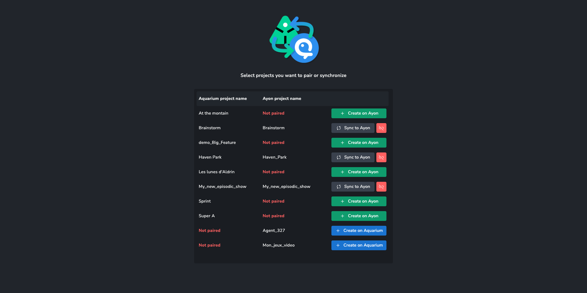
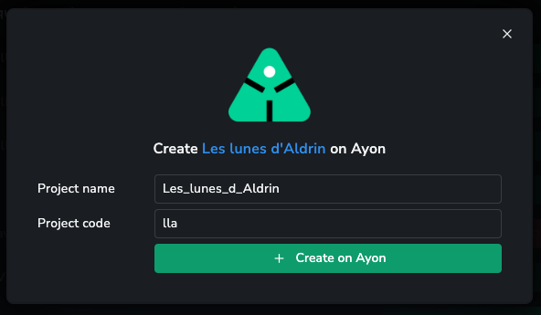
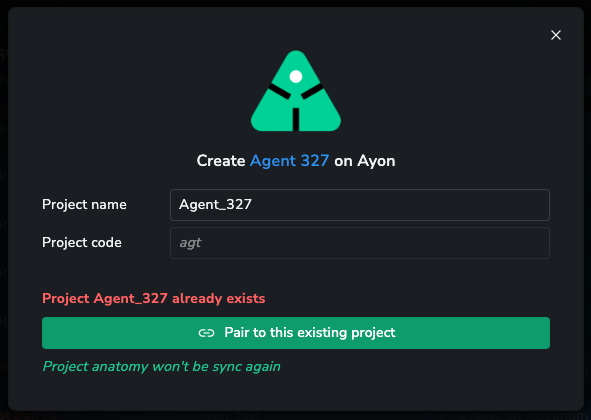
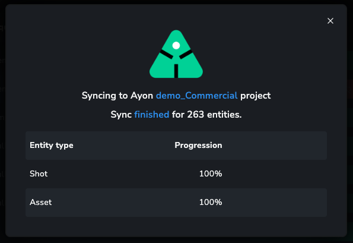

import ReactMarkdown from "react-markdown";
import versions from '@site/docs/assets/json/Ayon_addons_version.json'

<ReactMarkdown>
{versions.Aquarium_Badge}
</ReactMarkdown>

import Tabs from '@theme/Tabs';
import TabItem from '@theme/TabItem';

:::info Requirements
Don't forget to [setup and configure your addon](addon_aquarium_admin) before being able to use it.
:::

:::danger Only for Ayon managers
All the following information, are only available for Ayon users flag at least manager access level. If a "standard" user try to click on button, the server will raise a `Forbidden 403` error.
:::

## Pairing projects

Once your Aquarium addon is enabled on a production bundle, a new tab will appear : `Aquarium`. If you are in the development environment, you need to start it from your computer. Check our [developer documentation](addon_aquarium_developer.md).

This interface shows you all your Ayon and Aquarium active projects. You can see the state of each projects :

- [**Create on Ayon**](#create-on-ayon), mean that the project exists only on Aquarium
- [**Create on Aquarium**](#create-on-aquarium), mean that the project exists only on Ayon
- [**Sync on Ayon**](#sync-to-ayon), mean that the project is paired with Aquarium

### Create on Ayon

Use the button to trigger the creation of a new Ayon project, based on Aquarium's data.

Use the form to provide you Ayon `project name` and `project code`. The addon will provide by default a name and code compatible with Ayon naming convention.

Creating a project with this tools, will do multiple things :

- Ensuring that the project doesn't exists yet
- Storing Aquarium project._key in new Ayon's project data
- Gathering Aquarium's project data to create a project anatomy
- Trigger a full project to get all your compatible items in Ayon (Library, Asset, Episode, Sequence, Shot and Task)

If you try to create a project, with the same name, the addon will ask you if you want to pair projects together instead of creating it.

:::warning
If the project is already paired with another Aquarium project, you won't be able to pair it. Use the `Unpair` button first.
:::

### Create on Aquarium

Use this button to trigger the creation of a new Aquarium project, based on Ayon's data.

Clicking on the button will :

- Gather your Ayon hierarchy
- Generate a compatible JSON file with the project, templates, entities and tasks
- Upload that JSON file to Aquarium

:::info
This process is asynchronous. So if your Ayon project is really big, the import will take few minutes. Fow now, the only way to track the completion of the import, is to use Aquarium API, to list all the jobs of your bot.

In a next release, we will provide an interface from Ayon, to display the progression. Feel free to [reach us](mailto:support@fatfi.sh) if you are interested or if you need assistance.

:::

### Sync to Ayon

Use this button to trigger a full project sync. We provide an interface for you to be able to track the progression of the synchronization.

Clicking on the `Sync to Ayon` button will:

- Create an event into Ayon database so sync can be processed by the processor service
- The processor will:
  - Get Aquarium items
  - "Ayonise" Aquarium's item
  - Create or update entities in Ayon

Next to the Sync to Ayon button, you have a red button. This button is used to un-pair projects from each other.

:::info
No data will be deleted or trashed ! Technically it's just an update on your project's data : we remove the `aquariumProjectKey` in Ayon and Aquarium.
:::