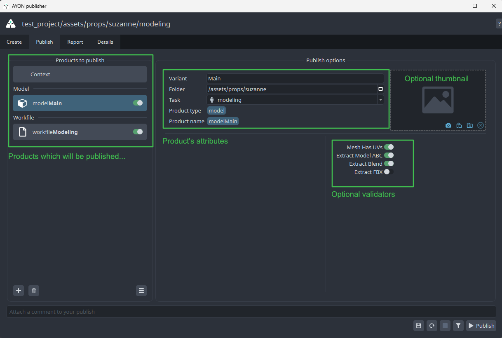
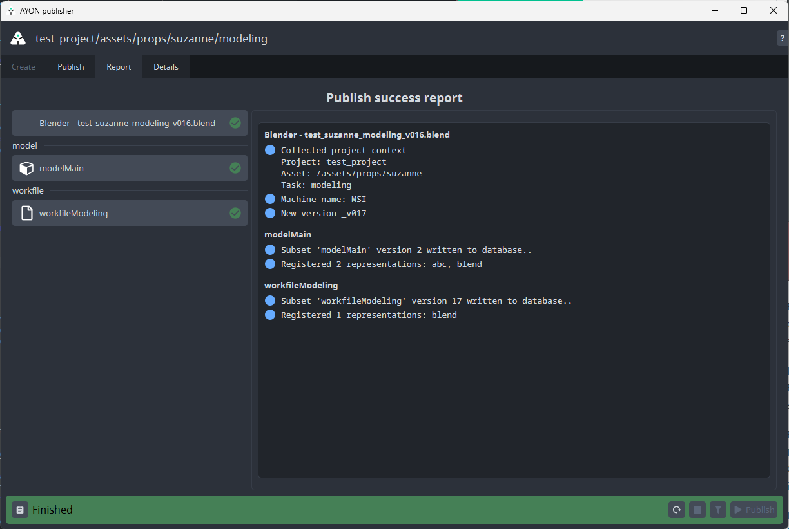
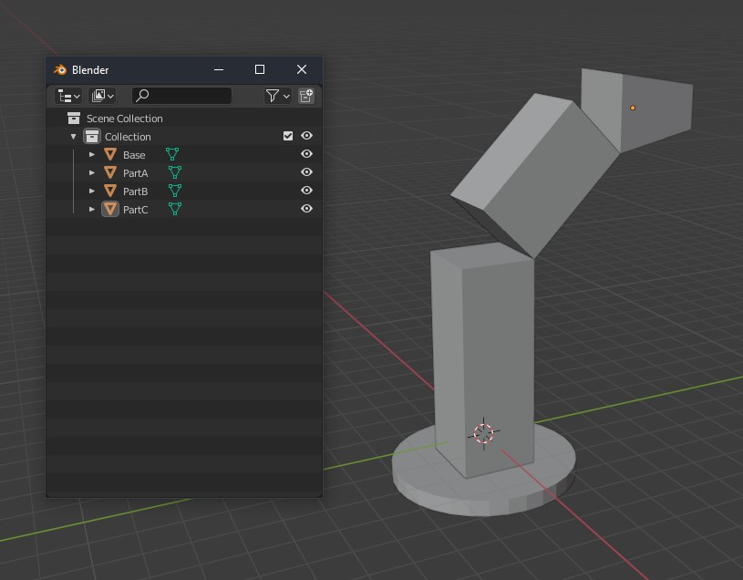

## AYON global tools

-   [Work Files](artist_tools_workfiles)
-   [Create](artist_tools_creator)
-   [Load](artist_tools_loader)
-   [Manage (Inventory)](artist_tools_inventory)
-   [Publish](artist_tools_publisher)
-   [Library Loader](artist_tools_library_loader)

## Working with AYON in Blender

AYON is here to ease you the burden of working on project with lots of
collaborators, worrying about naming, setting stuff, browsing through endless
directories, loading and exporting and so on. To achieve that, AYON is using
concept of being _"data driven"_. This means that what happens when publishing
is influenced by data in scene. This can by slightly confusing so let's get to
it with few examples.

## Setting scene data

Blender settings concerning framerate, resolution and frame range are handled
by AYON. If set correctly in Ftrack, Blender will automatically set the
values for you.

## Publishing models

### Intro

Publishing models in Blender is pretty straightforward. Create your model as you
need. You might need to adhere to specifications of your studio that can be different
between studios and projects but by default your geometry does not need any
other convention.

### Creating instance

Now create **Model instance** from it to let AYON know what in the scene you want to
publish. Go **AYON → Create... → Model**.

`Product` field is a name of asset you are working on - it should be already filled
with correct name as you've started Blender or switched context to specific product. You
can change the product you want to publish your model as by selecting it from
the left column, and selecting the task in the bottom left corner.

`Variant` field is a name you can decide on. It should describe what kind of data you
have in the model. For example, you can name it `Proxy` to indicate that this is
low resolution stuff. See [Subset](artist_concepts.md#subset).

`Use selection` toggle will use whatever you have selected in Outliner to be
wrapped in Model instance. This is usually what you want. Click on **Create** button.

You'll notice then after you've created new Model instance, there is a new
collection in Outliner called after your product and variant, in our case it is
`/assets/props/suzanne_modelMain`. The assets selected when creating the Model instance
are linked in the new collection.

And that's it, you have your first model ready to publish.

Now save your scene (if you didn't do it already). You will notice that path
in Save dialog is already set to place where scenes related to modeling task on
your asset should reside. As in our case we are working on product called
**suzanne** and on task **modeling**, path relative to your project directory will be
`project_XY/assets/props/suzanne/work/modeling`. The default name for the file will
be `project_XY_product_task_version`, so in our case
`test_suzanne_modeling_v001.blend`. Let's save it.

### Publishing models

Now let's publish it. Go **AYON → Publish...**. You will be presented with following window:

Note that content of this window can differs by your pipeline configuration.
For more detail see [Publisher](artist_tools_publisher).

Items in left column are instances you will be publishing. You can disable them
by clicking on the toggle next to them.

See that in this case we are publishing the Blender model named
`modelMain` and the workfile `workfileModeling` (its instance is generated
automatically for any workfile).

On the right side, you can enable or disable optional validators or extractors
for the selected instance.

Lets do dry-run on publishing to see if we pass all validators. Click on the filter
icon at the bottom next to the "Publish" button. Validators are run.

### Fixing problems

For the sake of demonstration, I intentionally kept the model in Edit Mode, to
trigger the validator designed to check just this.

The report tab in the publisher window shows us that we have problem with
validator `Validate Object Mode`.

From there you can see that there is problem with the
object `Suzanne`. Some validators have option to fix problem for you or just
select objects that cause trouble. This is the case with our failed validator.

On top you can see a button `Select Invalid`. This
will select offending object in Blender.

Fix is easy. Without closing Publisher window we just turn back the Object Mode.
Then we need to reset it to make it notice changes we've made. Click on arrow
circle button at the bottom and it will reset the Publisher to initial state. Run
validators again (filter icon) to see if everything is ok.

It should OK be now. Click the Publish button when ready.

Publish process will now take its course. Depending on data you are publishing
it can take a while. You should end up in the report tab of the publisher window,
with a success message and information about published data.

You can now close publisher window.
To check for yourself that model is published, open
[Asset Loader](artist_tools_loader) - **AYON → Load...**.
There you should see your model, named `modelDefault`.

### Loading models

You can load model with [Loader](artist_tools_loader). Go **AYON → Load...**,
select your rig, right click on it and click **Link model (blend)**.

## Creating Rigs

Creating and publishing rigs with AYON follows similar workflow as with
other data types. Create your rig and mark parts of your hierarchy in sets to
help AYON validators and extractors to check it and publish it.

### Preparing rig for publish

When creating rigs in Blender, it is important to keep a specific structure for
the bones and the geometry. Let's first create a model and its rig. For
demonstration, I'll create a simple model for a robotic arm made of simple boxes.

I have now created the armature `RIG_RobotArm`. While the naming is not important,
you can just adhere to your naming conventions, the hierarchy is. Once the models
are skinned to the armature, the geometry must be organized in a separate Collection.
In this case, I have the armature in the main Collection, and the geometry in
the `Geometry` Collection.

When you've prepared your hierarchy, it's time to create *Rig instance* in AYON.
Select your whole rig hierarchy and go **AYON → Create...**. Select **Rig**.

A new collection named after the selected Product and Variant should have been created.
In our case, it is `character1_rigDefault`. All the selected armature and models
have been linked in this new collection. You should end up with something like
this:

### Publishing rigs

Publishing rig is done in same way as publishing everything else. Save your scene
and go **AYON → Publish**. For more detail see [Publisher](artist_tools_publisher).

### Loading rigs

You can load rig with [Loader](artist_tools_loader). Go **AYON → Load...**,
select your rig, right click on it and click **Link rig (blend)**.

## Layouts in Blender

A layout is a set of elements that populate a scene. AYON allows to version
and manage those sets.

### Publishing a layout

Working with Layout is easy. Just load your assets into scene with
[Loader](artist_tools_loader) (**AYON → Load...**). Populate your scene as
you wish, translate each piece to fit your need. When ready, select all imported
stuff and go **AYON → Create...** and select **Layout**. When selecting rigs,
you need to select only the armature, the geometry will automatically be included.
This will create set containing your selection and marking it for publishing.

Now you can publish is with **AYON → Publish**.

### Loading layouts

You can load a Layout using [Loader](artist_tools_loader)
(**AYON → Load...**). Select your layout, right click on it and
select **Link Layout (blend)**. This will populate your scene with all those
models you've put into layout.
