import ReactMarkdown from "react-markdown";
import versions from '@site/docs/assets/json/Ayon_addons_version.json'

<ReactMarkdown>
{versions.Core_Badge}
</ReactMarkdown>

import Tabs from '@theme/Tabs';
import TabItem from '@theme/TabItem';

## General

Settings applicable to the full studio.

### Studio Name
Full name of the studio (can be used as variable on some places)

### Studio Code
Studio acronym or a short code (can be used as variable on some places)

### Global environment variables
Globally applied environment variables that will be appended to any AYON process in the studio.

### Disk mapping
- Platform dependent configuration for mapping of virtual disk(s) on an artist's AYON machines before OP starts up.
- Uses `subst` command, if configured volume character in `Destination` field already exists, no re-mapping is done for that character(volume).

:::info
Project settings can have project specific values. Each new project is using studio values defined in **studio settings** but these values can be modified or overridden per project. Refer to Settings related to [Working with settings](admin_settings.md) for more details.
:::

## Tools
### Creator
Settings related to [Creator tool](artist_tools_creator.md).

#### Product name profiles
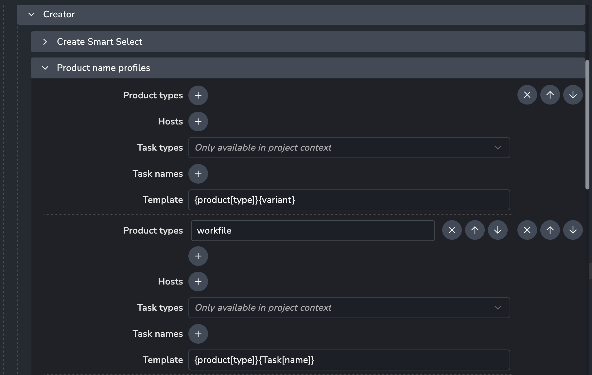

Product name helps to identify published content. More specific name helps with organization and avoid mixing of published content. Product name is defined using one of templates defined in **Product name profiles settings**. The template is filled with context information at the time of creation.

Usage of template is defined by profile filtering using creator's family, host and task name. Profile without filters is used as default template and it is recommend to set default template. If default template is not available `"{family}{Task}"` is used.

**Formatting keys**

All templates can contain text and formatting keys **family**, **task** and **variant** e.g. `"MyStudio_{family}_{task}"` (example - not recommended in production).

|Key|Description|
|---|---|
|family|Creators family|
|task|Task under which is creation triggered|
|variant|User input in creator tool|

**Formatting keys have 3 variants with different letter capitalization.**

|Task|Key variant|Description|Result|
|---|---|---|---|
|`bgAnim`|`{task}`|Keep original value as is.|`bgAnim`|
|`bgAnim`|`{Task}`|Capitalize first letter of value.|`BgAnim`|
|`bgAnim`|`{TASK}`|Each letter which be capitalized.|`BGANIM`|

Template may look like `"{family}{Task}{Variant}"`.

Some creators may have other keys as their context may require more information or more specific values. Make sure you've read documentation of host you're using.

### Workfiles
Settings related to [Workfile tool](artist_tools_workfiles.md).

#### Open last workfile at launch
This feature allows you to define a rule for each task/host or toggle the feature globally to all tasks as they are visible in the picture.

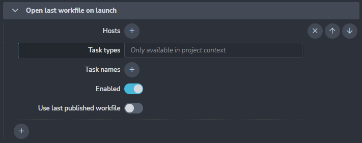

### Publish

#### Template name profiles

Allows to select [anatomy template](admin_settings_project_anatomy.md#templates) based on context of product being published.

For example for `render` profile you might want to publish and store assets in different location (based on anatomy setting) then for `publish` profile.
Profile filtering is used to select between appropriate template for each context of published products.

Applicable context filters:
- **`hosts`** - Host from which publishing was triggered. `["maya", "nuke"]`
- **`tasks`** - Current task. `["modeling", "animation"]`

    

(This image shows use case where `render` anatomy template is used for products of families ['review, 'render', 'prerender'], `publish` template is chosen for all other.)

### Filter creator profiles

This feature offers settings that narrow down the list of creators appearing in Publisher according to the specific context, thereby making it easier for artists to choose the right creator for their work.
Each profile consists of 
- A list of host names.
- Task Types drop down menu.
- A list of task names, which can serve as an alternative to task types.
- A list of Creator Labels, where you can add the labels of the creators you want to be displayed.

If you would like to show creator, put its creator label to `Allowed Creator Labels`, easiest way is to open DCC, select creator label in the list of creators and copy&paste it to Settings.
Regular expression is supported (eg. `Image.*` would show all `ImageHD`, `ImageLD`, `ImageThumb` creators).

Logging is provided in debug mode (`ayon_console --debug`) to highlight if profile matched and filtering is happening.

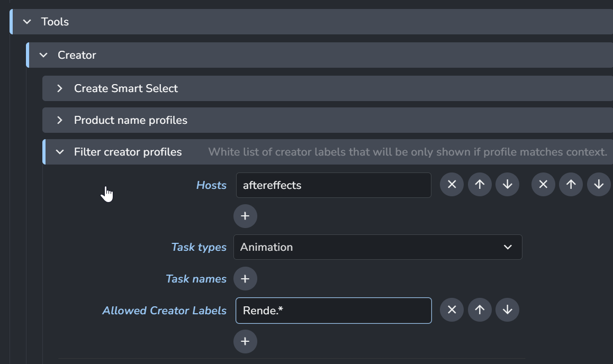

::: note
In the example shown above only available creators with labels starting with `Render` (eg. `Render`, `RenderLOD` etc.) for `animation` task started in `AfterEffects`.
No other creators will be shown for use when this filter profile being active. No other DCCs or even tasks in `AfterEffects` would be affected.
:::

#### Custom Staging Directory Profiles
With this feature, users can specify a custom data folder path based on presets, which can be used during the creation and publishing stages.

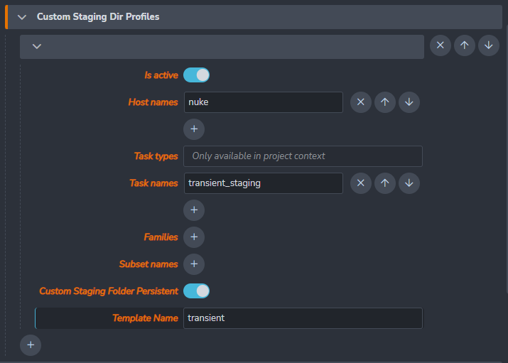

Staging directories are used as a destination for intermediate files (such as renders) before they are renamed and copied to proper location during the integration phase. They could be created completely dynamically in the temporary folder or for some DCCs in the `work` area.
For example could be Nuke where the artist might want to temporarily render images into the `work` area to check them before they get published with the choice of "Use existing frames" when publishing.

One of the key advantages of this feature is that it allows users to choose the folder for writing such intermediate files to take advantage of faster storage for rendering, which can help improve workflow efficiency. Additionally, this feature allows users to keep their intermediate extracted data persistent, and use their own infrastructure for regular cleaning.

In some cases, these DCCs (Nuke, Houdini, Maya) automatically add a rendering path during the creation stage, which is then used in publishing. Creators and extractors of such DCCs need to use these profiles to fill paths when publishing to use this functionality.

The custom staging folder uses a path template configured in `project_anatomy/templates/others` with `transient` being a default example path that could be used. The template requires a 'folder' key for it to be usable as custom staging folder.

##### Known issues
- Any DCC that uses prefilled paths and store them inside of workfile nodes needs to implement resolving these paths with a configured profiles.
- If a studio uses Site Sync, remote artists need to have access to configured custom staging folder.
- Each node on the rendering farm must have access to configured custom staging folder.

## Color Management (ImageIO)

:::info Default OCIO config
AYON distributes its own OCIO configs. Those can be found in `{ayon install dir}/{version}/vendor/bin/ocioconfig/OpenColorIOConfigs`. Windows example: `C:\Program Files (x86)\AYON\3.14.0\vendor\bin\ocioconfig\OpenColorIOConfigs`
:::

### Using OCIO config
Global config path is set by default to AYON distributed configs. At the moment there are only two - **aces_1.2** and **nuke-default**. Since this path input is not platform specific it is required to use at least an environment variable for platform specific config root directory. Order of paths matter so first existing path found is used.

Each OCIO config path input supports formatting using environment variables and [anatomy template keys](admin_settings_project_anatomy.md#available-template-keys). The default global OCIO config path is `{AYON_ROOT}/vendor/bin/ocioconfig/OpenColorIOConfigs/aces_1.2/config.ocio`.

If the project settings for a particular host has its own OCIO config **enabled** and set to at least one path and the path exists, it overrides the global OCIO config for that host.

**For example**

Project nuke-specific OCIO config: `project_settings/nuke/imageio/ocio_config`

If config path is defined to particular shot target with following path inputs:
1. `{root[work]}/{project[name]}/{hierarchy}/{asset}/config/aces.ocio`
2. `{root[work]}/{project[name]}/{hierarchy}/config/aces.ocio`

Procedure of resolving path (from above example) will look first into path number 1 and if the path does not exist then it will try path number 2. If none of the paths are found, it will fall back to global default.

### Using File rules
File rules are inspired by [OCIO v2 configuration](https://opencolorio.readthedocs.io/en/latest/guides/authoring/rules.html). Each rule has a unique name which can be overridden by host-specific _File rules_ (example: `project_settings/nuke/imageio/file_rules/rules`).

The _input pattern_ matching uses REGEX expression syntax (try [regexr.com](https://regexr.com/)). Matching rules procedure's intention is to be used during publishing or loading of representation. Since the publishing procedure is run before integrator format publish template path, make sure the pattern is working or any work render path.

:::warning Colorspace name input
The **colorspace name** value is a raw string input and no validation is run after saving project settings. We recommend to open the specified `config.ocio` file and copy pasting the exact colorspace names.
:::

## Publish plugins

Publish plugins used across all integrations.

### Tags

A couple of settings make use of tags to customize the output.

| Tag Name | Tag value to be used | Description |
| ----------- | ----------- | ----------- |
| Add burnins | `burnin` | Adds burnins with the `ExtractBurnin` plugin. |
| Create review | `review` | Creates a review from the output with the [`ExtractReview`](#extract-review) plugin. |
| Add review to AYON | `webreview` | Uploads the review to AYON. |
| Add review to Ftrack | `ftrackreview` | Uploads the review to Ftrack. |
| Add review to Shotgrid | `shotgridreview` | Uploads the review to Shotgrid. |
| Add review to Kitsu | `kitsureview` | Uploads the review to Kitsu. |
| Add review to SyncSketch | `syncsketchreview` | Uploads the review to SyncSketch. |
| Delete output | `delete` | Deletes the output once its been processed by `ExtractBurnin` and [`ExtractReview`](#extract-review). |
| Add slate frame | `slate-frame` | Adds the slate frame. |
| Skip handle frames | `no-handles` | If handles are present in the publish context, they will be ignored. |
| Output as image sequence | `sequence` | Outputs as an image sequence |
| Do not add audio | `no-audio` | Skip any audio found in the publish context |
| **Use for Thumbnail** | `thumbnail` | [Internal Use] This tag indicates the representation will be integrated as a thumbnail. You can leverage it explicitly with *[CSV Ingest](addon_traypublisher_artist.md#csv-ingest).* |
| **Use as Thumbnail Source** | `need_thumbnail` | [Internal Use] This tag indicates the representation will only be used for thumbnail creation, mainly for Nuke when multiple representations exist for one instance. |
| **Convert to Scanline** | `toScanline` | [Internal Use] Enables scanline conversion, primarily for Maya. This tag is added automatically when users enable `Convert to Scanline` on render instances. |
| **Publish on Farm** | `publish_on_farm` | [Internal Use] This tag indicates that the representations will be published on the farm, skipping local processing. |
| | `thumb-nuke` | |
| **Skip Extract Review** | `passing` | Skips the [`ExtractReview`](#extract-review) plugin for tagged representations. *Mostly used with [CSV Ingest](addon_traypublisher_artist.md#csv-ingest); see the provided CSV example.* |

### Extract OIIO Transcode
OIIOTools transcoder plugin with configurable output presets. Any incoming representation with `colorspaceData` is convertible to single or multiple representations with different target colorspaces or display and viewer names found in linked **config.ocio** file.

`oiiotool` is used for transcoding, eg. `oiiotool` must be present in `vendor/bin/oiio` or environment variable `AYON_OIIO_PATHS` must be provided for custom oiio installation.

Notable parameters:
- **`Delete Original Representation`** - keep or remove original representation. If old representation is kept, but there is new transcoded representation with 'Create review' tag, original representation loses its 'review' tag if present.
- **`Extension`** - target extension. If left empty, original extension is used.
- **`Transcoding type`** - transcoding into colorspace or into display and viewer space could be used. Cannot use both at the same time.
- **`Colorspace`** - target colorspace, which must be available in used color config. (If `Transcoding type` is `Use Colorspace` value in configuration is used OR if empty value collected on instance from DCC).
- **`Display & View`** - display and viewer colorspace. (If `Transcoding type` is `Use Display&View` values in configuration is used OR if empty values collected on instance from DCC).
- **`Arguments`** - special additional command line arguments for `oiiotool`.
- **[`Tags`](#tags)** - Add additional tags to representation.

#### Examples

Example here describes use case for creation of new color coded review of png image sequence. Original representation's files are kept intact, review is created from transcoded files, but these files are removed in cleanup process.

Another use case is to transcode in Maya only `beauty` render layers and use collected `Display` and `View` colorspaces from DCC.
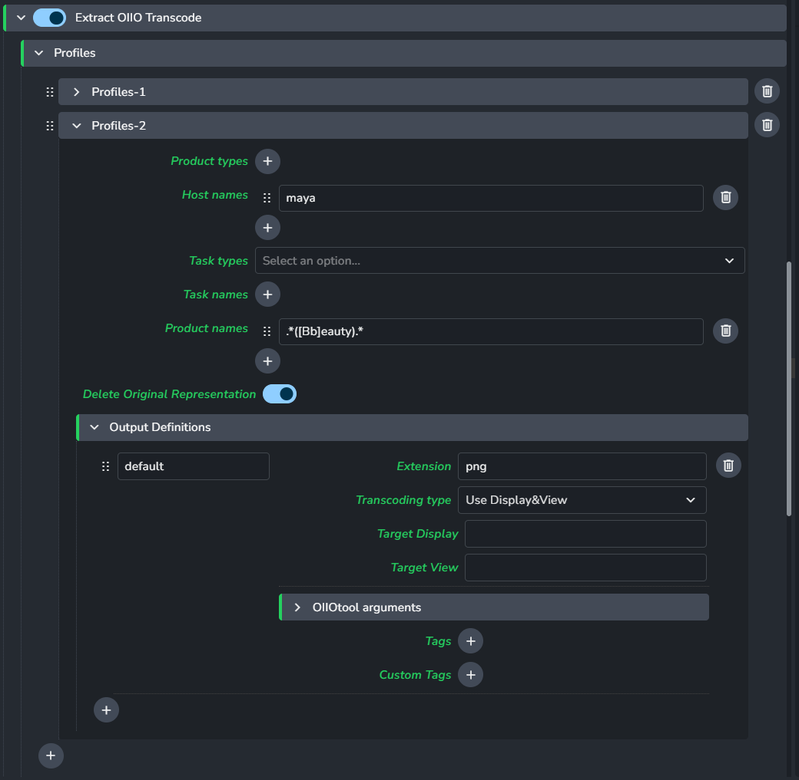

### Extract Review
Plugin responsible for automatic FFmpeg conversion to variety of formats.

Extract review uses profile filtering to render different outputs for different situations.

Applicable context filters:
 **`hosts`** - Host from which publishing was triggered. `["maya", "nuke"]`
- **`families`** - Main family of processed product. `["plate", "model"]`

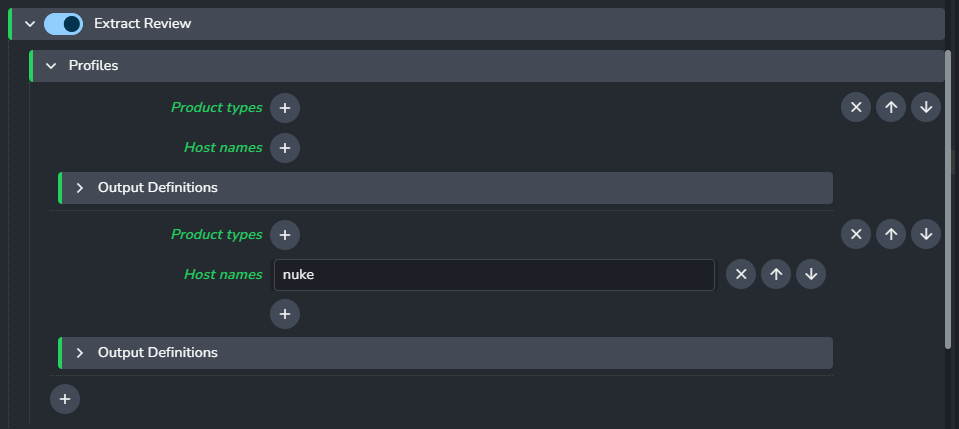

**Output Definitions**

A profile may generate multiple outputs from a single input. Each output must define unique name and output extension (use the extension without a dot e.g. **mp4**). All other settings of output definition are optional.

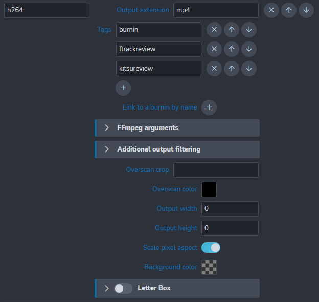
- **[`Tags`](#tags)**

- **`FFmpeg arguments`**
    These arguments are appended to ffmpeg arguments auto generated by publish plugin. Some of arguments are handled automatically like rescaling or letterboxes.
    - **Video filters** additional FFmpeg filters that would be defined in `-filter:v` or `-vf` command line arguments.
    - **Audio filters** additional FFmpeg filters that would be defined in `-filter:a` or `-af` command line arguments.
    - **Input arguments** input definition arguments of video or image sequence - this setting has limitations as you have to know what is input.
    - **Output arguments** other FFmpeg output arguments like codec definition.

:::tip Time Code argument
**Time Code argument:** `-timecode {timecode}`

Time Code `{timecode}` key is supported which is evaluated in the format `HH:MM:SS:FF`.
> It helps loading review files into Resolve - by having this timecode metadata included then Resolve 'understands' what the start frame / timecode is of the loaded media.

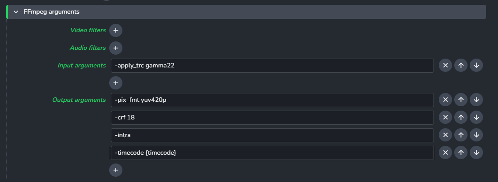
:::

- **`Output width`** and **`Output height`**
    - It is possible to rescale output to specified resolution and keep aspect ratio.
    - If value is set to 0, source resolution will be used.

- **`Overscan crop`**
    - Crop input resolution before rescaling.

    - Value is text may have a few variants. Each variant define output size for input size.

    - All values that cause output resolution smaller than 1 pixel are invalid.

    - Value without sign (+/-) in is always explicit and value with sign is
    relative. Output size for values "200px" and "+200px" are not the same "+200px" will add 200 pixels to source and "200px" will keep only 200px from source. Value of "0", "0px" or "0%" are automatically converted to "+0px" as 0px is invalid output.

    - Cropped value is related to center. It is better to avoid odd numbers if
    possible.

    **Example outputs for input size: 2200px**

    | String | Output | Description |
    |---|---|---|
    | ` `      | 2200px | Empty string keep resolution unchanged. |
    | `50%`    | 1100px | Crop 25% of input width on left and right side. |
    | `300px`  | 300px | Keep 300px in center of input and crop rest on left and right. |
    | `300`    | 300px | Values without units are used as pixels (`px`). |
    | `+0px`   | 2200px | Keep resolution unchanged. |
    | `0px`   | 2200px | Same as `+0px`. |
    | `+300px` | 2500px | Add black pillars of 150px width on left and right side. |
    | `-300px` | 1900px | Crop 150px on left and right side |
    | `+10%`   | 2420px | Add black pillars of 5% size of input on left and right side. |
    | `-10%`   | 1980px | Crop 5% of input size by on left and right side. |
    | `-10%+`  | 2000px | Input width is 110% of output width. |

    **Value "-10%+" is a special case which says that input's resolution is
    bigger by 10% than expected output.**

    - It is possible to enter single value for both width and height or
    combination of two variants for width and height separated with space.

    **Example for resolution: 2000px 1000px**

    | String        | Output        |
    |---------------|---------------|
    | "100px 120px" | 2100px 1120px |
    | "-10% -200px" | 1800px 800px  |
    | "-10% -0px" | 1800px 1000px  |

- **`Overscan color`**
    - Color of empty area caused by different aspect ratio of input and output.
    - By default is set to black color.

- **`Letter Box`**
    - **Enabled** - Enable letter boxes
    - **Ratio** - Ratio of letter boxes. Ratio type is calculated from output image dimensions. If letterbox ratio > image ratio, _letterbox_ is applied. Otherwise _pillarbox_ will be rendered.
    - **Type** - **Letterbox** (horizontal bars) or **Pillarbox** (vertical bars)
    - **Fill color** - Fill color of boxes (RGBA: 0-255)
    - **Line Thickness** - Line thickness on the edge of box (set to `0` to turn off)
    - **Line color** - Line color on the edge of box (RGBA: 0-255)
    - **Example**

    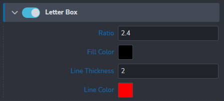
    

- **`Background color`**
    - Background color can be used for inputs with possible transparency (e.g. png sequence).
    - Input's without possible alpha channel are ignored all the time (e.g. mov).
    - Background color slows down rendering process.
        - set alpha to `0` to not use this option at all (in most of cases background stays black)
        - other than `0` alpha will draw color as background

- **`Additional filtering`**
    - Profile filtering defines which group of output definitions is used but output definitions may require more specific filters on their own.
    - They may filter by product name (regex can be used) or publish families. Publish families are more complex as are based on knowing code base.
    - Filtering by custom tags -> this is used for targeting to output definitions from other extractors using settings (at this moment only Nuke bake extractor can target using custom tags).
        - Nuke extractor settings path: `project_settings/nuke/publish/ExtractReviewDataMov/outputs/baking/add_custom_tags`
    - Filtering by input length. Input may be video, sequence or single image. It is possible that `.mp4` should be created only when input is video or sequence and to create review `.png` when input is single frame. In some cases the output should be created even if it's single frame or multi frame input.

### Extract Burnin

:::info
Remember to include the `burnin` tag when using `Extract Burnin`. Add it in the `Extract Review` settings to ensure it works correctly.
:::

The `Extract Burnin` plugin is a powerful tool for adding important details when publishing reviews. It comes with six placeholders that you can use right away.
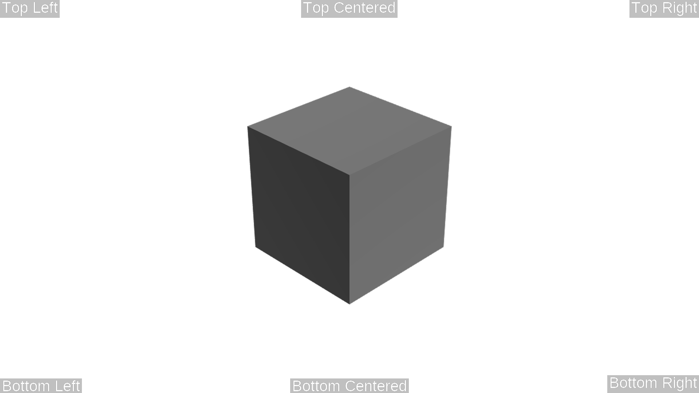

**Customizing Extract Burnin**

You have the freedom to tailor the Extract Burnin to your needs. There are two main areas you can adjust:
- **Burnin Formatting Options**: Change how the text looks.
- **Profiles**: Set up different rules and data for the plugin.

#### Burnin formatting options

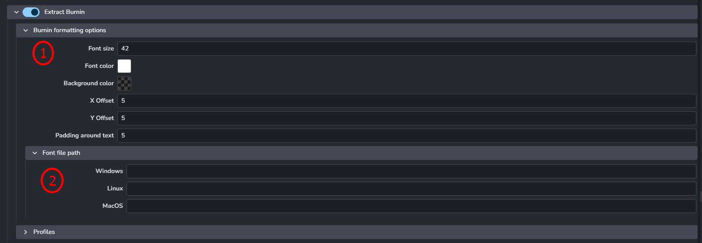

Adjust text appearance and position with these settings:
1. Text Settings:
   - Choose font size, color, and background color.
   - Set x offset, y offset, and padding to position the text just right.
2. Custom Font Path:
   - Use a specific font by providing its file path.
  
#### Profiles

Create profiles to control how the plugin functions:
1. Define the Context:
   - Choose specific products, hosts, and tasks that the plugin will identify and work with.
2. Burnin definitions:
   - a. **Name**: Burnin definition name.
   - b. **Placeholders Customization**: Tailor the placeholder text using [template keys](admin_settings_project_anatomy.md#available-template-keys), allowing flexibility for each user and context.
   - c. **Additional Filtering**: Add extra filters to manage the use of multiple burnin definitions effectively.
   - d. **Expansion (+)**: Add more definitions to fit your need.
3. **Expansion (+)**: Add more profiles.

:::info Placeholders and template keys
To see a list of available template keys, please visit the [template keys](admin_settings_project_anatomy.md#available-template-keys) section.
Additionally, be aware that some keys are exclusive to specific hosts. Nevertheless, these keys should function properly as we often align the addon features to ensure compatibility.
:::

:::tip Link Burnin by name
You can link `Extract Review` profiles to a specific burn-in by using its name. 
However, you're limited to choosing among burn-ins that are within the same burn-in profile.

In my example, both `focal_length_burnin` and `default_burnin` are within the same burn-in profile.

| **Extract Burnin** | **Extract Review** |
|--|--|
| 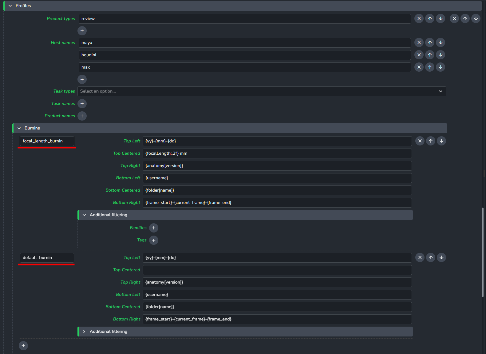 | 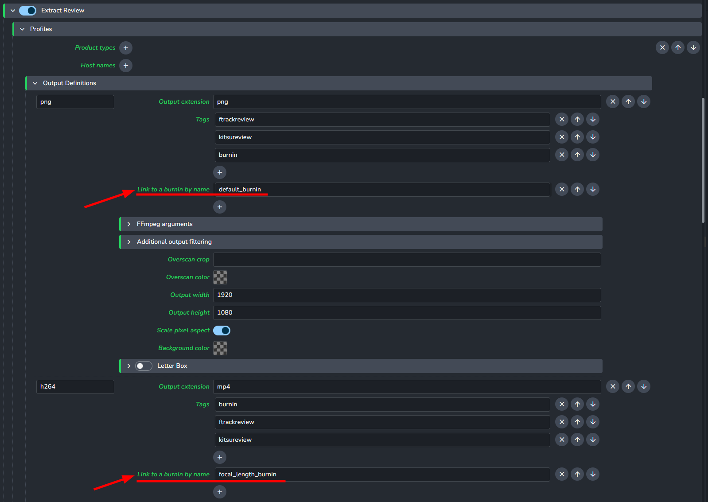 |

:::

### Integrate Product Group

Published products might be grouped together for cleaner and easier selection in the **[Loader](artist_tools_loader.md)**

Group name is chosen with use of profile filtering.

Applicable context filters:
- **`Families`** - Main family of processed product. `["plate", "model"]`
- **`Hosts`** - Host from which publishing was triggered. `["maya", "nuke"]`
- **`Task types`** - Current task. `["modeling", "animation"]`
- **`Tasks names`** - Current task. `["model_characterA", "layout_sh010"]`

    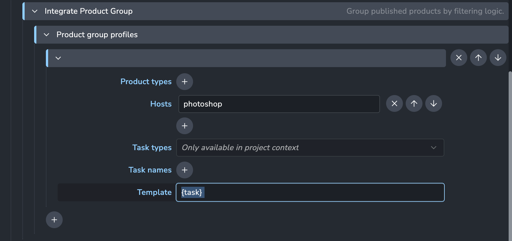

(This image shows use case where only assets published from 'photoshop', for all families for all tasks should be marked as grouped with a capitalized name of Task where they are published from.)
