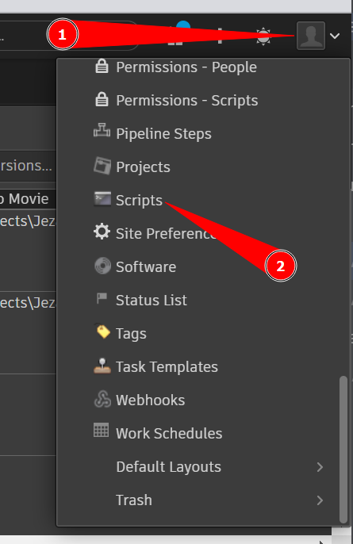
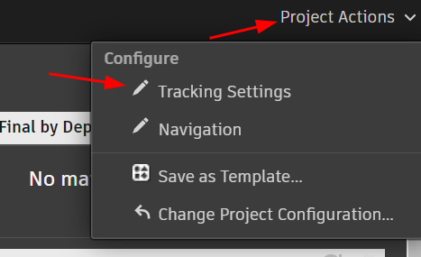
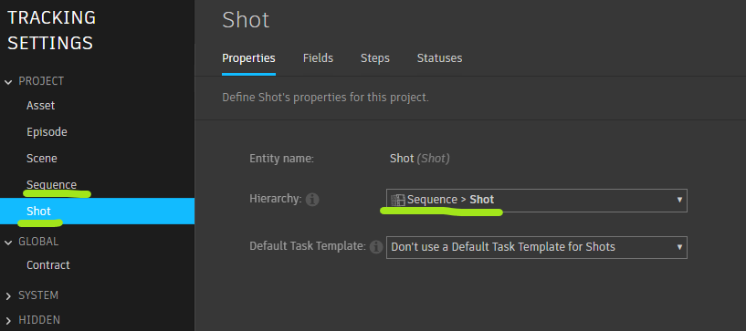
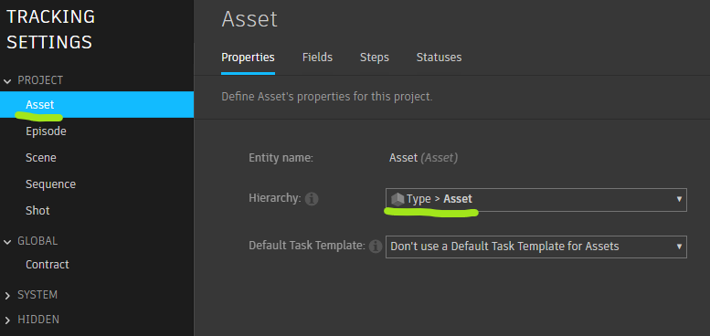
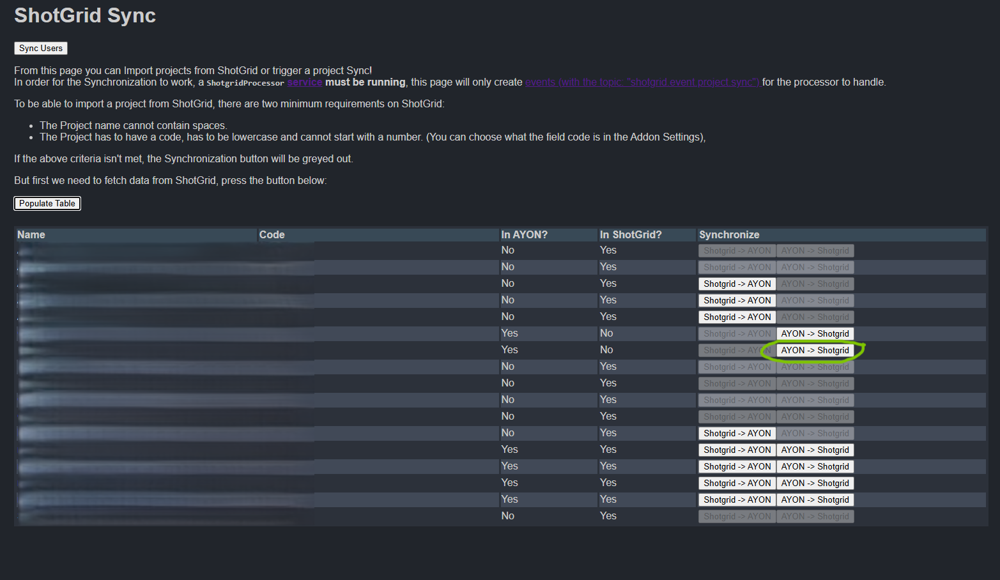
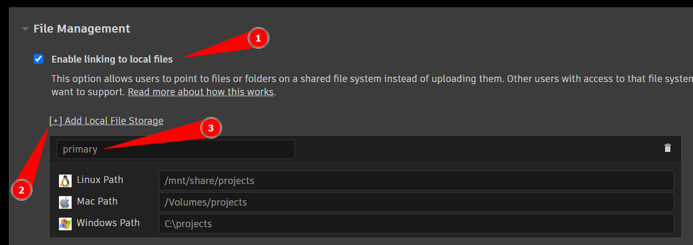
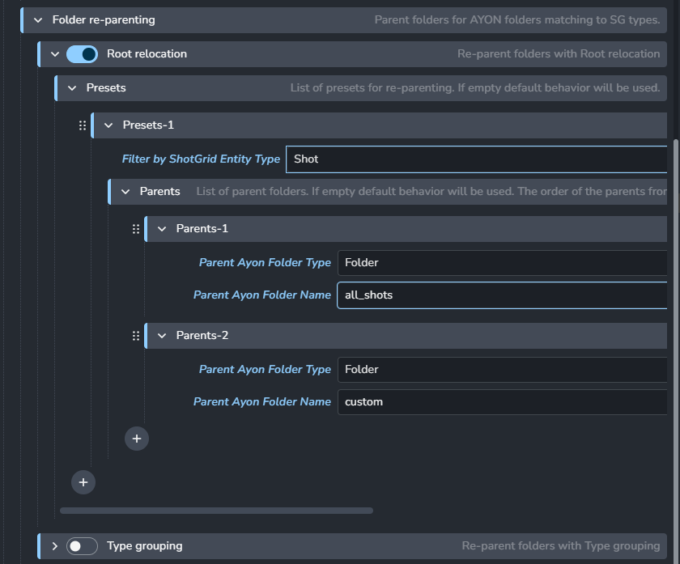
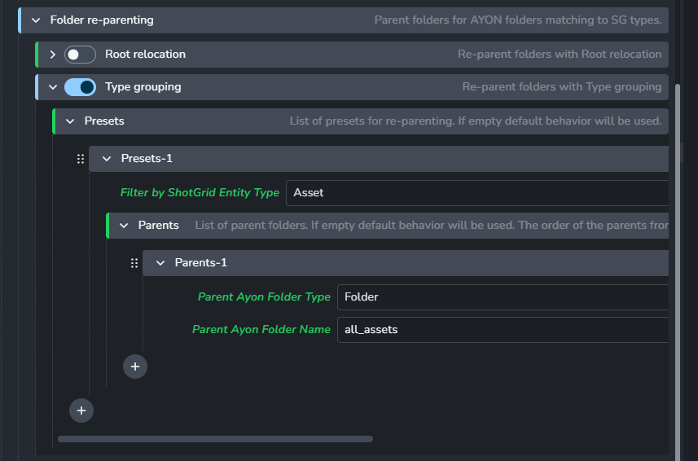

import ReactMarkdown from "react-markdown";
import versions from '@site/docs/assets/json/Ayon_addons_version.json'

<ReactMarkdown>
{versions.Flow_Badge}
</ReactMarkdown>

import Tabs from '@theme/Tabs';
import TabItem from '@theme/TabItem';

:::info Addon name
In Ayon, we've been using the name Shotgrid. But since we plan to change it, we'll start calling it Flow addon in our documentation. Sometimes, we might use SG too, just to keep things interesting.
:::

## Introduction

Flow (previously known as ShotGrid or ShotGun) is a production tracking and asset management software that helps studios manage their projects, assets, and shots. The AYON Flow integration allows you to seamlessly connect your Ayon Studio with Flow and automate the synchronization of your project data between the two systems. The integration enables you to synchronize folder attributes, status, tags, and reviewables between AYON and Flow

Current version of the integration also supports following features:

- Folder attributes two way synchronization
- Folder tasks two way synchronization
- Status two way synchronization
- Task assigneed user two way synchronization
- AYON comments as Flow notes two way synchronization
- Tags synchronization (currently only Ayon to Flow)
- Reviewables upload from AYON as Flow Version

## Getting started

The following documentation will guide you through the configuration required to set a sync between a Flow project and an AYON project:

:::tip Pre-requisites
* An online Flow server with admin accesses.
* An online AYON server with admin accesses.
* The latest `ayon-shotgrid` addon part of your **production bundle** (this might require a server restart). If your `ayon-shotgrid` addon is properly set, you should find a Shotgrid tab under the Studio settings.
:::

**A. Configure AYON/Flow connection**
* [Create new Flow Script(s)](#create-new-flow-scripts)
* [Register those Script credentials as AYON Secrets](#register-those-script-credentials-as-ayon-secrets)
* [Configure the services Flow addon in AYON](#configure-the-services-flow-addon-in-ayon)
* [Configure the users Flow addon in AYON](#configure-the-users-flow-addon-in-ayon)

**B. Configure syncing entities**
* [Check the Flow entities hierarchy set in project tracking settings](#check-the-flow-entities-hierarchy-set-in-project-tracking-settings)
* [Check the entities enabled for syncing](#check-the-entities-enabled-for-syncing)

**C. Start the syncing services**

**D. Trigger syncs**
* [Sync your first project from AYON to Flow](#sync-your-first-project-from-ayon-to-flow)
* [Sync-back an Asset from Flow to AYON](#sync-back-an-asset-from-flow-to-ayon)
* [Synchronize Users between from Flow to AYON](#synchronize-users-between-from-flow-to-ayon)
* [Enable auto-sync between Flow and AYON for a specific project.](#enable-auto-sync-between-flow-and-ayon-for-a-specific-project)

### A. Configure AYON/Flow connection

This section will guide you on creating a Script (API User) in Flow that is registered in AYON so the connection can be establish between both.

#### Create new Flow Script(s)

1. Log into your Flow server as admin.
2. Open the admin menu (1) and select Scripts menu item (2) to open the Scripts page. 
3. This page defines all of the available Script that will be available for your whole Flow instance (all projects).
4. We recommend you create **dedicated** Script for AYON sync usage. Use the `Add Script` button for that.
5. First, create a new `ayon_connector` Script with `API Admin` permissions which will be used for global sync between AYON and Flow via services.

:::warning Script Hash Key
When you create a Script, remember to save the generated hash key right away because it's only shown once.
:::

#### Register those Script credentials as AYON Secrets

1. Log into your AYON server as admin.
2. Go into the `Secrets` tab under Studio settings.
3. Click the `+ Add` button to register a new secret.
3. Register the Script hash keys for `ayon_connector` under a new secret called `sg_server_script_key`.

#### Configure the services Flow addon in AYON

1. Set the root URL of your Flow instance server under (`ayon+settings://shotgrid/shotgrid_server`). It should look something like `https://yourcompany.shotgrid.autodesk.com`.
2. Use your registered AYON secret to set the Script API key (`ayon+settings://shotgrid/service_settings/script_key`). In our case `sg_server_script_key`.
3. Report the Script name under (`ayon+settings://shotgrid/service_settings/script_name`). If you've followed the steps before, your Script name is `ayon_connector`.

#### Configure the users Flow addon in AYON

You need to decide how users will log into the Ayon Desktop app. Here are three options:

1. **Via Environment variable** - This is the default login method. Enter the user's email as `AYON_SG_USERNAME` on each user's computer in your studio. With this method, users won't see their login details on the Tray app widget.

2. **Via Tray App with password** - Users log in with their email and password. It's a common method, and you can set permissions in Flow. You can create different permission groups for users. However, sometimes users might not have access to certain projects.

3. **Via Tray App with shared API key** - Users log in with their email only. The shared secret API key is in the addon settings. This lets you set one permission group for all users.

### B. Configure syncing entities

#### Check the Flow entities hierarchy set in project tracking settings

The entities/folder hierarchy is driven from the Flow project [tracking settings](https://help.autodesk.com/view/SGSUB/ENU/?guid=SG_Administrator_ar_display_options_ar_project_tracking_settings_html).

To open the Flow project tracking settings:
1. Log into Flow instance as admin
2. Open the relevant Flow project
3. Click the `Project Action > Tracking Settings` menu

:::info Tracking settings
In there, ensure all of the entities you aim to use are **visible** which proper hierarchy.

Also define your entity hierarchy properly, an entity with missing hierarchy will be sync as "flat" directly under the project folder in AYON.
:::

###### Example 1: parent Shot under Sequence

In order to ensure `Shot` get parented under an `Sequence` when synced to AYON, the following setting must be set.

###### Example 2: parent Sequence under Episode

In order to ensure `Sequence` get parented under an `Episode` when synced to AYON, the following setting must be set.

###### Example 3: parent Asset under Asset Type (AssetCategory)

In order to ensure `Asset` get parented under an `AssetCategory` when synced to AYON, the following setting must be set.

#### Check the entities enabled for syncing

Once you verified the Flow hierarchy and the AYON project anatomy, you'll need to ensure the syncing entities are properly set in the addon settings.

As you might not use or need everything to be synced between Flow and AYON, the `ShotGrid Enabled entities` setting allows you to define on which entities the sync must operate (`ayon+settings://shotgrid/compatibility_settings/shotgrid_enabled_entities`).

:::warning Enabled entities
Enabled Entities must be visible in the Flow project tracking settings and part of the AYON project anatomy.
:::

### C. Start the syncing services

TODO

### D. Trigger syncs

This section will guide you syncing your first project between AYON and Flow.

#### Sync your first project from AYON to Flow

1. Create a new blank project in AYON
2. Under the Shotgrid tab, click `Populate Table` to detect projects 
3. You should find your newly created project with a `AYON -> Shotgrid` button under the Synchronize section.
4. Click the `AYON -> Shotgrid` button.
5. After the event is processed by the service, you should get a newly created Flow project in your Flow instance.

:::info New Project
Ensure any new AYON project is synced to Flow manually via the `AYON -> Shotgrid` button.
This ensures that all of the required fields/attributes are created and synced in both AYON and Flow.
:::

:::warning Troubleshooting
If `Populate Table` does not do anything or fails, this could be because of issues when [setting up Flow Script connection](#setting-up-flow-script-connection).
:::

#### Sync-back an Asset from Flow to AYON

1. In Flow, create a new Asset.
2. Re-populate the table by clicking `Populate Table` in the Shotgrid tab.
3. You should find your newly created project with a `Shotgrid -> AYON` button under the Synchronize section.
4. Click this `Shotgrid -> AYON` button.
5. This will ensure all of the task type, anatomy presets are properly pulled from Flow to your AYON project.
6. Ensure your Flow Asset has been reported in AYON.

#### Synchronize Users between from Flow to AYON

Having users being synced between AYON and Flow allow to report assignment for Task, Reviewables and more.
This way a task assigned to a particular user can be retrieved properly between Flow and AYON.

To synchronize users from Flow to AYON:
1. Go under the `Shotgrid` tab under the studio settings
2. Click `Sync Users`
3. Ensure new AYON users are created as AYON users.
4. For users to be assigned to tasks, they need to first be assigned to proper Project access group in `Project Settings > Project access`
5. Sync should now be possible in both ways AYON <-> Flow.

:::tip Active users in Flow
We understand that the amount of active Users in Flow directly impact costs. If an active User is present in AYON but it does not exist in Flow, Task(s), Comment(s) and Reviewable(s) will sync.
They will simply be left unassigned.
:::

#### Enable auto-sync between Flow and AYON for a specific project.

The previous sections shown you how to manually sync entities and configuration from AYON to Flow and the other way around.
It is recommended to manually trigger those global syncs processes when new entities are enabled or Flow project tracking settings have changed.

AYON addon also support an **auto-sync** feature. This ensures a **live** sync happens seamlessly. 
1. From AYON to Flow: ensure shotgrid push is enabled in the project settings (`ayon+anatomy://YOUR_PROJECT_NAME/attributes/shotgridPush`).
2. From Flow to AYON: ensure the `Ayon Auto Sync` (sg_ayon_auto_sync) field is enabled for the Flow project.

:::info Note
Synchronization between Flow and AYON started as unilateral from Flow. Two way synchronization features
are being added, but parity is not achieved yet. It is recommended to start from Flow for now.
:::

## Additional configuration

### Setting up local storage for Flow

In order to use power of Flows file system you have to configure local storage settings. This is done by enabling local storage and adding local storage name which had been previously configured in **Flow's Admin menu** > **Site preferences** > **File management**. Here it is important to **Enable linking to local files** (1) and create preset (2) for multiplatform file system. Copy name of the created preset (3) and paste it in Ayon Studio settings.

Paths should be mirroring defined paths in Ayon Anatomy root configuration. 

The name of the preset copied previously should be pasted in Ayon Studio settings. 

### Anatomy preset configuration

To use the Flow addon with Ayon, you need to set up an Anatomy preset. This preset helps sync things between Ayon and Flow. To get started, you can create a new preset or pick an existing one. Right now, the only thing to remember is that _Task Types_, _Folder Types_, and _Statuses_ should each have only one item. Make sure it matches a common item you'd find in Flow.

Here's how to add a **Comp** task type with the shortcode **cmp**. Make sure to include it in the **Flow Admin menu** under **Pipeline steps**.

Follow these steps for Folder Type and Statuses too, as explained below.

To create new Anatomy preset follow these steps:

1. Go to **Anatomy presets** tab in Studio settings
2. Hit Save as new preset button
3. Name it something like Flow or SG
4. Remove all Folder types except one - make sure it has corresponding type in Flow
5. Remove all Task types except one - make sure it has corresponding type in Flow
6. Remove all Statuses except one - make sure it has corresponding status in Flow

And now the anatomy preset is ready to be used in Flow addon settings.

### Configuring AYON Folder attributes synchronization

Name, statuses and tags attributes are synced between AYON folders with Flow entities.

The **Folder Attributes Map** setting (`ayon+settings://shotgrid/compatibility_settings/custom_attribs_map`) allows you to define additional mapping :

To sync AYON Folder attributes with Flow entities field:
1. Choose an AYON Folder attributes to sync by adding the name to the **AYON** column
2. Set the relevant Flow entity field name in the **SG** column (1).
3. Use the **Scope** column (2) to restrict the attribute mapping only some AYON folders / Flow entities

:::warning Available Flow field names
You can check the available fields and their type in Flow under **Fields** in the Flow admin menu.

Attributes with no value won't be considered. For instance, the *fps* attribute might be used only for Versions, Shots, and Project entities but not Task nor Asset.
:::

:::note SG attribute names
Use names without the "sg_" prefix, even though they exist in Flow's Field registry with this prefix. The system adds them automatically during synchronization. We first check if a name exists without the prefix and then try it with the prefix for the specific entity. If it's already in the registry, we use it; if not, we create it in Flow's field registry.
:::

### Reparenting the hierarchy in AYON

AYON **Folder re-parenting** setting can be used to define custom re-parenting rules when syncing Flow entities to AYON.

There are two methods that cannot be enabled together:
* Root relocation (`ayon+settings://shotgrid/compatibility_settings/folder_parenting/root_relocate`) allows to create a custom parent hierarchy for a provided folder type.
* Type grouping (`ayon+settings://shotgrid/compatibility_settings/folder_parenting/type_grouping`) allow to group all of the folders of a certain type under a custom folder hierarchy

##### Example 1: Reparent new Shot(s) under an `all_shots/custom` hierarchy

The following setting will:
* Ensure all newly created `Shot` in Flow are synced under `all_shots/custom` in AYON
* `Episode` or `Sequence` parents will be synced on their side without `Shot` underneath

##### Example 2: Reparent all of the Asset(s) under an `all_assets` folder

### AYON Comment / Flow Note synchronization

AYON comment can be synced as Flow note. 
To enable this:
1. Ensure `Note` is part of the `ShotGrid Enabled entities` setting (`ayon+settings://shotgrid/compatibility_settings/shotgrid_enabled_entities`).
2. *Recommended* - [Re-Synchronize](#synchronize-users-between-from-flow-to-ayon) Users between from Flow to AYON]
3. *Recommended* - Ensure [auto-sync between Flow and AYON](#enable-auto-sync-between-flow-and-ayon-for-a-specific-project) is active for your project.
4. Any new `Note` created in Flow will be synced to AYON
5. Any new `Comment` created in AYON will be synced to Flow

:::info Note author
Ensure that all of the Flow users get synced to AYON first to ensure note/comment `assigned_to` and `@` features work properly.
Otherwise `Comment` and `Note` will sync but be left unassigned.

Look at [Synchronize Users between from Flow to AYON](#synchronize-users-between-from-flow-to-ayon) for more details.
:::

### Syncing Tasks between AYON and Flow

Tasks can be synced between AYON and Flow both ways. 
To enable this:
1. Ensure `Task` is part of the `ShotGrid Enabled entities` setting (`ayon+settings://shotgrid/compatibility_settings/shotgrid_enabled_entities`).
2. *Recommended* - [Re-Synchronize](#synchronize-users-between-from-flow-to-ayon) Users between from Flow to AYON]
3. *Recommended* - Ensure [auto-sync between Flow and AYON](#enable-auto-sync-between-flow-and-ayon-for-a-specific-project) is active for your project.
4. Create a new `Task` in either AYON or Flow
5. Ensure the created `Task` get reported to the other platform

:::info Task types and statuses
For `Task` to sync properly, the project anatomy in AYON must define all of the task type(s) and status(es) available in Flow.
This can either reported manually or via the [Shotgrid -> AYON](#sync-back-an-asset-from-flow-to-ayon) button in the `Shotgrid` tab.
:::

:::info Task assignee
Similar to comment/notes, users must be synced across AYON and Flow to ensure `assigned_to` field is properly reported.
Otherwise `Task` will sync but be left unassigned.

Look at [Synchronize Users between from Flow to AYON](#synchronize-users-between-from-flow-to-ayon) for more details.
:::

### Targeting reviewables to Flow

You can effortlessly ensure that all reviewables will be uploaded to Flow. For this purpose, you simply need to attach a specific tag to Extract Review output presets. You can achieve this by following these steps:

1. Navigate either to your Studio Settings or any Project settings.
2. Find and add the **shotgridreview** tag to any of the selected preset's output.
   You can do this at the following path `ayon+settings://core/publish/ExtractReview/profiles/0/outputs`.

## Known limitations and bugs

#### Note/Comment parenting

Flow allows its note(s) to be parented to multiple entities where AYON only parent to one.
When a Flow `Note` get synced to AYON, the sync process will automatically determine its most relevant (peculiar) parent.

#### Flow Note vs Reply

Flow has 2 different kind of note entities: `Note` and `Reply` where AYON only define `Comment`.
Currently only `Note` entity is supported for synchronization.

#### Synced comments from AYON not appearing in the Activity page in Flow

This is a known bug reported to Autodesk. All `Comment` from AYON are synced as Flow `Note`.
If they do not appear in the activity page, you should still find them under the Project Note page.

#### Reviewable material size

When syncing AYON reviewable to Flow, the relevant media might be automatically re-uploaded to Flow.
Note that Flow impose a hard-limit of 5Go for its content, hence heavy reviewable might not be synced.

