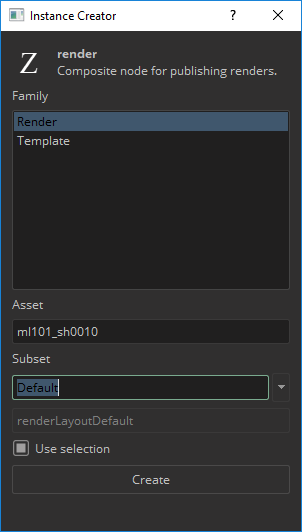
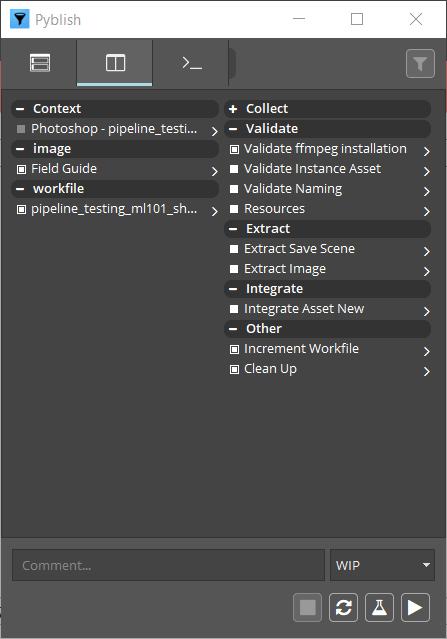
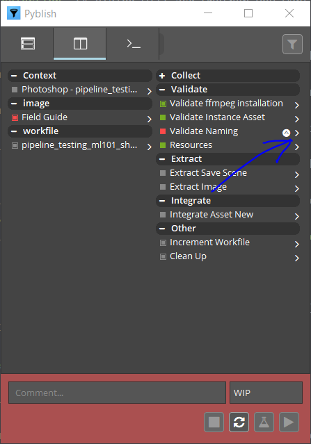
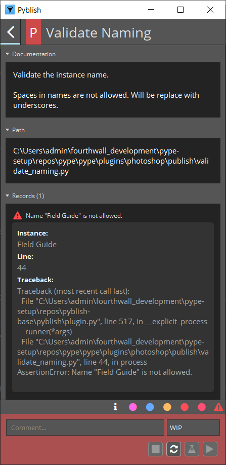
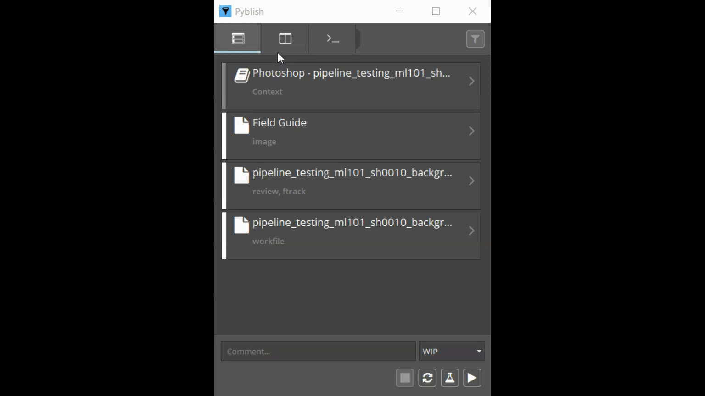

## Available Tools

-   [Work Files](artist_tools_workfiles)
-   [Create](artist_tools_creator)
-   [Load](artist_tools_loader)
-   [Publish](artist_tools_publisher)
-   [Manage](artist_tools_inventory)

:::note
Only one tool can be open at a time. If you open a tool while another tool is open, it will wait in queue for the existing tool to be closed. Once the existing tool is closed, the new tool will open.
:::

## Usage

The integration creates an `AYON` menu entry where all related tools are located.

:::note
Menu creation can be temperamental. Its best to start Harmony and do nothing else until the application is fully launched.
If you dont see the `AYON` menu, then follow this to create it:
- Go to the `Script Editor`
- Find the script called `TB_sceneOpened.js` and run it.
- Choose the `start` method to run.
:::

### Workfiles

`AYON > Workfiles`

Work files are temporarily stored locally, in `[user]/.avalon/harmony`, to reduce network bandwidth. When saving the Harmony scene, a background process ensures the network files are updated.

:::important
Because the saving to the network location happens in the background, be careful when quickly saving and closing Harmony (and the terminal window) since an interrupted saving to the network location can corrupt the workfile. To be sure the workfile is saved to the network location look in the terminal for a line similar to this:

`DEBUG:avalon.harmony.lib:Saved "[Local Scene Directory]" to "[Network Scene Directory]\[Name Of Workfile].zip"`
:::

### Create

`AYON > Create`

These are the families supported in Harmony:

- `Render`
    - This instance is for generating a render and review. This is a normal write node, but only PNGs are supported at the moment.
- `Template`
    - This instance is for generating a templates. This is a normal composite node, which you can connect any number of nodes to.
    - Any connected nodes will be published along with their dependencies and any back drops.
- `Palette`
    - Palettes are indirectly supported in Harmony. This means you just have to have palettes in your scene to publish them.

When you `Use selection` on creation, the last selected node will be connected to the created node.

### Publish

`AYON > Publish`

  <!-- picture has to be changed (Harmony needed) -->

This tool will run through checks to make sure the contents you are publishing is correct. Hit the "Play" button to start publishing.

You may encounter issues with publishing which will be indicated with red squares. If these issues are within the validation section, then you can fix the issue. If there are issues outside of validation section, please let the AYON team know.

#### Repair Validation Issues

All validators will give some description about what the issue is. You can inspect this by going into the validator through the arrow:

 <!-- picture has to be changed (Harmony needed) -->

You can expand the errors by clicking on them for more details:

 <!-- picture has to be changed (Harmony needed) -->

Some validator have repair actions, which will fix the issue. If you can identify validators with actions by the circle icon with an "A":

 <!-- picture has to be changed (Harmony needed) -->

To access the actions, you right click on the validator. If an action runs successfully, the actions icon will turn green. Once all issues are fixed, you can just hit the "Refresh" button and try to publish again.

 <!-- gif has to be changed (Harmony needed) -->
 
### Load

`AYON > Load`

  <!-- picture has to be changed (Harmony needed) -->

The supported families for Harmony are:

- `image`
- `harmony.template`
    - Only import is current supported for templates.
- `harmony.palette`
    - Loaded palettes are moved to the top of the colour stack, so they will acts as overrides. Imported palettes are left in the scene.
- `workfile`
    - Only of type `zip`.

To load, right-click on the subset you want and choose a representation:

 <!-- gif has to be changed (Harmony needed) -->

:::note
Loading templates or workfiles will import the contents into scene. Referencing is not supported at the moment, so you will have to load newer versions into the scene.
:::

### Manage

`AYON > Manage`

  <!-- picture has to be changed (Harmony needed) -->

You can switch to a previous version of the image or update to the latest.

 <!-- gif has to be changed (Harmony needed) -->
 <!-- gif has to be changed (Harmony needed) -->

:::note
Images and image sequences will be loaded into the scene as read nodes can coloured green. On startup the pipeline checks for any outdated read nodes and colours them red.
- Green = Up to date version in scene.
- Red = Outdated version in scene.
:::
