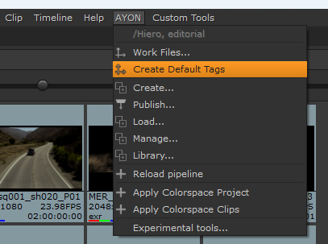
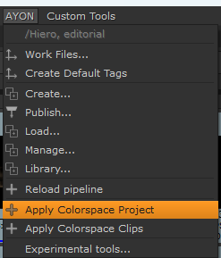
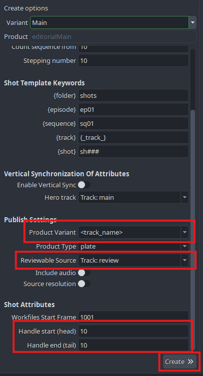
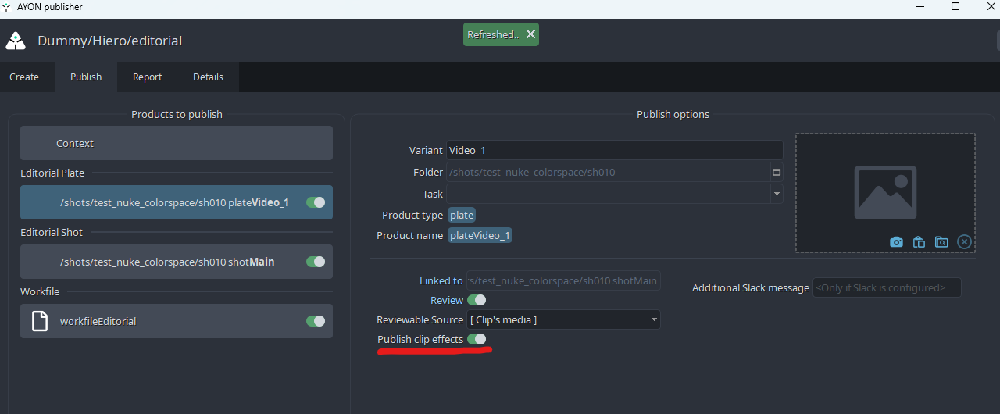
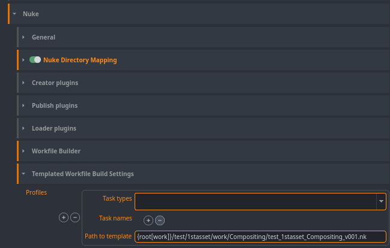
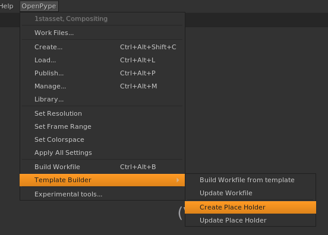
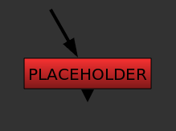
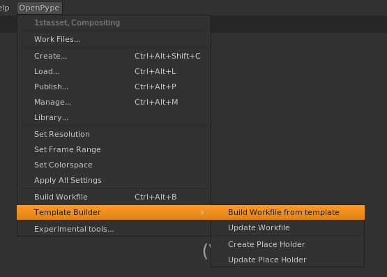

import ReactMarkdown from "react-markdown";
import versions from '@site/docs/assets/json/Ayon_addons_version.json'

<ReactMarkdown>
{versions.Hiero_Badge}
</ReactMarkdown>

import Tabs from '@theme/Tabs';
import TabItem from '@theme/TabItem';

:::note
All the information also applies to **_Nuke Studio_**(NKS), but for simplicity we only refer to Hiero/NKS. The workflows are identical for both. We are supporting versions **`11.0`** and above.
:::

## AYON global tools

-   [Work Files](artist_tools_workfiles.md)
-   [Create](artist_tools_creator.md)
-   [Load](artist_tools_loader.md)
-   [Manage (Inventory)](artist_tools_inventory.md)
-   [Publish](artist_tools_publisher.md)

## Hiero specific tools

### Create Default Tags

This tool will recreate all necessary AYON tags needed for successful publishing. It is automatically ran at start of the Hiero/NKS. Use this tool to manually re-create all the tags if you accidentally delete them, or you want to reset them to default values.

#### Result

-   Will create tags in Tags bin in case there were none
-   Will set all tags to default values if they have been altered

### Apply Colorspace Project

This tool will set any defined colorspace definition from AYON `Settings / Project / Anatomy / Color Management and Output Formats / Hiero / Workfile` to Hiero `menu / Project / Edit Settings / Color Management tab`

#### Result

-   Define correct color management settings on project

### Apply Colorspace Clips

This tool will set any defined colorspace definition from AYON `Settings / Project / Anatomy / Color Management and Output Formats / Hiero / Colorspace on Inputs by regex detection` to any matching clip's source path.

#### Result

-   Set correct `Set Media Color Transform` on each clip of active timeline if it matches defined expressions

## Publishing Shots

With AYON, you can use Hiero/Nuke Studio as a starting point for creating a project's **shots** as *assets* from timeline clips with its *hierarchycal parents* like **episodes**, **sequences**, **folders**, and its child **tasks**. Most importantly it will create **versions** of plate *products*, with or without **reference video**. Publishig is naturally creating clip's **thumbnails** and assigns it to shot *asset*. Hiero also supports publishing **audio** *product* and various **soft-effects** either as retiming component part of published plates or **color-tranformations**. Those will be available later on for compositor artists to use either as *viewport input-process* or *loaded nodes* in the graph editor.
    

<iframe width="512px" height="288px" src="https://www.youtube.com/embed/mdIfbTY5fCc" frameborder="0" modestbranding="1" allow="accelerometer; autoplay; encrypted-media; gyroscope; picture-in-picture" allowfullscreen="1"></iframe>

### Preparing a timeline for publishing shot, plates and more
Data conversion is not part of the process, so when working with raw camera sources or other formats which need to be converted for 2D/3D work, we recommend to convert those first and use those in the timeline. Before any clips in timeline could be converted to publishable instances we recommend following.
1. Reduce track amount by merging all tracks that can be one
2. Rename tracks to follow basic structure. Please avoid using `[-/_.,%&*]` or spaces. These names will be later used in *product* name creation as `{family}{trackName}` so for example **plateMain** or **plateFg01** 
	> if only one track it can be `main`
	> when dealing with multiple layers (elements) for one shot then use `main` and other elements for example: `bg`, `greenscreen`, `fg01`, `fg02`, `display01`, etc. 
3. Define correct `Set Media Color Transform` at all clips as those will be also published to metadata and used for later loading with correct color transformation.
4. Additional reviewable video material which you wish to be used as preview videos on any supported Project manager platform (Ftrack) has to be added ideally to track named **review**. This can be offline edit used as reference video for 2D/3D artists. This video material can be edited to fit length of **main** timeline track or it can be one long video clip under all clips in **main** track, because AYON will trim this to appropriate length with use of FFMPEG. Please be aware we only support MP4(h264) or JPG sequence at the moment.

### Converting timeline clips to instances

Every clip on timeline which is intended to be published has to be converted to publishable instance.

In AYON it is done by tagging a clip with our own metadata. Select all clips you wish to convert then `menu > AYON > Create`.
    

Then chose `Create Publishable Clip` in **Creator** editor.
  

In the create options, you can define instances' properties.
You might want to let `use only selected clip(s)` to only mark current selection as publishable clips.
If you wish to rename clips dynamically during creation then Keep  **Rename clips** ticked.
  

In case you wish to use *multiple elements of shots* workflow then ensure **Enable vertical sync** is ticked on and choose the correct hero track which is holding main plates, this is usually the **main** track.

Hover above each input field for help.

1. **Product Variant**

Product variant is created dynamically if `<track_name>` is selected on **Product name**.

2. **Reviewables**

You can enable generating `review` product per plate through the review setting.

3. **Handles**

Here you can set default value and change those later in the created AYON shot instances under `handleStart` and `handleEnd` properties (look below for details).

4. **Create**

After you hit **Create** new instances get added in the "Products to publish section". Also custom AYON tags are added to selected clips.

5. **Adjust handles instance properties**

If you wish to change any individual properties of the shot then you are able to do it directly on the instance under the `Publish` widget. In this example we can change `handleStart` and `handleEnd` to some other values.

6. **Adjust review instance properties**

You can adjust the reviewable property through eache `plate` created instance.

If you wish to publish a reviewable video for the relevant `plate`:
1. Ensure the `review` toggle is enabled for the plate instance
2. Select either the appropriate track name or `[clip's media]` (will use the clip own source) as `Reviewable Source`.

  

7. **Publish**

Action the **Publish** button to trigger the publishing process for the active instances.

### Vertical synchronization of product attributes

This feature allows to publish multiple plate variant(s) per shot.

The timeline must contain multiple tracks - as mentioned [here](#rename-timeline-track-names) one of those being the hero (driving) track.
Per shot, the clip on the hero track will be driving the shot creation (shot length, shot resolution...)

To publish multiple plates for a shot proceed as follows:

1. Set up a multiple track timeline. Rename each track to determine plate variants (e.g `L01`, `L02` and `L03`)
2. Pick-up one track to be the **hero** track and set your main plate clip onto it.
3. Then, for each shot, stack additional plate clip(s) on other tracks aligned with the hero/main plate clip. Clips can be shorter than the main hero track clip, but not longer.
4. (Optional) You can setup another track to contain your review material
5. Select all clips that needs to be published
6. In the creator enable vertical align and select your main track as hero track
5. Create instances by hitting "Create"
6. Ensure all instances are parented to the same shot, which length is driven by the hero clip.

:::note
If you are working with only two tracks where one track is going to be used as plates (e.g. `main`) and the other one holds video clips for offlines and web preview (e.g. `review`), then **Enable vertical sync** is not required.
:::

### Publishing Effects from Hiero to Nuke

When publishing a `plate` from Hiero, the process can automatically detect and export associated editorial effects (e.g. `Timewarp`, `OCIOFileTransform`, `Text`...) as `effect` products. Those are json files that can be used further down the pipeline to recreate the look/result from Hiero.

This video shows a way to publish shot look as `effects` from Hiero to Nuke.

<iframe width="512px" height="288px" src="https://www.youtube.com/embed/HzZDdtII5io" frameborder="0" modestbranding="1" allow="accelerometer; autoplay; encrypted-media; gyroscope; picture-in-picture" allowfullscreen="1"></iframe>

:::note
If you are not interested in publishing `effects`, this feature can be opted out in the Publisher UI through a toggle on each `plate` product instance.

:::

### Restrict instances collection to current clip selection

With long sequences, it is often the case that dozens (hundered?) of `plate`, `shot` and `audio` instances are created on a single timeline.

In that case, republishing only part of the sequence might be challenging, once would need to go through the product instances list and manually enable/disable the relevant ones.

To ease this corner case, the user can leverage the `ayon+settings://hiero/create/CollectShotClip/collectSelectedInstance` settings which, when enabled, restrict the product instance collection to the selected clips from the timeline.

:::note
If the current selection does not contain any clip, then all instances are collected.
:::

### Assembling edit from published shot versions

<iframe width="512px" height="288px" src="https://www.youtube.com/embed/5Wd6X-71vbg" frameborder="0" modestbranding="1" allow="accelerometer; autoplay; encrypted-media; gyroscope; picture-in-picture" allowfullscreen="1"></iframe>

# Nuke Build Workfile
This is a tool of Node Graph initialisation using a pre-created template.

### Add a profile
The path to the template that will be used in the initialisation must be added as a profile on Project Settings.

### Create Place Holder

This tool creates a Place Holder, which is a node that will be replaced by published instances.

#### Result
- Create a red node called `PLACEHOLDER` which can be manipulated as wanted by using it in Node Graph.

:::note
All published instances that will replace the place holder must contain unique input and output nodes in case they will not be imported as a single node. 
:::

The information about these objects are given by the user by filling the extra attributes of the Place Holder

### Update Place Holder
This tool allows the user to change the information provided in the extra attributes of the selected Place Holder.

### Build Workfile from template
This tool imports the template used and replaces the existed PlaceHolders with the corresponding published objects (which can contain Place Holders too). In case there is no published items with the description given, the place holder will remain in the node graph.

#### Result
- Replace `PLACEHOLDER` node in the template with the published instance corresponding to the information provided in extra attributes of the Place Holder

:::note
In case the instance that will replace the Place holder **A** contains another Place Holder **B** that points to many published elements, all the nodes that were imported with **A** except **B** will be duplicated for each element that will replace **B**
:::

### Update Workfile
This tool can be used to check if some instances were published after the last build, so they will be imported.

:::note
Imported instances must not be deleted because they contain extra attributes that will be used to update the workfile since the place holder is been deleted.
:::
