import ReactMarkdown from "react-markdown";
import versions from '@site/docs/assets/json/Ayon_addons_version.json'

<ReactMarkdown>
{versions.Houdini_Badge}
</ReactMarkdown>

## AYON global tools

- [Work Files](artist_tools_workfiles)
- [Create](artist_tools_creator)
- [Load](artist_tools_loader)
- [Manage (Inventory)](artist_tools_inventory)
- [Publish](artist_tools_publisher)
- [Library Loader](artist_tools_library_loader)

## Ayon Menu

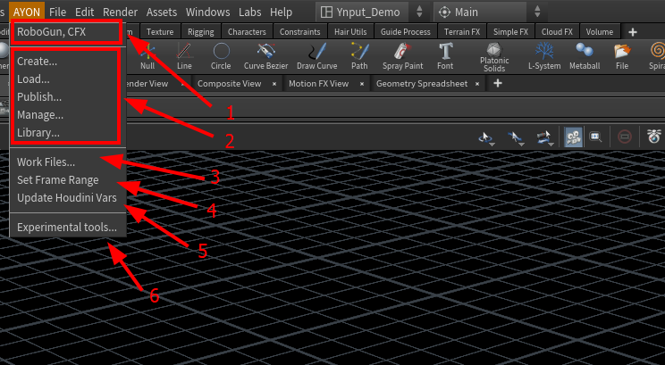

1. asset_name, task_name
2. Ayon create, publish, load and manage loaded assets
3. manage workfiles and artist notes
4. set global start and end frames for your Houdini session as well as FPS 
5. Update Houdini variables as in studio settings
6. Not implemented yet

## Ayon Publishing Process
:::info
Ayon tries to not be opinionated on your workflow, it only ensures that your work meets your studio's technical specifications using studio project settings customizations to customize it for particular studio or project's needs.
:::

The current publishing process is
1. Create a publish instance using `Create` menu or tab menu
2. Click publish! 
   
| Tab Menu | Create Menu |
|--|--|
|  |  |

| Publisher UI | AYON Publish Button |
|--|--|
|  | 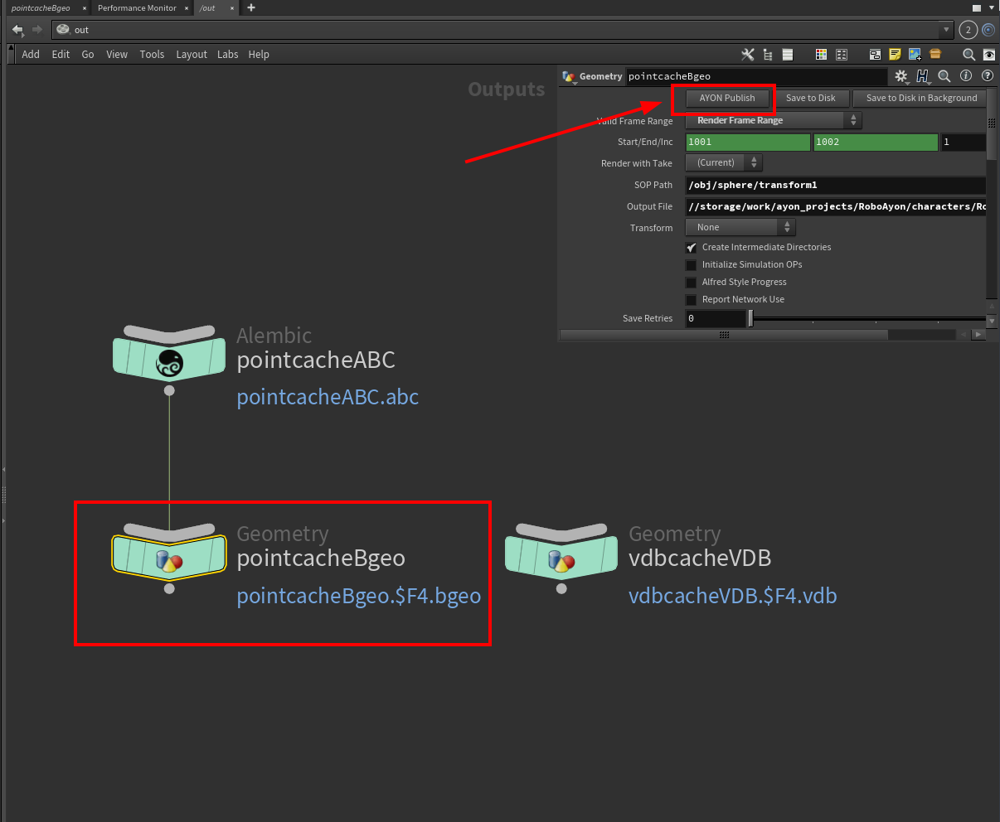 |

:::info
 The **AYON Publish** button is a self-publish button that performs publishing in a native Houdini way.
 Currently, it only tells the publisher what to include in the publishing, it also includes the connected Ayon ROPs because it calculates the dependency graph.
 
 > The order of ROPs is not considered because the Publisher UI follows alphabetical order by default.
:::

## Create and publish products

### Alembic Camera 
Publish baked camera in Alembic format. 

Steps:
- Select your camera
- Go **AYON -> Create**, select **Camera (abc)**, toggle **Use selection**, set **Variant** name and click **`Create 》`**. 
  > *Alternatively, you can just select `Create Create Camera (abc)` from the tab menu.* 
  > 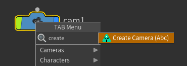
- Ayon will create Alembic ROP in **/out** with path and frame range already set.
- After that, you can **AYON -> Publish** and after some validations your camera will be published to `.abc` file.

import publish_alembic_camera from './assets/houdini/artist/publish_alembic_camera.mp4'

<video controls style={{width: "75%" }}>
  <source src={publish_alembic_camera}/>
</video>

### Arnold Scene Source 
Publish Arnold .ass Archive.

Steps:
- Go **AYON -> Create**, select **Arnold ASS**, set **Variant** name and click **`Create 》`**. 
  > *Alternatively, you can just select `Create Arnold ASS` from the tab menu.* 
  > 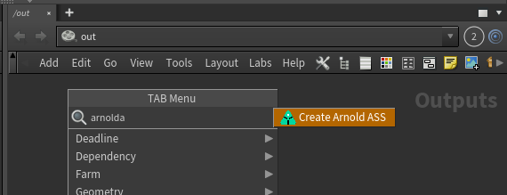
- Ayon will create Arnold ROP in **/out** with path and frame range already set.
- After that, you can **AYON -> Publish** and after some validations your scene source will be published to `.ass` file.

### Arnold ROP 
Publish Arnold Render.

Steps:
- Go **AYON -> Create**, select **Arnold ROP**, set **Variant** name, set user attributes and click **`Create 》`**. 
  > *Alternatively, you can just select `Create Arnold ROP` from the tab menu.* 
  > 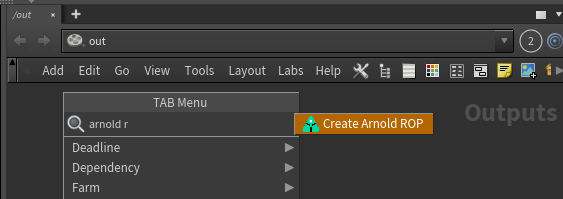
- Ayon will create Arnold ROP in **/out** with path and frame range already set.
- After that, you can **AYON -> Publish** and after some validations your render will be published to the selected format.

### Composite (Image Sequence) 
Publish image sequence from Houdini `cop` networks.

Steps:
- Select your cop node
- Go **AYON -> Create**, select **Composite (Image Sequence)**, toggle **Use selection**, set **Variant** name and click **`Create 》`**. 
  > *Alternatively, you can just select `Create Composite (Image Sequence)` from the tab menu.* 
  > 
- Ayon will create Composite ROP in **/out** with path and frame range already set.
- After that, you can **AYON -> Publish** and after some validations your cop will be published to `exr` file.

import composite_seq from './assets/houdini/artist/publish_composite_image_sequences.mp4'

<video controls style={{width: "75%" }}>
  <source src={composite_seq}/>
</video>

### Houdini Digital Asset
Publish Houdini Digital Asset for an easy interchange of data between Houdini instances or even other DCCs with Houdini Engine.
HDAs can be used to publish most of Houdini nodes.

:::caution Current limitations
1. Any HDA created by Ayon, you are not supposed to change its definition otherwise it will break.
2. It only works in Objects level
3. Having consistent data inside the HDA is your responsibility 
:::

Steps:
- Go **AYON -> Create**, select **Houdini digital asset (hda)**, set **Variant** name and click **`Create 》`**. 
- Ayon will create a HDA definition in **/obj** and move your selection inside it.
- After that, you can **AYON -> Publish** and after some validations your HDA will be published to `.hda` file.
  
import publish_hda from './assets/houdini/artist/publish_hda.mp4'

<video controls style={{width: "75%" }}>
  <source src={publish_hda}/>
</video>

### Karma ROP
Publish Karma render from Houdini.

Steps:
- Select your candidate objects
- Go **AYON -> Create**, select **Karma ROP**, toggle **Use selection**, set **Variant** name and click **`Create 》`**. 
  > *Alternatively, you can just select `Create Karma ROP` from the tab menu.* 
  > 
- Ayon will create Karma ROP in **/out** with path and frame range already set.
- After that, you can **AYON -> Publish** and after some validations your render will be published to the selected format.

import publish_karma_render from './assets/houdini/artist/publish_karma_render.mp4'

<video controls style={{width: "75%" }}>
  <source src={publish_karma_render}/>
</video>

### Mantra ROP 
Publish Mantra render from Houdini.

Steps:
- Select your candidate objects
- Go **AYON -> Create**, select **Mantra ROP**, toggle **Use selection**, set **Variant** name and click **`Create 》`**. 
  > *Alternatively, you can just select `Create Mantra ROP` from the tab menu.* 
  > 
- Ayon will create Mantra ROP in **/out** with path and frame range already set.
- After that, you can **AYON -> Publish** and after some validations your render will be published to the selected format.

import publish_mantra_render from './assets/houdini/artist/publish_mantra_render.mp4'

<video controls style={{width: "75%" }}>
  <source src={publish_mantra_render}/>
</video>

### PointCache (Abc)
Publish Alembic point caches from Houdini.

Steps:
- Select your sop node or obj node
- Go **AYON -> Create**, select **PointCache (Abc)**, toggle **Use selection**, set **Variant** name and click **`Create 》`**. 
  > *Alternatively, you can just select `Create PointCache (Abc)` from the tab menu.* 
  > 
- Ayon will create Alembic ROP in **/out** with path and frame range already set.
- After that, you can **AYON -> Publish** and after some validations your render will be published to the `.abc` file.

:::info Node Selection
 When selecting an ObjNode, Ayon will try to get its sop output node with the minimum `Output Index` otherwise it will get the sop node with display flag.
:::

:::caution
 Adding a `path` attribute to alembic point caches is a mandatory which achieves better compatibility with other DCCs.How
you handle `path` attribute is up to you. Ayon does not enforce specific values, it only checks for `path` presence and suggests a default `path` value if it is missing.
:::

import publish_pointcache_alembic from './assets/houdini/artist/publish_pointcache_alembic.mp4'

<video controls style={{width: "75%" }}>
  <source src={publish_pointcache_alembic}/>
</video>

### PointCache (Bgeo)
Publish Bgeo point caches from Houdini.

Steps:
- Select your sop node
- Go **AYON -> Create**, select **PointCache (Bgeo)**, toggle **Use selection**, set **Variant** name and click **`Create 》`**. 
  > *Alternatively, you can just select `Create PointCache (Bgeo)` from the tab menu.* 
  > 
- Ayon will create Geometry ROP in **/out** with path and frame range already set.
- After that, you can **AYON -> Publish** and after some validations your render will be published to the selected bgeo format.

### Redshift Proxy 
Publish Bgeo point caches from Houdini.

Steps:
- Select your sop node
- Go **AYON -> Create**, select **Redshift Proxy**, toggle **Use selection**, set **Variant** name and click **`Create 》`**. 
  > *Alternatively, you can just select `Create Redshift Proxy` from the tab menu.* 
  > 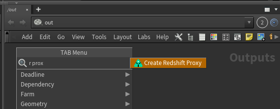
- Ayon will create Redshift Proxy ROP in **/out** with path and frame range already set.
- After that, you can **AYON -> Publish** and after some validations your render will be published to the `.rs` file.

### Redshift ROP 
Publish Redshift render from Houdini.

Steps:
- Select your candidate objects
- Go **AYON -> Create**, select **Redshift ROP**, toggle **Use selection**, set **Variant** name and click **`Create 》`**. 
  > *Alternatively, you can just select `Create Redshift ROP` from the tab menu.* 
  > 
- Ayon will create Redshift ROP in **/out** with path and frame range already set.
- After that, you can **AYON -> Publish** and after some validations your render will be published to the selected format.
  
### Review 
Publish Reviews from Houdini.

Steps:
- Select your candidate objects
- Go **AYON -> Create**, select **Review**, toggle **Use selection**, set **Variant** name and click **`Create 》`**. 
  > *Alternatively, you can just select `Create Review` from the tab menu.* 
  > 
- Ayon will create OpenGl ROP in **/out** with path and frame range already set.
- After that, you can **AYON -> Publish** and after some validations your render will be published to the selected format.

:::info Notes
**ColorManagement:** Specifying a value for `OCIO Colorspace` parameter is a mandatory if OCIO is enabled.
Ayon doesn't enforce specific values, it only validates the value is an existent colorspace otherwise it suggests using default colorspace.

**Convert to video and add burnins:** Ayon will do them automatically on publishing if they are enabled in studio settings.
:::

import publish_review from './assets/houdini/artist/publish_review.mp4'

<video controls style={{width: "75%" }}>
  <source src={publish_review}/>
</video>

### Static Mesh (FBX)
Publish Static Meshes from Houdini.

Steps:
- Select your sop node or obj node or obj subnetwork.
- Go **AYON -> Create**, select **Static Mesh**, toggle **Use selection**, set **Variant** name and click **`Create 》`**. 
  > *Alternatively, you can just select `Create Static Mesh (FBX)` from the tab menu.* 
  > 
- Ayon will create Flimbox FBX ROP in **/out** with path and frame range already set.
- After that, you can **AYON -> Publish** and after some validations your mesh will be published to a `.fbx` file.

:::info Node Name and product name
By default, the name will be something like this `staticMeshMain`

If your admin used unreal static mesh namings, you'll find names be something like this `S_assetNameMain` 

:::

import publish_filmbox_fbx from './assets/houdini/artist/publish_filmbox_fbx.mp4'

<video controls style={{width: "75%" }}>
  <source src={publish_filmbox_fbx}/>
</video>

### USD (experimental)
Publish Solaris Stage as USD file.

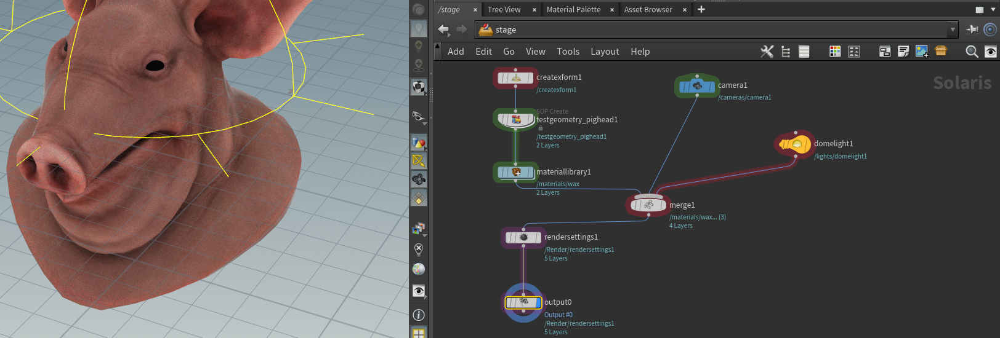

:::caution
This is an experimental product-type, and may not work properly.
:::

- Select your **lop** node
- Go **AYON -> Create**, select **USD (experimental)**, toggle **Use selection**, set **Variant** name and click **`Create 》`**. 
  > *Alternatively, you can just select `Create USD (experimental)` from the tab menu.* 
  > 
- Ayon will create USD ROP in **/out** with path and frame range already set.
- After that, you can **AYON -> Publish** and after some validations your Solaris Stage will be published to a `.usd` file.
  
### USD render (experimental)
Publish USD Render.

:::caution
This is an experimental product-type, and may not work properly.
:::

- Select your **lop** node
- Go **AYON -> Create**, select **USD render (experimental)**, toggle **Use selection**, set **Variant** name and click **`Create 》`**. 
  > *Alternatively, you can just select `Create USD render (experimental)` from the tab menu.* 
  > 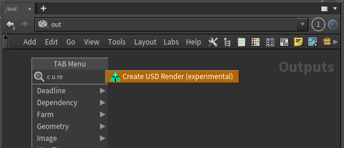
- Ayon will create USD ROP in **/out** with path and frame range already set.
- After that, you can **AYON -> Publish** and after some validations your render will be published to a `.usd` file.
  
### VDB Cache
Publish VDB caches from Houdini.

Steps:
- Select your sop node or obj node
- Go **AYON -> Create**, select **VDB Cache**, toggle **Use selection**, set **Variant** name and click **`Create 》`**. 
  > *Alternatively, you can just select `Create VDB Cache` from the tab menu.* 
  > 
- Ayon will create Geometry ROP in **/out** with path and frame range already set.
- After that, you can **AYON -> Publish** and after some validations your vdb cache will be published to a `.vdb` file.

:::info Node Selection
 When selecting an ObjNode, Ayon will try to get its sop output node with the minimum `Output Index` otherwise it will get the sop node with display flag.
:::

:::caution VDB and Volumes
VDB publishing uses Houdini Geometry Rop Node which doesn't export volumes. Therefore, you should always convert any volumes to VDB.
:::

import publish_vdb_cache from './assets/houdini/artist/publish_vdb_cache.mp4'

<video controls style={{width: "75%" }}>
  <source src={publish_vdb_cache}/>
</video>

### VRay ROP
Publish VRay render from Houdini.

Steps:
- Select your camera
- Go **AYON -> Create**, select **VRay ROP**, toggle **Use selection**, set **Variant** name and click **`Create 》`**. 
  > *Alternatively, you can just select `Create VRay ROP` from the tab menu.* 
  > 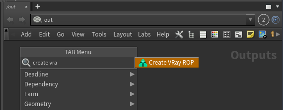
- Ayon will create VRay ROP in **/out** with path and frame range already set.
- After that, you can **AYON -> Publish** and after some validations your render will be published to the selected format.

## Publishing cache to Deadline
Artist can publish cache to deadline while using local machine for other tasks which increases productivity.
Caching on the farm is supported for:

- **Arnold ASS (.ass)**
- **Pointcache (.bgeo and .abc)**
- **VDB (.vdb)**
- **Redshift Proxy (.rs)**

Follow these steps to submit your cache to deadline:
1. you need to create the instance(s) with **Submitting to Farm** enabled, you also can still enable **Use selection** to
select the object for caching in farm.

2. When you go to Publish Tab and click the instance(s), you can set up your preferred
**Frame per task**. If you want to publish the existing instances to farm, you can enable
the toggled button **Submitting to Farm**.

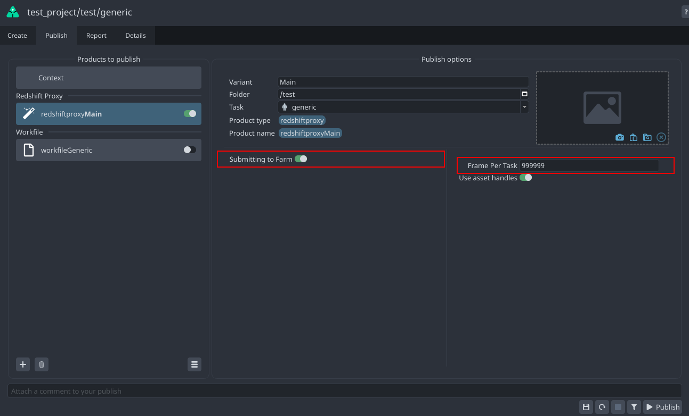

3. Once you hit **Publish**, the cache would be submitted and rendered in deadline.
When the render is finished, all the caches would be located in your publish folder.
You can see them in the Loader.
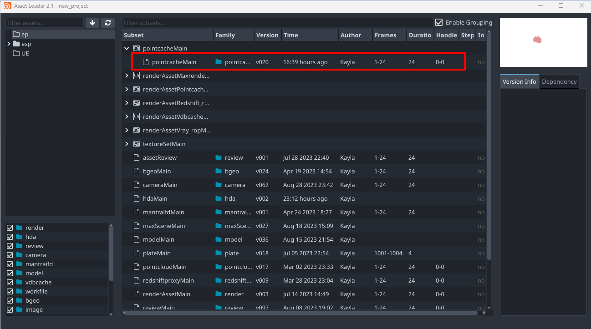

## Load published products
Loading is done by
- **load...** : load products from the current project
- **library...** : load products from a library project
  

Loaded stuff is by default wrapped in subnetwork node called `AVALON_CONTAINERS`.
Artist can move nodes inside `AVALON_CONTAINERS` out without losing management ability. For more info, Go to [Load](artist_tools_loader) and [Library Loader](artist_tools_library_loader)

import loader_tool_demo from './assets/houdini/artist/loader_tool_demo.mp4'

<video controls style={{width: "75%" }}>
  <source src={loader_tool_demo}/>
</video>

:::info Loading HDA
When you load hda, it will install its type in your hip file and add published version as its definition file. When
you switch version via Scene Manager, it will add its definition and set it as preferred.
:::

:::info Push to library project
You can use the `loader` to push a product to a library project. 

:::

## Manage Loaded products
Use Inventory menu button to manage loaded products.

Key features:
1. Set Version
2. Switch Asset
3. Inventory Actions

For more info, Go to [Manage (Inventory)](artist_tools_inventory)

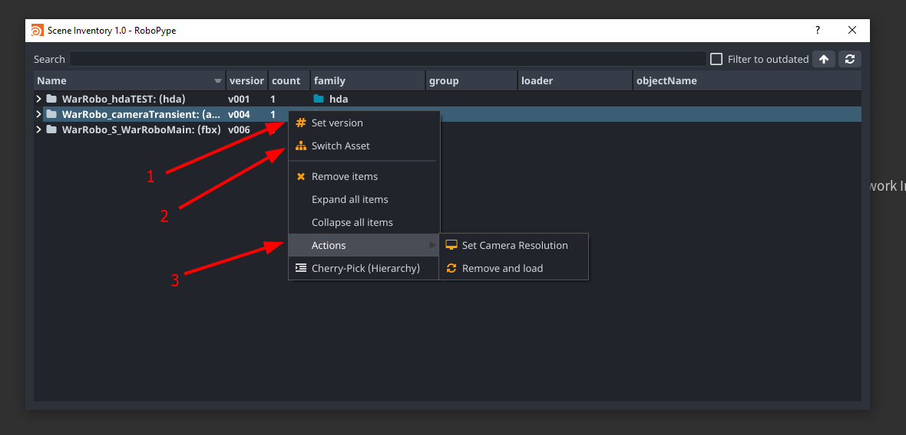

## FAQ

### How does Ayon name ROP nodes ? and is it safe to rename them ?

Nodes are named after their `product` names by default.
It's safe to change the node name but it's not safe to change the `product` name (found in `Extra` attributes) without referring to your pipeline admin. 
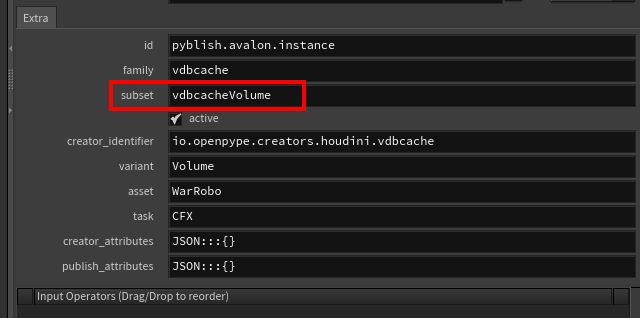

The default product naming profile consists of family name (product type) and variant name
For example if you are creating a `camera` publish and set the variant to name `Main`
Then Ayon will create a rop node with the name `cameraMain`.

:::info 
Admins are free to update product naming profiles.
:::

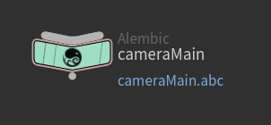

### Does Ayon work with vanilla Houdini ROPs and Deadline nodes ?
This feature is not implemented yet.

### How to publish existing files on disk ?
This feature is not implemented yet. For more info, Follow this Github Issue [Enhancement: Houdini publish existing caches/frames](https://github.com/ynput/OpenPype/issues/5767)