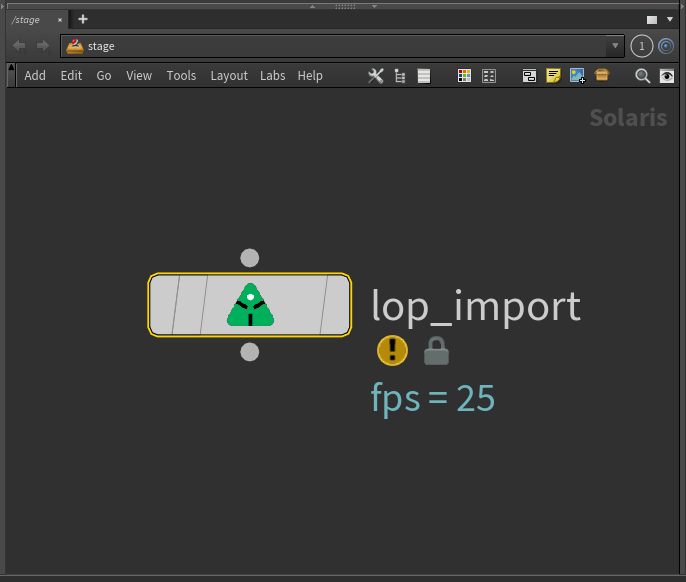
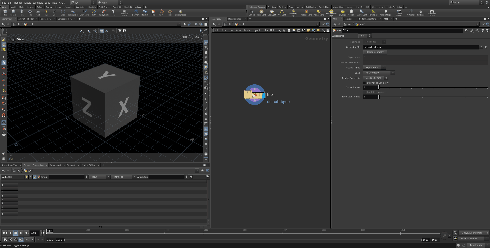
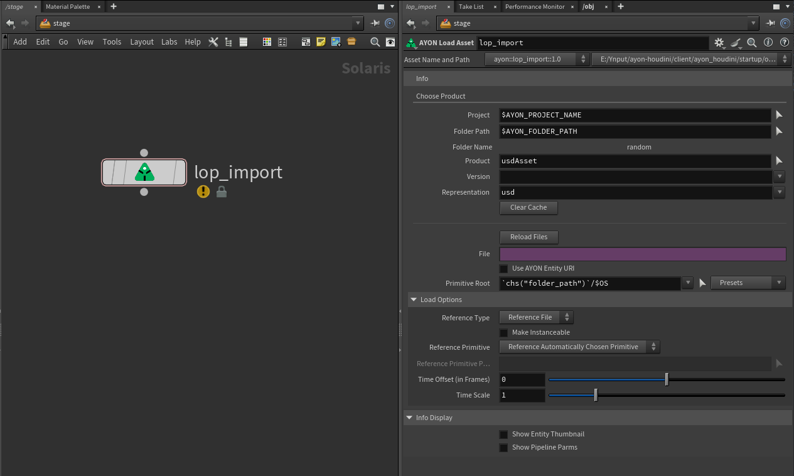
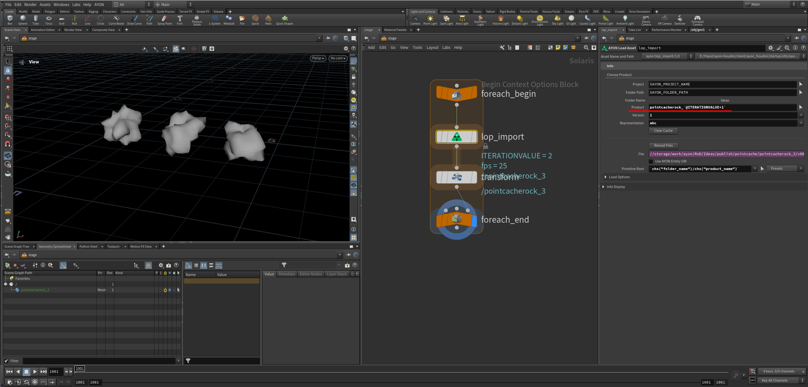
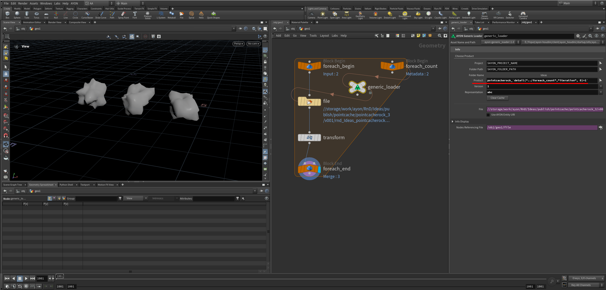
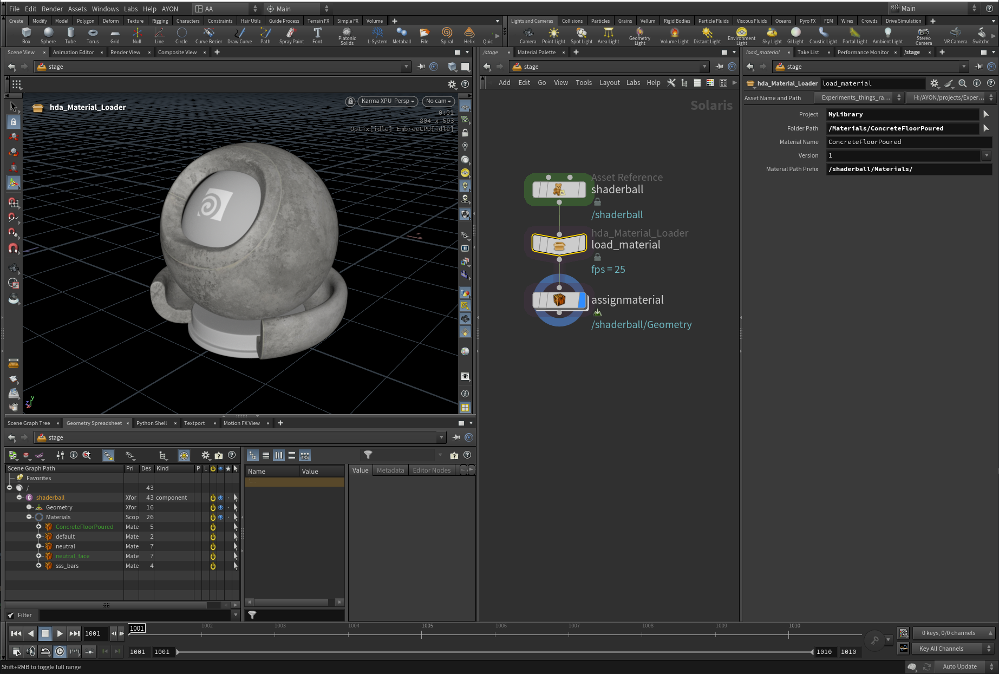

import ReactMarkdown from "react-markdown";
import versions from '@site/docs/assets/json/Ayon_addons_version.json'

<ReactMarkdown>
{versions.Houdini_Badge}
</ReactMarkdown>

## Introduction
AYON Loader HDAs serve as controllers that let you select and load AYON products into your scene.

- **Generic Loader**: As the name suggests, it is generic and loads any AYON product as a *filepath*.
- **Lop Import (Load Asset)**: Loads USD assets.
- **Load Shot**: Loads USD shots.

| Generic Loader |
|--|
| Currently, Available in `OBJs`, `SOPs` and `LOPs`.  |

| LOP Import | Load Shot |
|--|--|
|  |  |

## Access Loader HDAs

### TAB Menu
All of these nodes are accessible in the TAB menu.

| LOPs | OBJs | SOPs |
|--|--|--|
|  |  |  |

### Loader Tool
Some loader plugins rely on these nodes to perform loading:


1. **Load Asset**: Creates a `LOP Import` node in `\stage`.
2. **Load Shot**: Creates a `Load Shot` node in `\stage`.
3. **Load Filepath to Node**: Creates a `Generic Loader` node in `\obj\AVALON_CONTAINERS`.

### Quickly Load into Any String Parameter

You can find a parameter action called `Load with AYON` by right-clicking any file-type parameter on non-Rop nodes.
This action creates a `Generic Loader` node in `\obj\AVALON_CONTAINERS`, copies its file parameter to the `File` parameter where the action was triggered, and opens the parameter panel for the created `Generic Loader` node.

:::tip
When using the `Load with AYON` parameter action with a file parameter already connected to a `Generic Loader`, it opens the parameter panel for that `Generic Loader` node without creating a new one.
:::



## Loader HDAs

### Generic Loader

#### Overview


#### Parameters

- **Project**: Select a project.
- **Folder Path**: Select a folder path.
- **Folder Name**: Shows the name of the selected folder.
- **Product**: Select a product.
- **Version**: Select the product's version.
- **Representation**: Select the product's representation (format).
- **Enable Representation Filter**: Toggle to show the **Representation Filter** parameter.
- **Representation Filter**: Enter a space-separated list of representation names to filter. This filters the representation drop-down menu.
- **Clear Cache**: Clears the node's cache.
- **File**: Displays the file of the selected product. Automatically applies `$F` and `<UDIM>` tokens.
- **Use AYON Entity URI**: When enabled, the File parameter becomes an AYON URI.
- **Show Entity Thumbnail**: When enabled, shows the selected product's thumbnail and extra parameters for adjusting the image in the network view.
- **Size** & **Offset**: Adjust the displayed thumbnail in the network view.
- **Update Thumbnail**: Click to manually update the thumbnail. Use this if auto-update doesn't work.
- **Show Pipeline Parms**: Displays extra pipeline parameters like `Representation ID`, mainly for debugging and automation.
- **Nodes Referencing File**: Displays nodes that reference the `File` parameter.

#### How to Use Generic Loader

1. Select the project and folder path.
2. Choose the product, version, and representation.
3. The **File** parameter will be populated, allowing you to copy and use it as needed.
4. Product selection fields support expressions and context options. Find examples below [Example Usages](#example-usages).
   
### Lop Import 

#### Overview
It uses a combination of the [Generic Loader](#generic-loader) and the [Reference](https://www.sidefx.com/docs/houdini/nodes/lop/reference.html) node.

> The **representation filter** parameter on the inner `Generic Loader` node is set to:
> ```
> usd usda usdlc usdnc abc
> ```



#### Parameters

This shares the same parameters as the Generic Loader and adds a few more. It also exposes some parameters of the [Reference](https://www.sidefx.com/docs/houdini/nodes/lop/reference.html) node.

Additional parameters on the node include:

- **Reload Files**
- **Primitive Root**
- **Presets**: This menu provides default values for building assets and shots.
- **Reference Type**
- **Make Instanceable**
- **Reference Primitive**
- **Reference Primitive Path**
- **Time Offset (in Frames)**
- **Time Scale**

#### How to Use LOP Import
- Selecting products works the same as with the [Generic Loader](#how-to-use-generic-loader).
- Set the `Primitive Root`. The `Presets` menu provides default values for building assets and shots.

### Load Shot

#### Overview
It uses a combination of the [Generic Loader](#generic-loader) and the [Sublayer](https://www.sidefx.com/docs/houdini/nodes/lop/sublayer.html) node.

> The **representation filter** parameter on the inner `Generic Loader` node is set to:
> ```
> usd usda usdlc usdnc abc
> ```


## Parameters
It shares the same parameters as the Generic Loader and adds a few more:

- **Reload Files**
- **Mute Layer**
- **Time Offset (in Frames)**
- **Time Scale**

#### How to Use Load Shot
- Selecting products works the same as with the [Generic Loader](#how-to-use-generic-loader).
- Keep in mind, it adds the loaded product as a sublayer.

## Example Usages
These examples come from tests during the development of the HDAs and various discussions in our community.
You might find some inspiration here. While they may not perfectly meet your studio's needs, they can serve as a good starting point.

:::tip
Feel free to share your examples with us on the [Ynput Community Forums](https://community.ynput.io/).
:::

### Context Options and MultiShots

You can use a `context options` entry to select from, allowing the user to choose any folder in the project.
For example, you can create a context options menu that includes all folder paths in the current project.

<details><summary>Create <code>Folder Path</code> context menu</summary>

You can create a Python menu context option by using this:

```python
from ayon_core.pipeline import get_current_project_name
import ayon_api


project_name = get_current_project_name()
folders = ayon_api.get_folders(
	project_name,
    fields={"path"}, 
    has_children=False,
    has_tasks=True
)
paths = [(folder["path"], folder["path"]) for folder in folders]
paths.sort()

return paths
```

</details>


### Expressions and Context Options

AYON Loader HDAs support expressions and context options, allowing users to automate operations.

For instance, you can use this feature to load multiple products in a loop with a single loader.
This method requires the products to share the same name, differing only by a number.

First, I published three products: `pointcacherock_1`, `pointcacherock_2`, and `pointcacherock_3`.


Next, I loaded them into my scene using loader HDAs in a loop with expressions.

- **LOP, expressions, and context options:**
  ```
  pointcacherock_`@ITERATIONVALUE+1`
  ```
  
- **SOP, expressions, and detail attribute:**
  ```
  pointcacherock_`detail("../foreach_count","iteration", 0)+1`
  ```
  

### Build Your Own HDAs Using Generic Loader

One of the main uses of loader HDAs is to enable users to incorporate them into their own HDAs or build new HDAs on top of them.
My custom HDA example is based on using unified naming conventions for materials in my project. <br/>
In my HDA, I just need to select the material folder path within my library project and specify the version. I can also set the material prim path prefix.

> Download my example custom HDA: [Expr_random_hda_Material_Loader_v001.hda](assets/houdini/artist/Expr_random_hda_Material_Loader_v001.hda).



:::info
For this example, textures were published with the product type `image` and variant name `materialName_AOV` using [Tray Publisher](addon_traypublisher_artist.md).


The material used in this example is [Concrete Floor Poured | Poliigon](https://www.poliigon.com/texture/mottled-matte-panel-concrete-texture-misty-grey/7656).
:::

