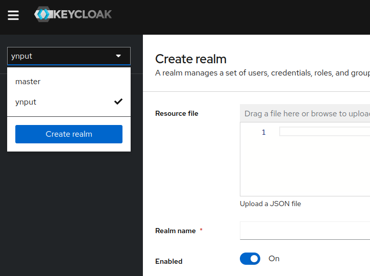
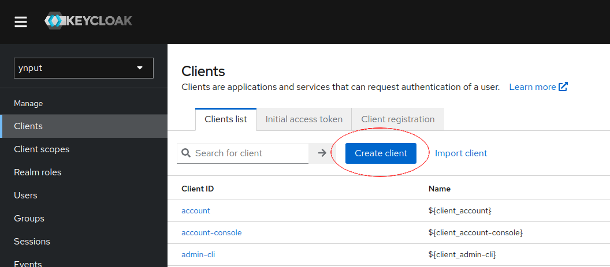
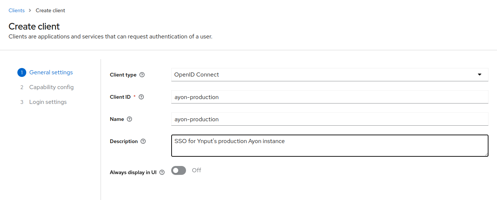
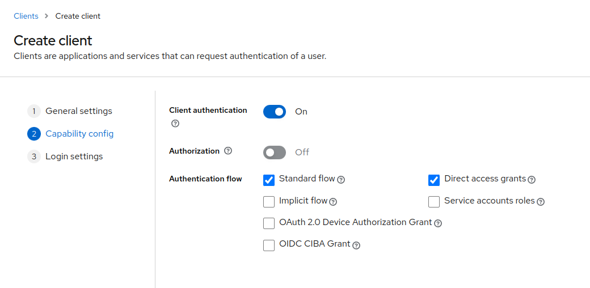
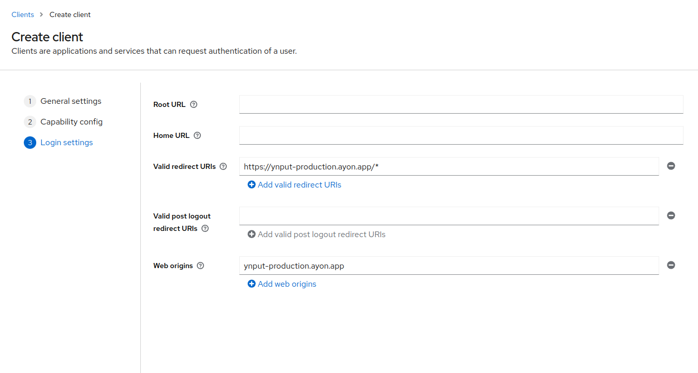
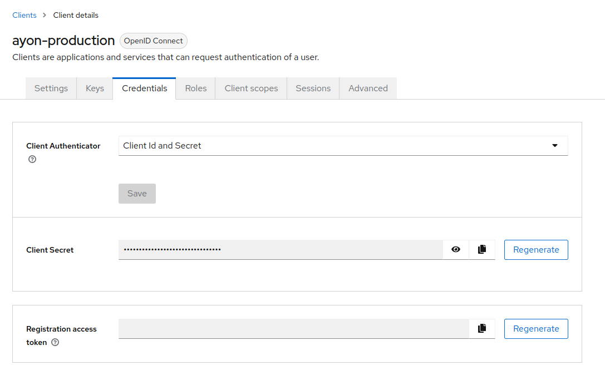
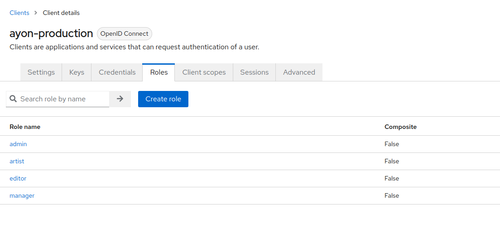
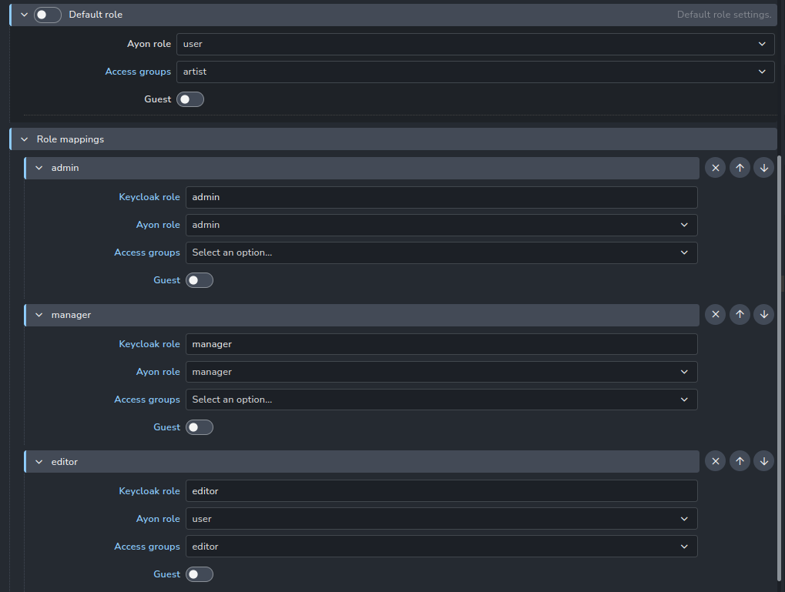

Keycloak addon provides SSO for Ayon using Keycloak (https://keycloak.org). 
Keycloak is an open-source IAM server supporting Google SSO, LDAP/AD user federation, 2FA, and more.

This addon requires a valid SSO license. 
See [https://ynput.io/ayon/pricing/](https://ynput.io/ayon/pricing/) for more information.

This guide outlines the steps to configure a new Keycloak instance for authentication. 
Follow these steps to create a realm, set up a client, configure client settings, and manage user roles.

Setting up Keycloak server
--------------------------

### Create or Re-use a Realm

Start by creating a new realm for authentication purposes. If a suitable realm already exists, 
you can re-use it for this setup. 

A realm is a basic organizational unit within Keycloak. 
As Keycloak supports multi-tenancy, a realm can represent a tenant or an organization. 
Realms are completely isolated environments, each with its user database and rules. 
The master realm should be used only for Keycloak administration.

When creating a new realm, you only need to assign it a name.

### Creating a client

A client is a single application that uses the authentication service. If a realm represents an organization, 
a client represents an Ayon instance. Multiple clients can be configured within a realm, 
for production and staging instances, or to hard limit access to a particular instance dedicated to a specific project.

Navigate to the realm's client page and click "Create client".

Select "OpenID Connect" as the "Client Protocol".

Assign a unique ID to your client in the "Client ID" field. It may be an instance identifier for example. 

In Ayon, save this value to the secrets database as `keycloak_client_id` 

### Client configuration

After creating the client, enable "Client Authentication" on the next page. 
Leave the other settings at their default values unless specific changes are required for your setup.

Add `http://yourserver/*` to the "Valid Redirect URIs" field. 
This URI is where Keycloak will send the authentication response. 

For "Web Origins", enter the `host:port` format, such as `localhost:3000` or `mydomain.example.app`. 
This setting specifies the allowed origins for CORS.

### Client Authentication and Secrets

After setting up the client, go to the "Credentials" tab and create/copy the client secret. 
This secret is used to authenticate your client with Keycloak. 

In Ayon, save it to the secrets database as `keycloak_client_secret`

### Setting up roles

In the "Roles" tab, create roles, that you then be able to map to ayon user levels and access groups

When user logs in, assigned client roles in Keycloak are matched to role mapping settings of the addon 
and if there is a match, Ayon role and Access groups are assigned to the user. 
If no Keycloak role matches and "Default role" is enabled, the user is assigned the default one. 
If "Default role" is disabled, the user is denied access to Ayon.

Users are matched using their email address. If the user with the same email already exists in Ayon, 
the existing account will be used and access rights updated according to Keycloak addon rules. 
Otherwise, a new user is created and the first part of the email address (before @) will be used as their username.

Roles are re-applied every time the user logs in.
Identity Providers and User Federation
Configure any identity providers (e.g., Google, Facebook) or user federation (e.g., LDAP, Active Directory) 
for your realm as needed. This allows for authentication using external user databases or social logins.

Please refer to Keycloak documentation for more information on configuring 
identity providers and their mapping to client roles.

After restarting the server and logging out, you will see a new "Log in using Keycloak" button on the login page.
