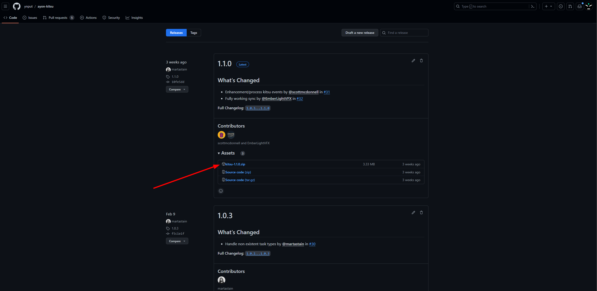
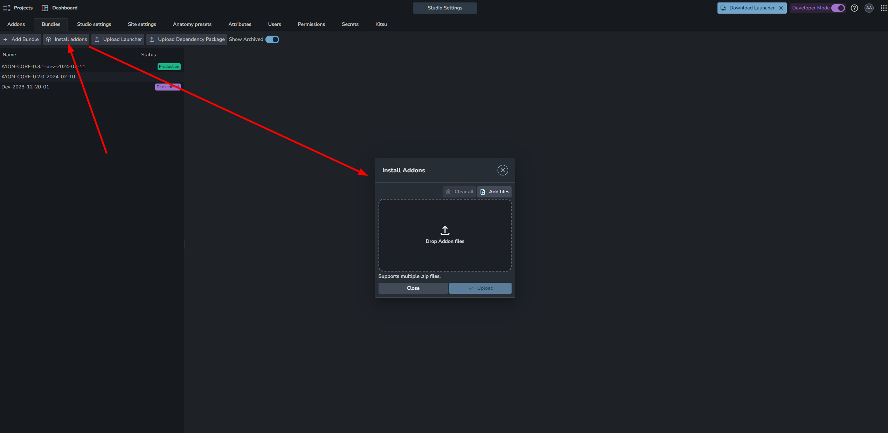
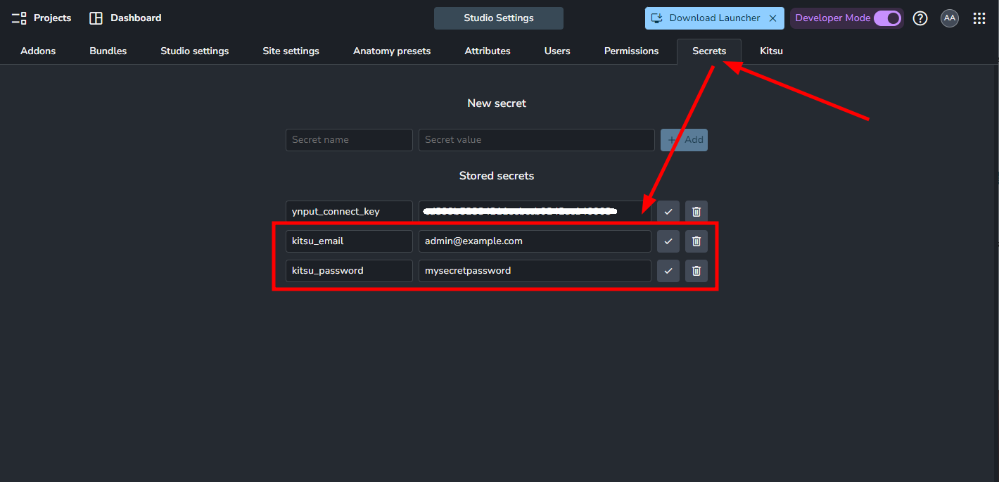
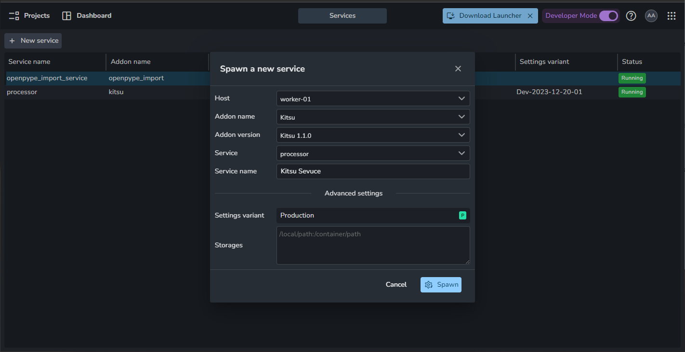
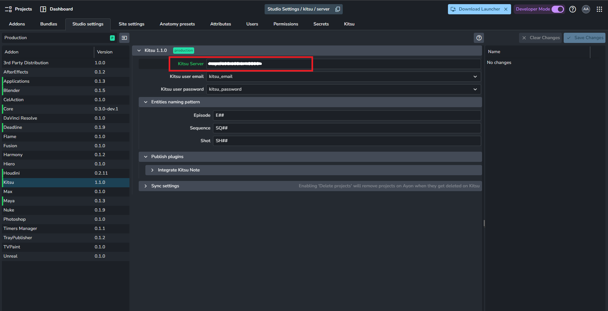
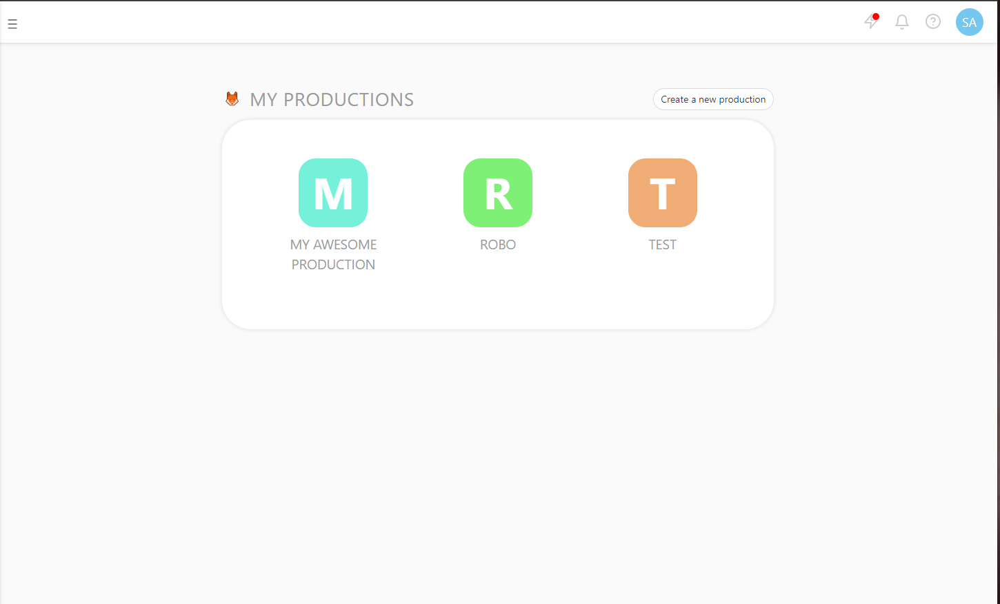
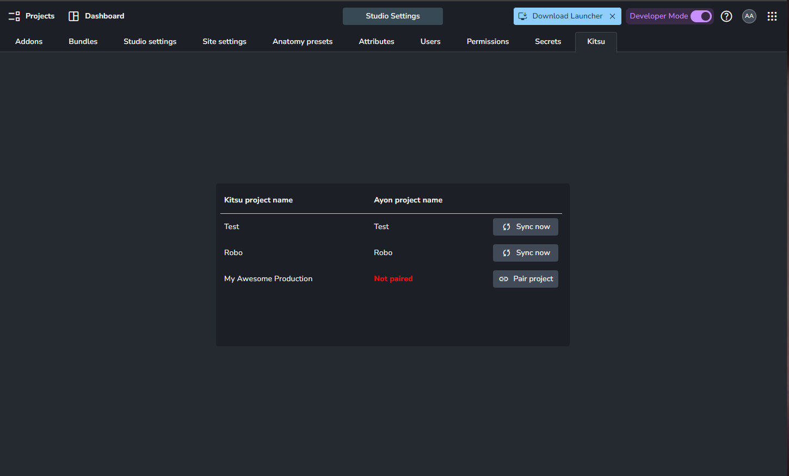
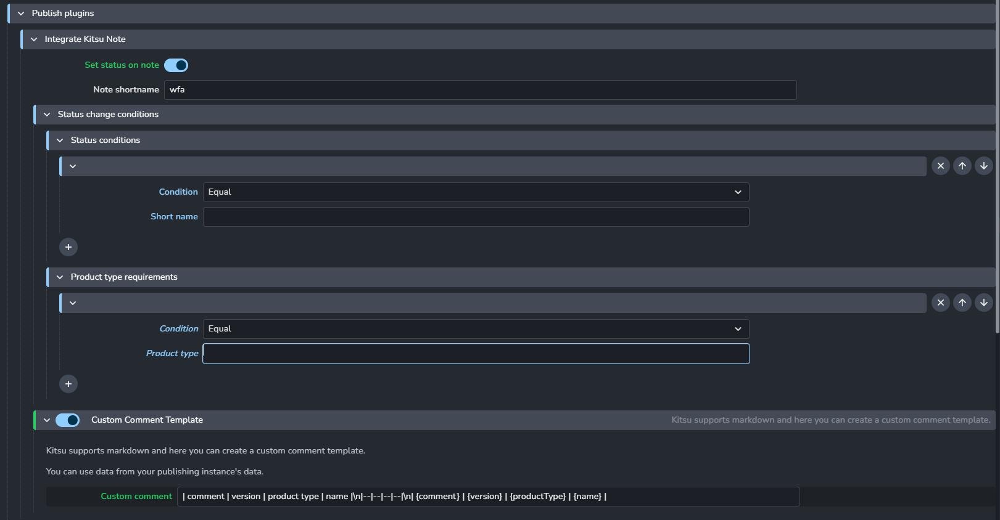
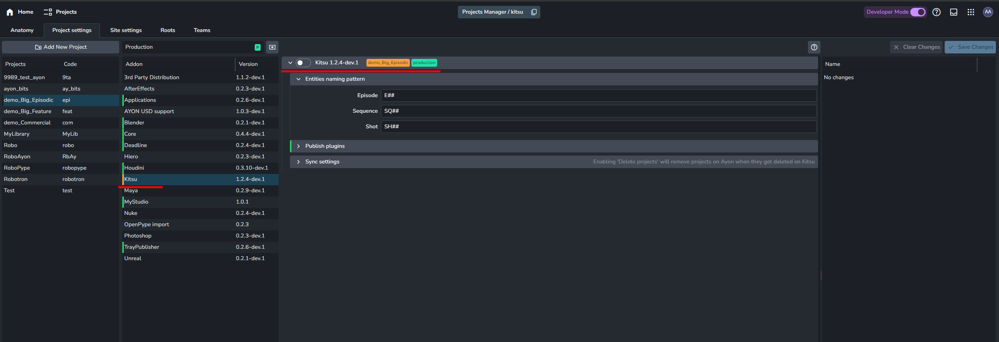

import ReactMarkdown from "react-markdown";
import versions from '@site/docs/assets/json/Ayon_addons_version.json'

<ReactMarkdown>
{versions.Kitsu_Badge}
</ReactMarkdown>

import Tabs from '@theme/Tabs';
import TabItem from '@theme/TabItem';

Kitsu is a great open source production tracker and can be used for project management instead of Ftrack. This documentation assumes that you are familiar with Kitsu and its basic principles. If you're new to Kitsu, we recommend having a thorough look at [Kitsu Official Documentation](https://kitsu.cg-wire.com/).

:::info prerequisites

-   Having Kitsu set up and running.   For more info refer to [official installation guide](https://zou.cg-wire.com/) or [community kitsu docker](https://github.com/EmberLightVFX/Kitsu-for-Docker)
-   Having [AYON Server Host (ASH)](https://github.com/ynput/ash) set up and running.
    :::

## Kitsu Addon Installation

If you have already connected your ayon instance to Ynput cloud, you would be able to get the addon from Addon Market.

### Manual Installation

Another method is to get it from Github releases and install it manually.

-   [Kitsu Addon Github Releases](https://github.com/ynput/ayon-kitsu/releases)

| Download Addon                                                 | Install Addon                                                   |
| -------------------------------------------------------------- | --------------------------------------------------------------- |
|  |  |

## Preparation for Kitsu Addon

Essential preparation for Kitsu addon to work.

1. Create New Bundle and set Kitsu addon version
2. Add Kitsu Admin Account to AYON Secrets.
3. Spawn Kitsu service.
4. Set Kitsu Server URL

### Create Bundle and Set Addon Version

Create new production bundle, Set Kitsu Addon version to your installed version, and finally restart server.

:::info NOTE
The Kitsu tab will only become visible once you set the bundle that includes the Kitsu addon to production mode.

Once you restart your server, the Kitsu tab will appear, but it will be empty initially.
:::

### Set Kitsu Admin Account

By default Kitsu addon expects two special keys in AYON secrets.

-   `kitsu_email`
-   `kitsu_password`

### Spawn Kitsu service

From Services, Create New Service.

:::caution
Kitsu service should be the same version as your Kitsu addon version.
If you already have a running Kitsu service, you can simply Right-click, delete it and create new one.
:::

### Server URL

:::tip
If you're operating your Kitsu instance with Docker and encounter a connection error, it's likely due to an incorrect IP address. Make sure to use the right one. For additional details, visit this community post: [Kitsu connection error (Could not login to Kitsu)](https://community.ynput.io/t/kitsu-connection-error-could-not-login-to-kitsu/1556/13).
:::

As soon as you set the `Server` url in Kitsu settings. And that's all!

-   `ayon+settings://kitsu/server`

## Synchronize

Synchronization is two step process.
From Kitsu Tab:

1. Click `Pair project`
2. Click `Sync now`

> Currently, Synchronization is one-way only **Kitsu ➜ AYON**.

| Kitsu Productions                            | Kitsu Tab                                  |
| -------------------------------------------- | ------------------------------------------ |
|  |  |

## Kitsu Addon Configuration

### Integrate Kitsu Note

Task status can be automatically set during publish thanks to `Integrate Kitsu Note`. This feature can be configured in:

-   `ayon+settings://kitsu/publish/IntegrateKitsuNote`.

Available settings:

-   `Set status on note`: Turns on and off this integrator.
-   `Note shortname`: Which status shortname should be set automatically (Case sensitive).
-   `Status change conditions`: Conditions that need to be met for kitsu status to be changed. You can add as many conditions as you like.
    -   `Status Conditions`: There are two fields to each conditions:
        -   `Condition` (Whether current status should be equal or not equal to the condition status)
        -   `Short name` (Kitsu Shortname of the condition status).
    -   `Product type requirements`
        -   `Condition` (Whether published product type should be equal or not equal to the condition status)
        -   `Product type` (AYON Product type)
-   `Custom Comment Template` -> when enabled, AYON publisher will use this template as Kitsu comment. You can use markdown as it's supported by Kitsu.

#### Custom Comment Template example

Here's an example template that makes a nice table.

-   `| comment | version | product type | name |\n|--|--|--|--|\n| {comment} | {version} | {productType} | {name} |`

:::tip Custom Comment Template
Artists need only to provide comment in publisher UI.
And, `Integrate Kitsu Note` will do the hard work for them.

:::

### Sync Settings

-   `Delete Projects`: Enabling 'Delete projects' will remove projects on Ayon when they get deleted on Kitsu
-   `Sync users` Sync Kitsu Users, their passwords and map Kitsu roles to AYON roles.
-   `Default sync info`
    -   Tasks (Name, Short Name, Icon)
    -   Statuses (Short Name, State, Icon)

## Q&A

### Is it safe to rename an entity from Kitsu?

:::caution
While changing the names of entities is allowed, Be aware it doesn't change the existent file names or publishes.
:::

Absolutely! Entities are linked by their unique IDs between the two databases.

-   If you rename an entity in the AYON project editor, this change won't show up in Kitsu. Instead, it will be replaced with the original name when the next sync happens.
-   When you rename an entity directly in Kitsu, the new name will be updated in AYON during the upcoming synchronization.

### Managing Multiple Production Tracker for Various Projects

To effectively manage multiple projects with different production tracker addons such as ShotGrid and Kitsu, you'll need to include both addons in your production bundle. It will allow their respective tabs to appear within the Ayon server interface.

Then, you should activate or deactivate each addon based on the specific needs of the project at hand.
You can usually do this within the project settings.

