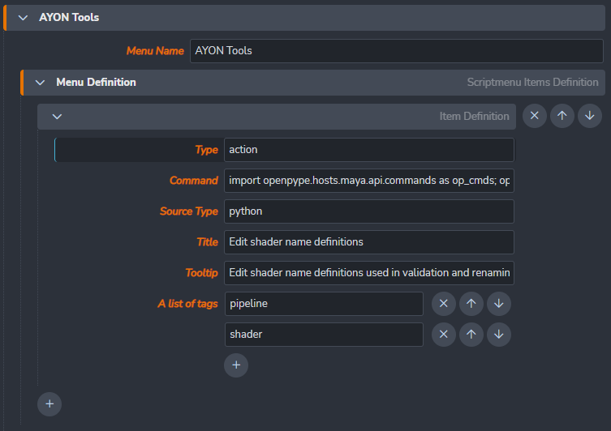

## Publish Plugins

### Render Settings Validator

`ValidateRenderSettings`

Render Settings Validator is here to make sure artists will submit renders with the correct settings. Some of these settings are needed by AYON but some can be defined by the admin using [AYON Settings UI](admin_settings.md).

AYON enforced settings include:

- animation must be enabled in output
- render prefix must start with `maya/<scene>` to make sure renders are in
correct directory
- there must be `<renderlayer>` or its equivalent in different renderers in
file prefix
- if multiple cameras are to be rendered, `<camera>` token must be in file prefix

For **Vray**:
- AOV separator must be set to `_` (underscore)

For **Redshift**:
- all AOVs must follow `<BeautyPath>/<BeautyFile>_<RenderPass>` image file prefix
- AOV image format must be same as the one set in Output settings

For **Renderman**:
- both image and directory prefixes must comply to `<layer>_<aov>.<f4>.<ext>` and `<ws>/renders/maya/<scene>/<layer>` respectively

For **Arnold**:
- there shouldn't be `<renderpass>` token when merge AOVs option is turned on

Additional check can be added via Settings - **Project Settings > Maya > Publish plugin > ValidateRenderSettings**.
You can add as many options as you want for every supported renderer. In first field put node type and attribute and in the second required value. You can create multiple values for an attribute, but when repairing it'll be the first value in the list that get selected.


In this example we've put `aiOptions.AA_samples` in first one and `6` to second to enforce
Arnolds Camera (AA) samples to 6.

Note that `aiOptions` is not the name of node but rather its type. For renderers there is usually
just one instance of this node type but if that is not so, validator will go through all its
instances and check the value there. Node type for **VRay** settings is `VRaySettingsNode`, for **Renderman**
it is `rmanGlobals`, for **Redshift** it is `RedshiftOptions`.

:::info getting attribute values
If you do not know what an attributes value is supposed to be, for example for dropdown menu (enum), try changing the attribute and look in the script editor where it should log what the attribute was set to.
:::

### Model Name Validator

`ValidateModelName`

This validator can enforce specific names for model members. It will check them against **Validation Regex**.
There is special group in that regex - **shader**. If present, it will take that part of the name as shader name
and it will compare it with list of shaders defined either in file name specified in **Material File** or from
database file that is per project and can be directly edited from Maya's *AYON Tools > Edit Shader name definitions* when
**Use database shader name definitions** is on. This list defines simply as one shader name per line.


For example - you are using default regex `(.*)_(\d)*_(?P<shader>.*)_(GEO)` and you have two shaders defined
in either file or database `foo` and `bar`.

Object named `SomeCube_0001_foo_GEO` will pass but `SomeCube_GEO` will not and `SomeCube_001_xxx_GEO` will not too.

#### Top level group name
There is a validation for top level group name too. You can specify whatever regex you'd like to use. Default will
pass everything with `_GRP` suffix. You can use *named capturing groups* to validate against specific data. If you
put `(?P<asset>.*)` it will try to match everything captured in that group against current asset name. Likewise you can
use it for **product** and **project** - `(?P<product>.*)` and `(?P<project>.*)`.

**Example**

You are working on asset (shot) `0030_OGC_0190`. You have this regex in **Top level group name**:
```regexp
.*?_(?P<asset>.*)_GRP
```

When you publish your model with top group named like `foo_GRP` it will fail. But with `foo_0030_OGC_0190_GRP` it will pass.

:::info About regex
All regexes used here are in Python variant.
:::

## AYON Tools
You can add your custom tools menu into Maya by extending definitions in **Maya -> Scripts Menu Definition**.



## Multiplatform path mapping
You can configure path mapping using Maya `dirmap` command. This will add bi-directional mapping between
list of paths specified in **Settings**. You can find it in **Settings -> Project Settings -> Maya -> Maya Directory Mapping**


## Templated Build Workfile

Building a workfile using a template designed by users. Helping to assert homogeneous products hierarchy and imports. Template stored as file easy to define, change and customize for production needs.

 **1. Make a template**

Make your template. Add families and everything needed for your tasks. Here is an example template for the modeling task using a placeholder to import a gauge.


If needed, you can add placeholders when the template needs to load some assets. **AYON > Template Builder > Create Placeholder**


- **Configure placeholders**

Fill in the necessary fields (the optional fields are regex filters)


    - Builder type: Whether the the placeholder should load current asset representations or linked assets representations

    - Representation: Representation that will be loaded (ex: ma, abc, png, etc...)

    - Family: Family of the representation to load (main, look, image, etc ...)

    - Loader: Placeholder loader name that will be used to load corresponding representations

    - Order: Priority for current placeholder loader (priority is lowest first, highet last)

- **Save your template**


 **2. Configure Template**

- **Go to Project Settings > Maya > Templated Build Settings**
- Add a profile for your task and enter path to your template


**3. Build your workfile**

- Open maya

- Build your workfile


