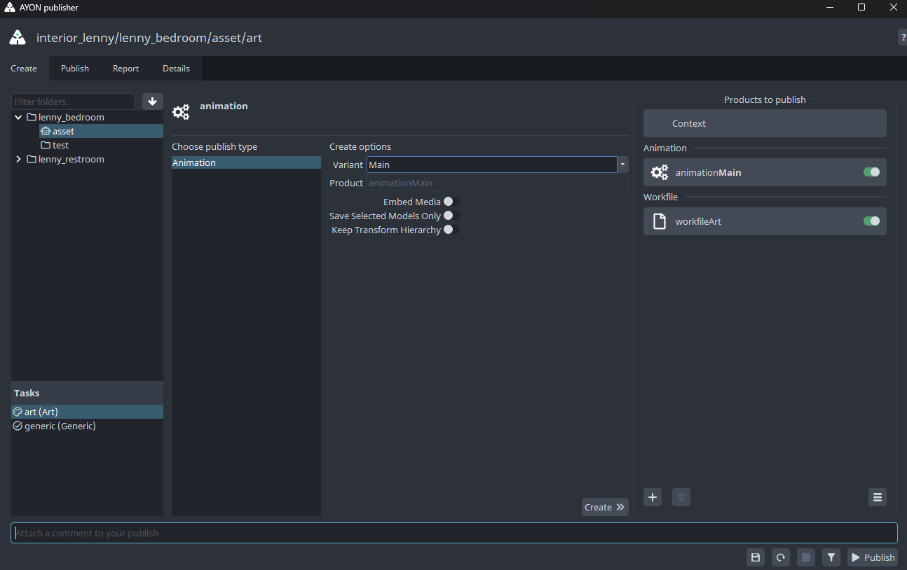
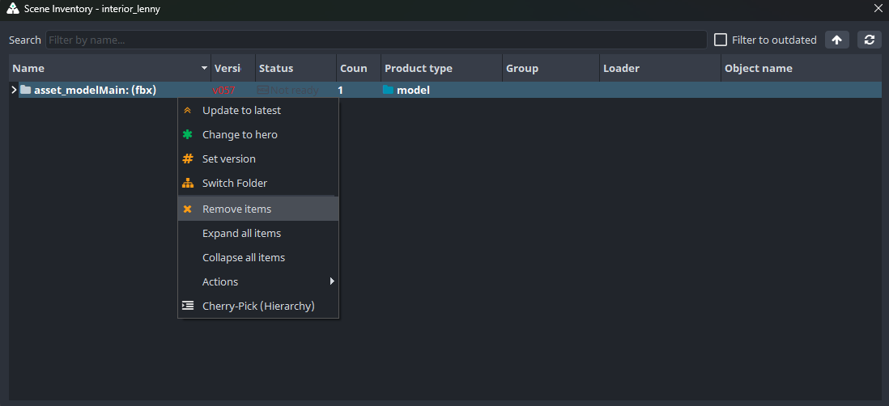

import ReactMarkdown from "react-markdown";
import versions from '@site/docs/assets/json/Ayon_addons_version.json'

<ReactMarkdown>
{versions.MotionBuilder_Badge}
</ReactMarkdown>

:::note Work in progress
This part of documentation is still work in progress.
:::
## First Steps With AYON
With AYON plugins in Motionbuilder, you can save/load project in workfile tools, load your rig/character/animation into the scene, and publish your scene and animation.

Locate **AYON Icon** in the OS tray (if hidden dive in the tray toolbar).

> If you cannot locate the AYON icon ...it is not probably running so check [Getting Started](artist_getting_started.md) first.

By clicking the icon  ```AYON Menu``` rolls out.


Choose ```AYON Menu > Launcher``` to open the ```Launcher``` window.

When opened you can **choose** the **project** to work in from the list. Then choose the particular **asset** you want to work on then choose **task**
and finally **run Motionbuilder by its icon** in the tools.


:::note Launcher Content
The list of available projects, assets, tasks and tools will differ according to your Studio and need to be set in advance by supervisor/admin.
:::

## Running in the Motionbuilder

If Motionbuilder has been launched via OP Launcher there should be **AYON Menu** visible in Motionbuilder **top header** after start.
This is the core functional area for you as a user. Most of your actions will take place here.


:::note AYON Menu
User should use this menu exclusively for **Opening/Saving** when dealing with work files not standard ```File Menu``` even though user still being able perform file operations via this menu but preferably just performing quick saves during work session not saving actual workfile versions.
:::

## Creating and Publishing Instances

:::warning Important
Before proceeding further please check [Glossary](artist_concepts.md) and [What Is Publishing?](artist_publish.md) So you have clear idea about terminology.
:::

### Intro

Current MotionBuilder Integration supports ```Workfile```and ```Animation``` product types for publishing while ```Animation```, ```Camera```,
```Model```and ```Rig``` for loading.

Both **Animation** and **Workfile** product type are outputting the animation in FBX format. **Workfile** product type generally outputs all objects from the scene. **Animation** product type allow users to choose export by model selections and their FBX export options before publishing.

## Publish Animation
Select the objects in the scene you want to export and go **AYON -> Create** and select **Animation**.
There are several FBX options available being user customizable in AYON: *Embed Media*, *Save Selected Models Only*, *Keep Transform Hierarchy*

*Embed Media*: When enabled, it is possible to embed all media into FBX file. If the FBX being in ASCII format then it is impossible to embed any media in.

*Save Selected Models Only*: Only selected models will be saved.

*Keep Transform Hierarchy*: Indicate if transform hierarchy is kept when SaveSelectedModelsOnly is true. Default value is false to ensure consistent behavior with SaveSelected operation via file menu.




If you turn on *Save Selected Models Only*, and select your model in the scene, the model is added to the created set. AYON would solely publish the animated model under the set.


## Loading Products
The pointcache loader only imports the asset in FBX format which is published from ```Animation```, ```Camera```, ```Model```and ```Rig```.

The loader will create the set which includes the loaded assets. All these assets are with the namespace, which is useful for updating assets.

## Removing Products
If the users remove the assets by going to **AYON -> Manage**, right-click and **Remove items**. The assets would be removed along with its namespace.

