import ReactMarkdown from "react-markdown";
import versions from '@site/docs/assets/json/Ayon_addons_version.json'

<ReactMarkdown>
{versions.Nuke_Badge}
</ReactMarkdown>

:::note
AYON supports Nuke version **`13.0`** and above.
:::

:::caution Nuke License compatibility
The AYON Nuke addon integration is compatible exclusively with the `commercial` license of Nuke, which provides Full Python API Support and pipeline functionality. Please note that the `non-commercial` and `indie` licenses lack full Python API support and, as a result, are not supported by the addon.

For more details, check out the comparison between different Nuke licenses [here](https://learn.foundry.com/nuke/content/getting_started/meet_nuke/about_indie.html).
:::

## AYON global tools

-   [Work Files](artist_tools_workfiles.md)
-   [Create](artist_tools_creator.md)
-   [Publish](artist_tools_publisher.md)
-   [Load](artist_tools_loader.md)
-   [Manage (Inventory)](artist_tools_inventory.md)
-   [Library Loader](artist_tools_library_loader.md)

## Nuke specific tools

### Set Frame Ranges

Use this feature in case you are not sure the frame range is correct.

##### Result

-   setting Frame Range in script settings
-   setting Frame Range in viewers (timeline)

 <!-- picture needs to be changed -->

<figure>

<figcaption>

1.  limiting to Frame Range without handles
2.  **Input** handle on start
3.  **Output** handle on end

</figcaption>
</figure>

### Set Resolution

This menu item will set correct resolution format for you defined by your production.

##### Result

-   creates new item in formats with project name
-   sets the new format as used

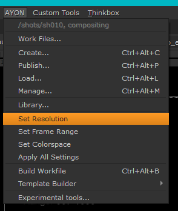 <!-- picture needs to be changed -->

### Set Colorspace

This menu item will set correct Colorspace definitions for you. All has to be configured by your production (Project coordinator).

##### Result

-   set Colorspace in your script settings
-   set preview LUT to your viewers
-   set correct colorspace to all discovered Read nodes (following expression set in settings)

See [Nuke Color Management](addon_nuke_artist.md#nuke-color-management)

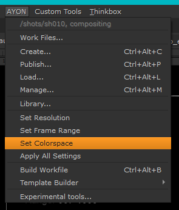 <!-- picture needs to be changed -->

### Apply All Settings

It is usually enough if you once per while use this option just to make yourself sure the workfile is having set correct properties.

##### Result

-   set Frame Ranges
-   set Colorspace
-   set Resolution

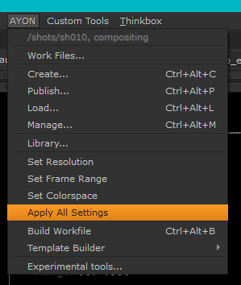 <!-- picture needs to be changed -->

### Push to Project

This tool enables you to transfer your workfile to any accessible project. It simplifies packing and moving a workfile to a Library project. Additionally, It's handy when a shot spans multiple projects and requires the same workfile in each. The tool systematically processes all linked resources and relocates them to the new destination within the `/resources` folder.

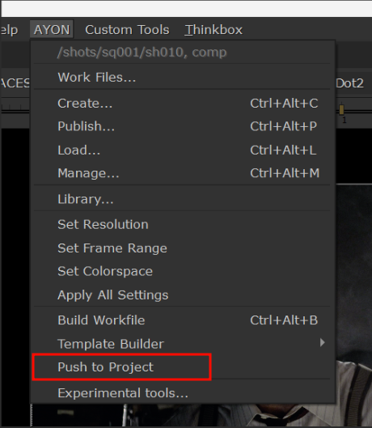 <!-- picture needs to be changed -->

1. Choose the desired project for the workfile.
2. Pick the specific folder within the project for the workfile.
3. Determine the task context.
4. Click 'OK' and await completion.

A confirmation message will display the workfile's destination path.

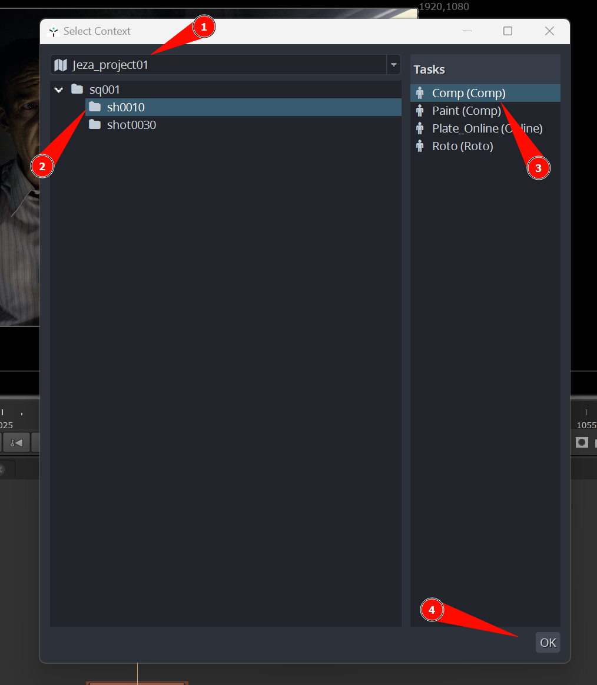 <!-- picture needs to be changed -->

## Nuke QuickStart

This QuickStart is short introduction to what AYON can do for you. It attempts to make an overview for compositing artists, and simplifies processes that are better described in specific parts of the documentation.

<iframe width="512px" height="288px" src="https://www.youtube.com/embed/jgwmLOPJg0g" frameborder="0" modestbranding="1" allow="accelerometer; autoplay; encrypted-media; gyroscope; picture-in-picture" allowfullscreen="1"></iframe>

### Launch Nuke - Shot and Task Context
AYON has to know what shot and task you are working on. You need to run Nuke in context of the task, using Ftrack Action or AYON Launcher to select the task and run Nuke.

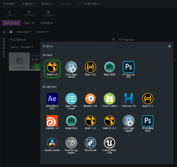
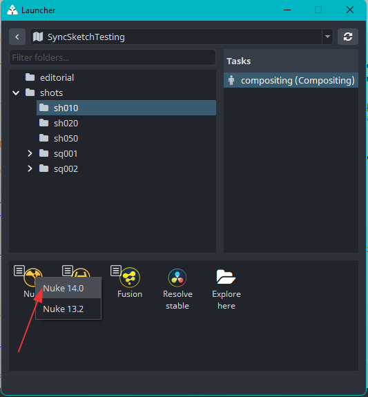

:::tip Admin Tip - Nuke version
You can [configure](admin_settings_project_anatomy.md#Attributes) which DCC version(s) will be available for current project in **Studio Settings → Project → Anatomy → Attributes → Applications**
:::

### Nuke Initial setup
Nuke AYON menu shows the current context

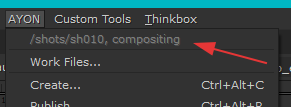

Launching Nuke with context stops your timer, and starts the clock on the shot and task you picked.

AYON makes initial setup for your Nuke script. It is the same as running [Apply All Settings](addon_nuke_artist.md#apply-all-settings) from the AYON menu.

- Reads frame range and resolution from Avalon database, sets it in Nuke Project Settings,
Creates Viewer node, sets it’s range and indicates handles by In and Out points.

- Reads Color settings from the project configuration, and sets it in Nuke Project Settings and Viewer.

- Sets project directory in the Nuke Project Settings to the Nuke Script Directory

:::tip Tip - Project Settings
After Nuke starts it will automatically **Apply All Settings** for you. If you are sure the settings are wrong just contact your supervisor and he will set them correctly for you in project database.
:::

### Save Nuke script – the Work File
Use AYON - Work files menu to create a new Nuke script. AYON offers you the pre-configured naming.
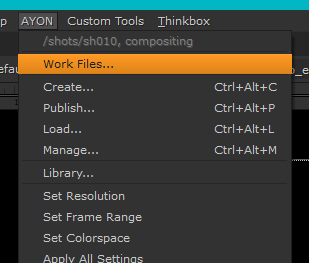

The Next Available Version checks the work folder for already used versions and offers the lowest unused version number automatically.

Subversion can be used to distinguish or name versions. For example used to add shortened artist name.

More about [workfiles](artist_tools_workfiles.md).

:::tip Admin Tips
- **Workfile Naming**

  - The [workfile naming](admin_settings_project_anatomy.md#templates) is configured in anatomy
    - ***Studio Settings* → Anatomy presets Tab → Templates → Work → default**
    - ***Projects Settings* → [select project] → Anatomy Tab → Templates → Work → default**

- **Open Workfile**

  - You can [configure](addon_nuke_admin.md#create-first-workfile) Nuke to automatically open the last version, or create a file on startup.
    - ***Studio Settings* → Studio settings → [select Core] → Tools → Open last workfile on launch**
    - ***Projects Settings* → [select project] → [select Core] → Tools → Open last workfile on launch**

- **Nuke Color Settings**

  - [Color setting](admin_colorspace.md#configuration-of-host-settings) for Nuke can be found in:
    - ***Studio Settings* → Studio settings → [select Nuke] → Color Management (imageio)**
    - ***Projects Settings* → [select project] → [select Nuke] → Color Management (imageio)**
:::

### Load plate
Use Load from AYON menu to load any plates or renders available.
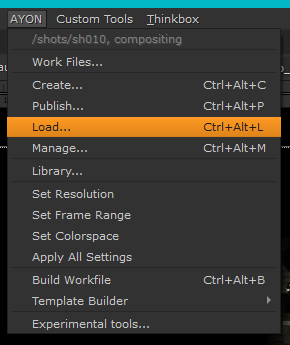
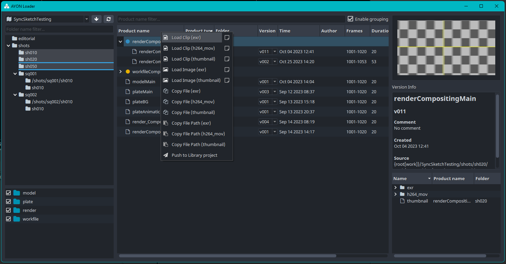

Pick the plate asset, right click and choose Load Image Sequence to create a Read node in Nuke.

Note that the Read node created by AYON is green. Green color indicates the highest version of asset is loaded. Asset versions could be easily changed by [Manage](#managing-versions). Lower versions will be highlighted by orange color on the read node.

More about [Asset loader](artist_tools_loader).

### Create Write Node
To create AYON managed Write node, select the Read node you just created, from AYON menu, pick Create.
In the Instance Creator, pick Create Write Render, and Create.

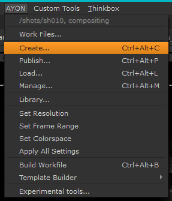
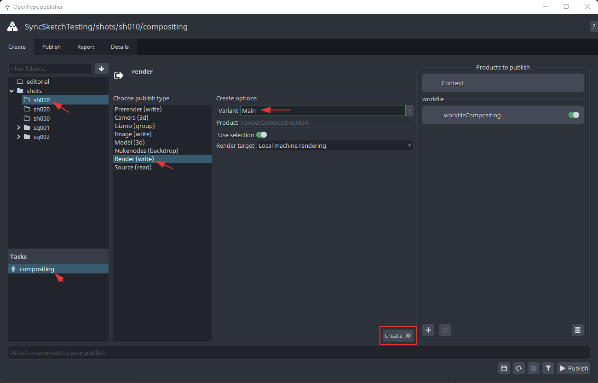

This will create a Group with a Write node inside.

#### Configuring write node

You can configure write node parameters in **Studio Settings → Nuke → Color Management (imageio) → Nodes** (ayon+settings://nuke/imageio/nodes).

These settings allow you to configure:
* node to use for product type (e.g. `Write`)
* knobs default

:::note
By default AYON relies on the `file_type` knob default to configure the extension of the output Write node.
However some extensions do not match the `file_type`.
In which case, set the `file_type` knob and enforce the relevant extension via an additional `ext` knob default.

For example:
* Stereo EXR (sxr): `file_type = exr` and `ext = sxr`
* JPEG/JPG: `file_type = jpeg` and `ext = jpg`
:::

### Create Prerender Node
Creating Prerender is very similar to creating AYON managed Write node.

<iframe width="512px" height="288px" src="https://www.youtube.com/embed/er4SztHFN-w" frameborder="0" modestbranding="1" allow="accelerometer; autoplay; encrypted-media; gyroscope; picture-in-picture" allowfullscreen="1"></iframe>

### What Nuke Publish Does
From Artist perspective, Nuke publish gathers all the stuff found in the Nuke script with Publish checkbox set to on, exports stuff and raises the Nuke script (workfile) version.

The Pyblish dialog shows the progress of the process.

The left column of the dialog shows what will be published. Typically it is one or more renders or prerenders, plus work file.

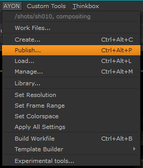
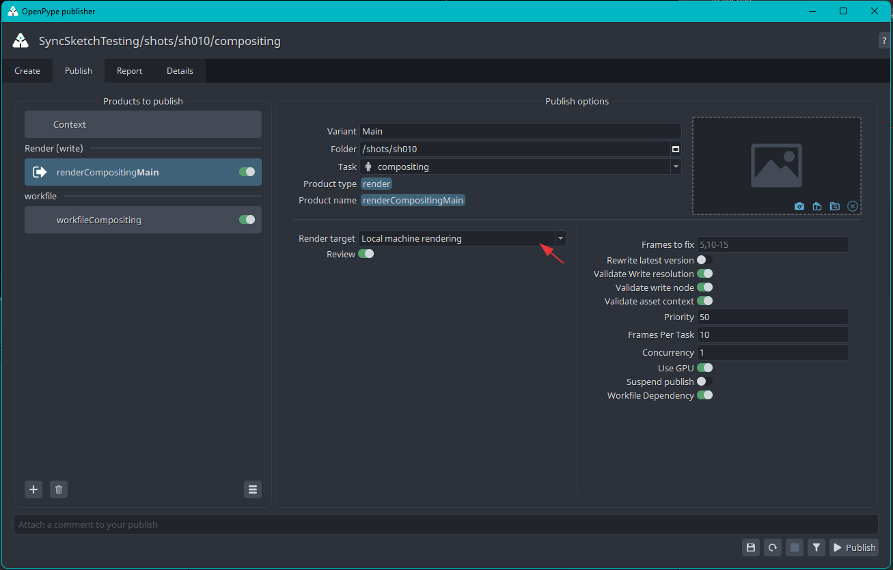

The right column shows the publish steps

##### Publish steps
1. Gathers all the stuff found in the Nuke script with Publish checkbox set to on
2. Collects all the info (from the script, database…)
3. Validates components to be published (checks render range and resolution...)
4. Extracts data from the script
   -  generates thumbnail
   -  creates review(s) like h264
   -  adds burnins to review(s)
   -  Copies and renames components like render(s), review(s), Nuke script... to publish folder
5. Integrates components (writes to database, sends preview of the render to Ftrack ...
6. Increments Nuke script version, cleans up the render directory

Gathering all the info and validating usually takes just a few seconds. Creating reviews for long, high resolution shots can however take significant amount of time when publishing locally.

##### Publish iteration Note

Artist can add Note before firing the publish button. The Note is meant for easy communication between artist and supervisor. After publish, Note can be seen in any integrated Project Management platforms.

##### Product publishing activation

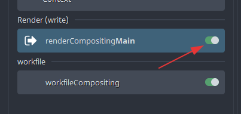

If you run the publish and decide to not publish the render product, you can turn it off right in the Publish dialog by clicking on the toggle.

More info about [Using Pyblish](artist_tools_publisher.md)

:::tip Admin Tip - Configuring validators
You can configure Nuke validators like Output Resolution in:
  - ***Studio Settings* → Studio settings → [select Nuke] → Publish Plugins**
  - ***Projects Settings* → [select project] → [select Nuke] → Publish Plugins**
:::

### Review
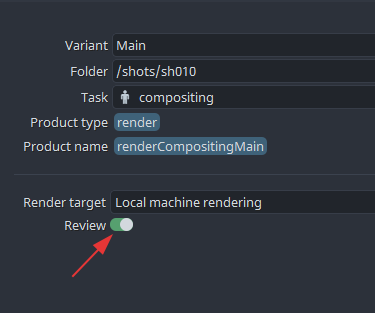

When you turn the review checkbox on in your AYON write node, here is what happens:
- AYON uses the current Nuke script to
  - Load the render
  - Optionally apply LUT
  - Render Prores 4444 with the same resolution as your render
- Use Ffmpeg to convert the Prores to whatever review(s) you defined
- Use Ffmpeg to add (optional) burnin to the review(s) from previous step

Creating reviews is a part of the publishing process. If you choose to do a local publish or to use existing frames, review will be processed also on the artist's machine.
If you choose to publish on the farm, you will render and do reviews on the farm.

So far there is no option for using existing frames (from your local / check render) and just do the review on the farm.

More info about [configuring reviews](addon_core_settings.md#extract-review).

:::tip Admin Tip - Configuring Reviews
You can configure reviewsin **Studio Settings → Project → Global → Publish plugins → ExtractReview / ExtractBurnin**
Reviews can be configured separately for each host, task, or family. For example Maya can produce different review to Nuke, animation task can have different burnin then modelling, and plate can have different review then model.
:::

### Render and Publish

Let’s say you want to render and publish the shot right now, with only a Read and Write node. You need to decide if you want to render, check the render and then publish it, or you want to execute the render and publish in one go.

If you wish to check your render before publishing, you can use your local machine or your farm to render the write node as you would do without AYON, load and check your render (AYON Write has a convenience button for that), and if happy, use publish with Use existing frames option selected in the write node to generate the review on your local machine.

If you want to render and publish on the farm in one go, run publish with On farm option selected in the write node to render and make the review on farm.

### Rewriting old version

Sometimes, it can be beneficial to rewrite only selected frames of a long image sequence. The Nuke integration includes a specific feature for local renders that makes this possible.

In the Publisher UI, there are the following fields:
- `Frames to Fix` – where the artist can specify the frame range to be re-rendered.
- `Rewrite Latest Version` – a toggle that determines whether the last version should be updated in place, or if a new version should be created using the old frames, with only the newly re-rendered ones applied on top.

#### Render Attributes

- `Workfile Dependency` - when submitting the render to Deadline, the workfile is will added as an asset dependency putting the job in pending state initially. Once the workfile path is available to Deadline, the job will be released.
- `Use Published Workfile` - when submitting the render to Deadline, the workfile used for rendering will be the published workfile. If false, the workfile from the work area will be used.

### Version-less Render

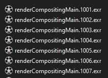

AYON is configured so your render file names have no version number until the render is fully finished and published. The main advantage is that you can keep the render from the previous version and re-render only part of the shot. With care, this is handy.

Main disadvantage of this approach is that you can render only one version of your shot at one time. Otherwise you risk to partially overwrite your shot render before publishing copies and renames the rendered files to the properly versioned publish folder.

When making quick farm publishes, like making two versions with different color correction, care must be taken to let the first job (first version) completely finish before the second version starts rendering.

<iframe width="512px" height="288px" src="https://www.youtube.com/embed/j95OITIWJk8" frameborder="0" modestbranding="1" allow="accelerometer; autoplay; encrypted-media; gyroscope; picture-in-picture" allowfullscreen="1"></iframe>

### Managing Versions

AYON checks all the assets loaded to Nuke on script open. All out of date assets are colored orange, up to date assets are colored green.

Use Manage to switch versions for loaded assets.

### Loading Effects
This video show how to publish effect from Hiero / Nuke Studio, and use the effect in Nuke.

<iframe width="512px" height="288px" src="https://www.youtube.com/embed/zFoH7bq-w0E" frameborder="0" modestbranding="1" allow="accelerometer; autoplay; encrypted-media; gyroscope; picture-in-picture" allowfullscreen="1"></iframe>

<iframe width="512px" height="288px" src="https://www.youtube.com/embed/HzZDdtII5io" frameborder="0" modestbranding="1" allow="accelerometer; autoplay; encrypted-media; gyroscope; picture-in-picture" allowfullscreen="1"></iframe>

### Nuke Color Management

<iframe width="512px" height="288px" src="https://www.youtube.com/embed/NKjQHkuwkSM" frameborder="0" modestbranding="1" allow="accelerometer; autoplay; encrypted-media; gyroscope; picture-in-picture" allowfullscreen="1"></iframe>

## Troubleshooting

### Fixing Validate Containers

If your Pyblish dialog fails on Validate Containers, you might have an old asset loaded. Use AYON - Manage... to switch the asset(s) to the latest version.

<iframe width="512px" height="288px" src="https://www.youtube.com/embed/hridMybn5nA" frameborder="0" modestbranding="1" allow="accelerometer; autoplay; encrypted-media; gyroscope; picture-in-picture" allowfullscreen="1"></iframe>

### Fixing Validate Version
If your Pyblish dialog fails on Validate Version, you might be trying to publish already published version. Rise your version in the AYON WorkFiles SaveAs.

Or maybe you accidentally copied write node from different shot to your current one. Check the write publishes on the left side of the Pyblish dialog. Typically you publish only one write. Locate and delete the stray write from other shot.

<iframe width="512px" height="288px" src="https://www.youtube.com/embed/Ic9z4gKnHAA" frameborder="0" modestbranding="1" allow="accelerometer; autoplay; encrypted-media; gyroscope; picture-in-picture" allowfullscreen="1"></iframe>

### Inconsistent FBX Camera loading

When loading an FBX camera, you may encounter incomplete loading error, particularly if your wokfile already contains Alembic (ABC) data. Although Nuke supports [FBX camera imports](https://learn.foundry.com/nuke/content/comp_environment/3d_compositing/importing_fbx_cameras.html), the Camera node can sometimes fail to load the FBX file properly.

This issue often arises because ABC and FBX formats seem to share a common loading context, which can lead to conflicts when both are present in the same workfile.

**To resolve this:**
1. Try manually reloading the FBX file. 
2. Make sure the `node name` is set to the Camera. 

:::info Default FBX Views
views like "Producer Perspective," "Producer Top," and "Producer Bottom" are default FBX views that Nuke adds automatically.
:::

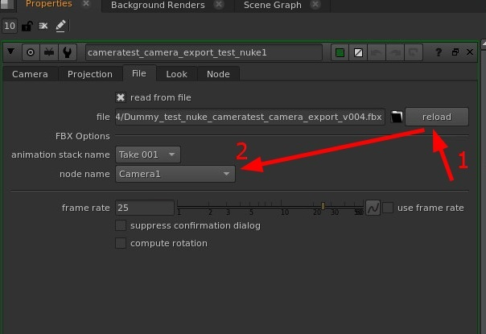
