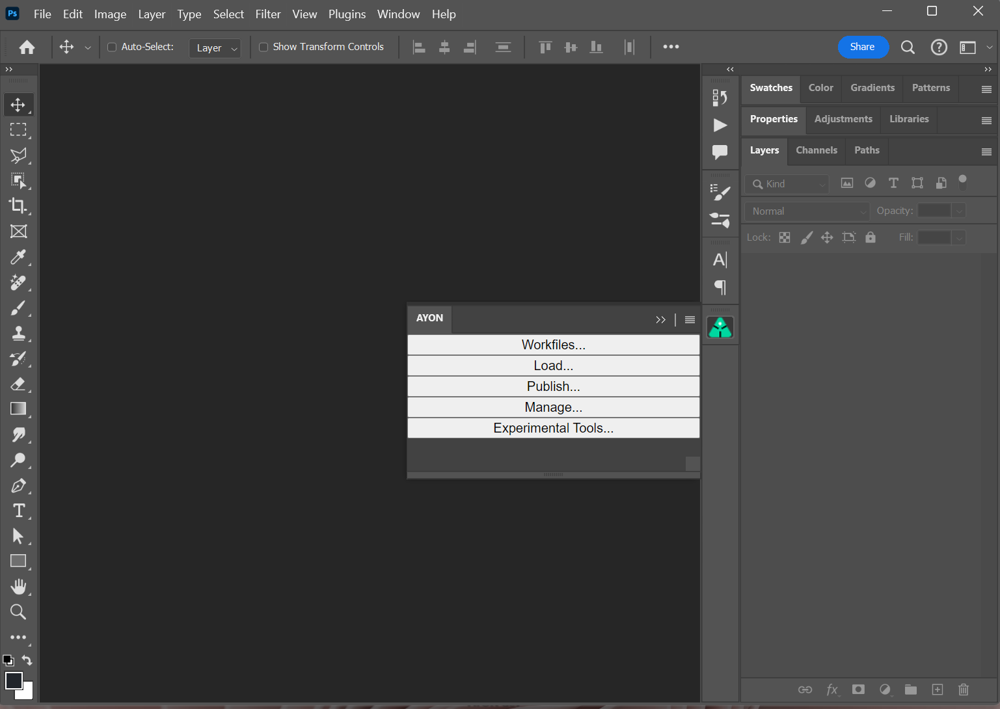
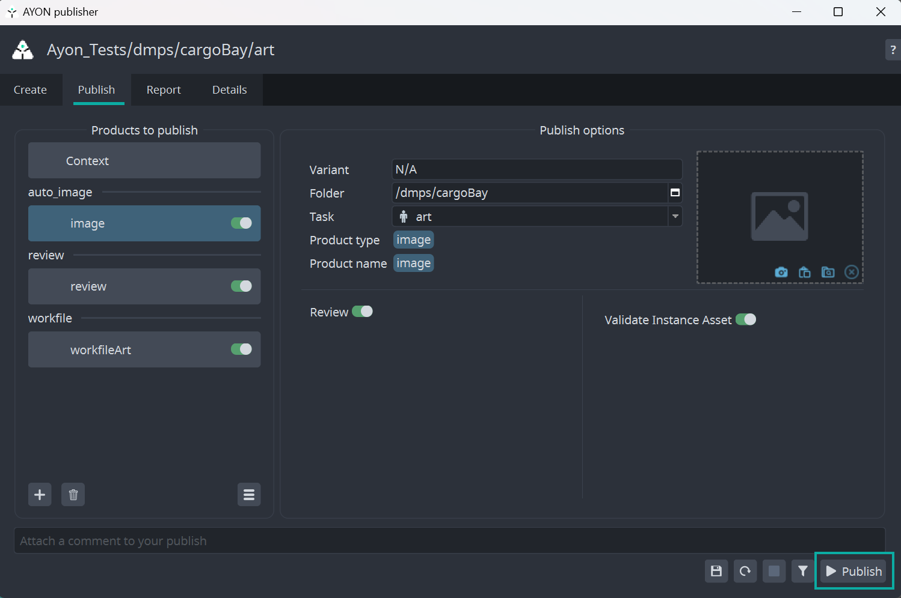
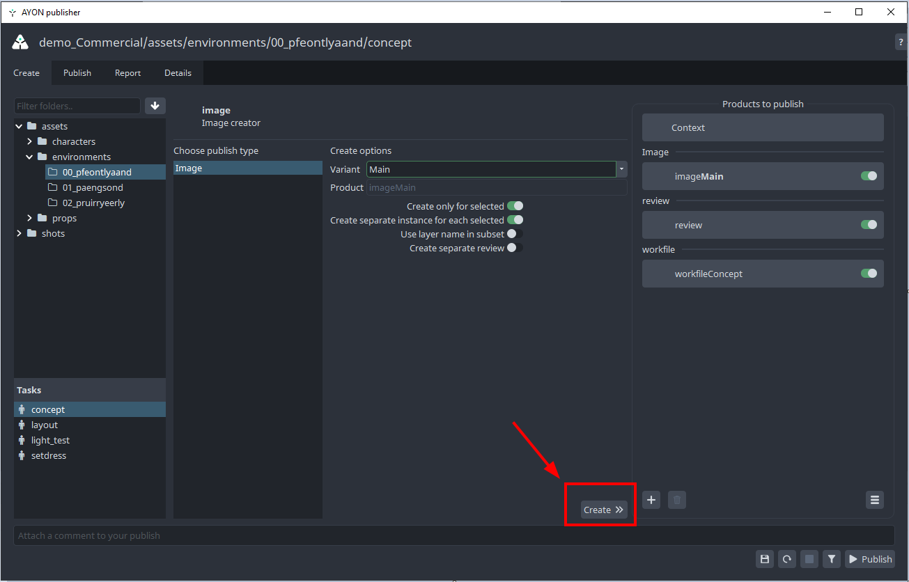
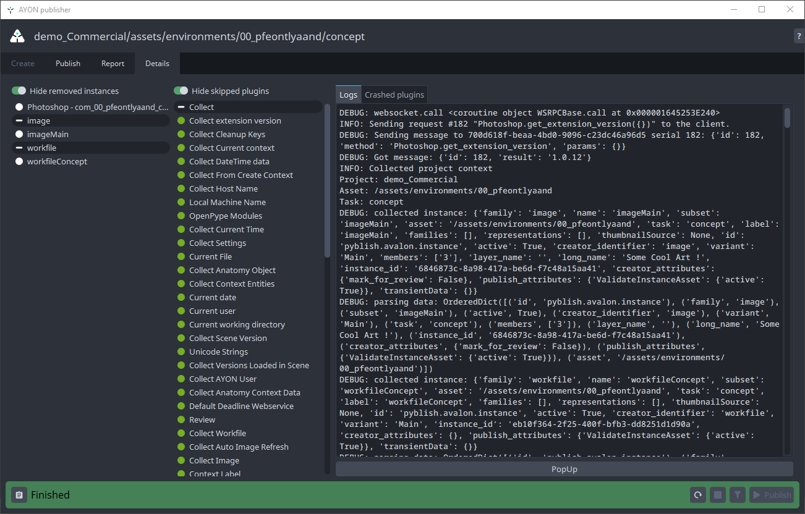
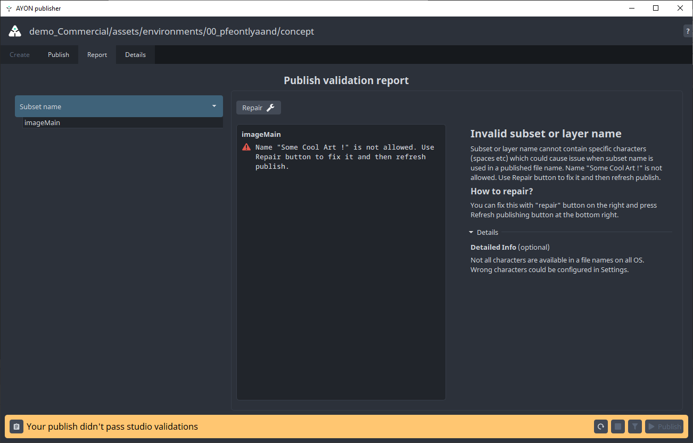

import ReactMarkdown from "react-markdown";
import versions from '@site/docs/assets/json/Ayon_addons_version.json'

<ReactMarkdown>
{versions.Photoshop_Badge}
</ReactMarkdown>

## Available Tools

-   [Work Files](artist_tools_workfiles)
-   [Create](artist_tools_creator)
-   [Load](artist_tools_loader)
-   [Publish](artist_tools_publisher)
-   [Manage](artist_tools_inventory)

## Setup

To install the extension, download, install [Anastasyi's Extension Manager](https://install.anastasiy.com/). Open Anastasyi's Extension Manager and select Photoshop in menu. Then go to `{path to PS addon}hosts/photoshop/api/extension.zxp`.

(Current location will be most likely in artist `AppData`, on Windows it would be something like `c:\Users\YOUR_USER\AppData\Local\Ynput\AYON\addons\core_X.X.X\ayon_core\hosts\photoshop\api`.
On Linux look in `~/.local/share/Ynput/AYON/addons`, on Mac `~/Library/Application Support/Ynput/AYON/addons`)
This location is temporary until full separation of addons is implemented. Artist must start Tray at least once for Ayon server to populate this location.)

## Usage

When you launch Photoshop you will be met with the Workfiles app. If you don't have any previous workfiles, you can just close this window.

In Photoshop you can find the tools in the `AYON` extension:

 <!-- picture needs to be changed -->

You can show the extension panel by going to `Window` > `Extensions` > `AYON`.

### Publish

When you are ready to share some work, you will need to publish. This is done by opening the `Publisher` through the `Publish...` button.

There is always instance for workfile created automatically (see 'workfileArt' item in `Products to publish` column.) This allows to publish (and therefore backup)
workfile which is used to produce another publishable elements (as `image` and `review` items).

#### Create

Main publishable item in Photoshop will be of `image` product type. Result of this item (instance) is picture that could be loaded and used in another DCCs (for example as
single layer in composition in AfterEffects, reference in Maya etc).

There are couple of options what to publish:
- separate image per layer (or group of layers)
- all visible layers (groups) flattened into single image

In most cases you would like to keep `Create only for selected` toggled on and select what you would like to publish. Toggling this off
will allow you to create instance(s) for all visible layers without a need to select them explicitly.

For separate layers option keep `Create separate instance for each selected` toggled, select multiple layers and hit `Create >>>` button in the middle column.

This will result in:

(In Photoshop's `Layers` tab standard layers will be wrapped into group and enriched with ℗ symbol to denote publishable instance. With `Create separate instance for each selected` toggled off
it will create only single publishable instance which will wrap all visible layers.)

Name of publishable instance (eg. product name) could be configured with a template in `project_settings/global/tools/creator/product_name_profiles`.
(This must be configured by admin who has access to AYON Settings.)

Trash icon under the list of instances allows to delete any selected `image` instance.

Workfile instance will be automatically recreated though. If you do not want to publish it, use pill toggle on the instance item.

If you would like to modify publishable instance, click on `Publish` tab at the top. This would allow you to change name of publishable
instances, disable them from publishing, change their task etc.

Publisher allows publishing into different context, just click on any instance, update `Variant`, `Asset` or `Task` in the form in the middle and don't forget to click on the 'Confirm' button.

#### Validate

If you would like to run validation rules set by your Studio, click on funnel icon at the bottom right. This will run through all
enabled instances, you could see more information after clicking on `Details` tab.

In this dialog you could see publishable instances in left column, triggered plugins in the middle and logs in the right column.

In left column you could see that `review` instance was created automatically. This instance flattens all publishable instances or
all visible layers if no publishable instances were created into single image which could serve as a single reviewable element (for example in Ftrack).

Creation of Review could be disabled in `project_settings/photoshop/publish/CollectReview`.

If you are satisfied with results of validation phase (and there are no errors there), you might hit `Publish` button at bottom right.
This will run through extraction phase (it physically creates images from `image` instances, creates `review` etc) and publishes them
(eg. stores files into their final destination and stores metadata about them into DB).
This part might take a while depending on amount of layers in the workfile, amount of available memory and performance of your machine.

You may encounter issues with publishing which will be indicated with red squares. If these issues are within the validation section, then you can fix the issue. If there are issues outside of validation section, please let the AYON team know.

You can always start new publish run with a circle arrow button at the bottom right. You might also want to move between phases (Create, Update etc)
by clicking on available tabs at the top of the dialog.

#### Simplified publish

There is a simplified workflow for simple use case where only single image should be created containing all visible layers.
No image instances must be present in a workfile and `project_settings/photoshop/publish/CollectInstances/flatten_product_template` must be filled in Settings.
Then artists just need to hit 'Publish' button in menu.

#### Repair Validation Issues

If there is some issue in validator phase, you will receive something like this:

All validators will give some description about what the issue is. You can inspect this by clicking on items in the left column.

If there is an option of automatic repair, there will be `Repair` button on the right. In other case you need to fix the issue manually.
(By deleting and recreating instance etc.)

#### Buttons on the bottom right are for:
- `Refresh publishing` - set publishing process to starting position - useful if previous publish failed, or you changed configuration of a publish
- `Stop/pause publishing` - if you would like to pause publishing process at any time
- `Validate` - if you would like to run only collecting and validating phases (nothing will be published yet)
- `Publish` - standard way how to kick off full publishing process

### Load

When you want to load existing published work, you can load in smart layers through the `Loader`. You can reach the `Loader` through the extension's `Load` button.

The supported product types for Photoshop are:

- `image`

To load an image, right-click on the product you want and choose a representation:

### Manage

Now that we have some images loaded, we can manage which version is loaded. This is done through the `Scene Inventory`. You can reach it through the extension's `Manage` button.

:::note
Loaded images has to stay as smart layers in order to be updated. If you rasterize the layer, you cannot update it to a different version.
:::

You can switch to a previous version of the image or update to the latest.

#### Support help
If you would like to ask for help admin or support, you could use any of the three options on the `Note` button on bottom left:
- `Go to details` - switches into a more detailed list of published instances and plugins.
- `Copy report` - stash full publishing log to a clipboard
- `Export report` - save log into a file for sending it via mail or any communication tool

If you are able to fix the workfile yourself, use the first button on the right to set the UI to initial state before publish. (Click the `Publish` button to start again.)

#### Legacy instances

All screenshots from Publish are from updated dialog, before publishing was being done by regular `Pyblish` tool.
New publishing process should be backward compatible, eg. if you have a workfile with instances created in the previous publishing approach, they will be translated automatically and
could be used right away.

If you hit on unexpected behaviour with old instances, contact support first, then you could try to delete and recreate instances from scratch.
Nuclear option is to purge workfile metadata in `File > File Info > Origin > Headline`. This is only for most determined daredevils though!
