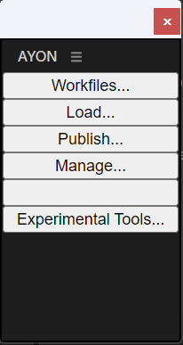
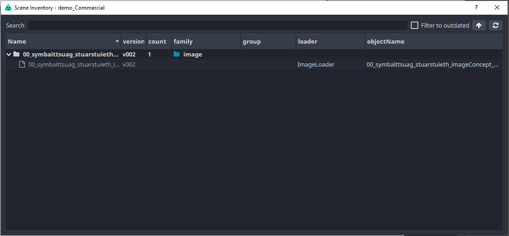
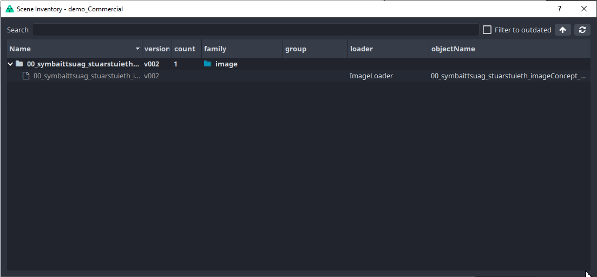
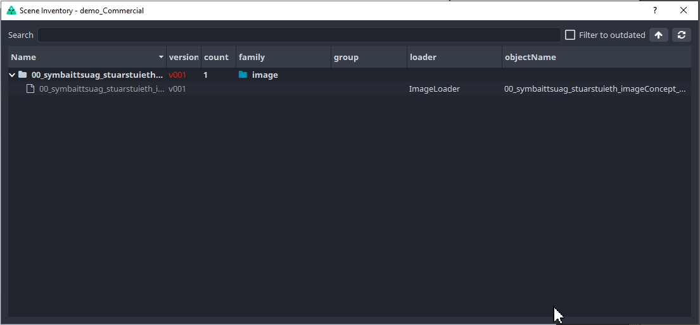

import ReactMarkdown from "react-markdown";
import versions from '@site/docs/assets/json/Ayon_addons_version.json'
import Tabs from '@theme/Tabs';
import TabItem from '@theme/TabItem';

<ReactMarkdown>
{versions.Premiere_Badge}
</ReactMarkdown>

<!-- based on PS implementation, same principle and menu -->
## Available Tools

-   [Work Files](artist_tools_workfiles.md)
-   [Create](artist_tools_creator.md)
-   [Load](artist_tools_loader.md)
-   [Publish](artist_tools_publisher.md)
-   [Manage](artist_tools_inventory.md)

## Premiere Extension installation

:::info
Once your admin has activated `Premiere` in the production bundle, you need to run the AYON launcher at least once. This allows the launcher to download the addon to the correct location on your computer. 
After that, you can continue with the installation instructions for the Premiere extension.
:::

<Tabs
groupId="platforms"
defaultValue="win"
values={[
{label: 'Windows', value: 'win'},
{label: 'Linux', value: 'linux'},
{label: 'Mac', value: 'mac'},
]}>

<TabItem value="win">

1. Use your favorite app to install extensions. We recommend using [Anastasyi's Extension Manager](https://install.anastasiy.com/).
2. Locate and install the `extension.zxp` file. You can find it in the `AppData` folder, typically at `c:\Users\YOUR_USER\AppData\Local\Ynput\AYON\addons\premiere_X.X.X\ayon_premier\api`.

:::tip
You can quickly navigate to the local app data using the environment variable shortcut: `%LOCALAPPDATA%`. For example, using `%LOCALAPPDATA%\Ynput\AYON\addons` as path to see your installed addons.
:::

</TabItem>

<TabItem value="linux">

1. Use your favorite app to install extensions.
2. Locate and install the `extension.zxp` file. You can find it in the user data folder, typically at `~/.local/share/Ynput/AYON/addons/premiere_X.X.X/ayon_premier/api`.

</TabItem>

<TabItem value="mac">

1. Use your favorite app to install extensions. We recommend using [Anastasyi's Extension Manager](https://install.anastasiy.com/).
2. Locate and install the `extension.zxp` file. You can find it in the `Application Support` folder, typically at `~/Library/Application Support/Ynput/AYON/addons/premiere_X.X.X/ayon_premier/api`.

</TabItem>

</Tabs>

## Implemented functionality

Premiere implementation currently allows you to:
- import and add various media to sequences (image plates, renders, audio files, video files etc.)
- manage workfiles (eg. load existing, publish new ones)

## Usage

When you launch Premiere you will be met with the Workfiles app. If don't have any previous workfiles, you can just close this window.

Workfiles tools takes care of saving your `.prproj` files in the correct location and under a correct name. You should use it instead of standard file saving dialog.

In Premiere you'll find the tools in the `AYON` extension:

 

You can show the extension panel by going to `Window` > `Extensions` > `AYON`.

:::note guide
On newer MacOS you need to:
- go to `Applications/Adobe Premiere XXXX`
- right clicking on the `Adobe Premiere XXXX.app`
- then `Get Info`, check `Open using Rosetta`
:::

### Publish

When you are ready to share some work, you will need to publish it. This is done by opening the `Publisher` through the `Publish...` button.

There is always instance for workfile created automatically (see 'workfileCompositing' item in `Products to publish` column.) This allows to publish (and therefore backup) workfile which is used to produce another publishable elements (as `image` and `review` items).

Name of publishable instance (eg. product name) could be configured with a template in `project_settings/global/tools/creator/product_name_profiles`.
(This must be configured by admin who has access to AYON Settings.)

Workfile instance will be automatically recreated though. If you do not want to publish it, use pill toggle on the instance item.

If you would like to modify publishable instance, click on `Publish` tab at the top. This would allow you to change name of publishable instances, disable them from publishing, change their task etc.

Publisher allows publishing into different context, just click on any instance, update `Variant`, `Folder` or `Task` in the form in the middle and don't forget to click on the 'Confirm' button.

### Load

When you want to load existing published work, you can use the `Loader` tool. You can reach it in the extension's panel.

 <!-- picture needs to be changed -->

The supported product types for loading into Premiere are:

- `image`
- `plate`
- `render`
- `prerender`
- `review`
- `audio`

To load an item, right-click on the product you want and choose a representation you want to load:

### Manage

Now that we have some content loaded, you can manage which version is loaded. This is done through the `Scene Manager`. You can reach it through the extension's `Manage` button.

:::note
Loaded images have to stay as smart layers in order to be updated. If you rasterize the layer, you can no longer update it to a different version using AYON tools.
:::

You can switch to a previous version of the image or update to the latest.

#### Support help
If you would like to ask for help admin or support, you could use any of the three options on the `Note` button on bottom left:
- `Go to details` - switches into a more detailed list of published instances and plugins.
- `Copy report` - stash full publishing log to a clipboard
- `Export report` - save log into a file for sending it via mail or any communication tool

If you are able to fix the workfile yourself, use the first button on the right to set the UI to initial state before publish. (Click the `Publish` button to start again.)

### Experimental tools

Currently empty. Could contain special tools available only for specific hosts for early access testing.

### Metadata management

For AYON integration to work, some information about loaded items or create instances is stored directly 
into `.pproj` file.

For this new dummy Bin with name `AYON Metadata - DO NOT DELETE` is always automatically created. This Bin 
shouldn't be touched or all information about loaded containers would be lost!

But if you encounter some unrecovered error, `Publisher` or `Scene Inventory` windows wouldn't show up, 
you might try to delete this Bin. It will be re-created after pushing on `Publish...` menu item.

(For curious metadata are physically stored in this `Bin.Clip.Description`)