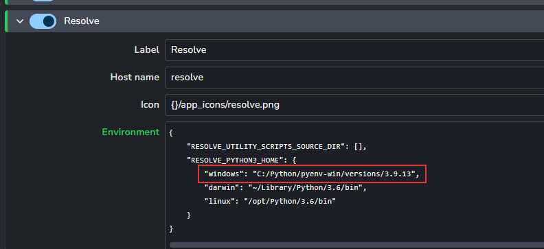
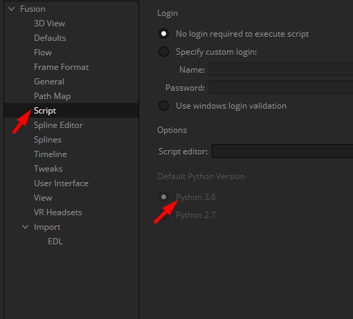

import ReactMarkdown from "react-markdown";
import versions from '@site/docs/assets/json/Ayon_addons_version.json'

<ReactMarkdown>
{versions.Resolve_Badge}
</ReactMarkdown>

import Tabs from '@theme/Tabs';
import TabItem from '@theme/TabItem';

## Resolve requirements
Resolve is using its own python interpreter which cannot be connected to Ayon. This interpreter needs to have installed PySide2 (or PySide6 if on MacOS) and OpenTimelineIO dependencies for Ayon to work correctly. Bellow you can find instructions on how to install them into an installed Python of your choice.

Resolve 17 is using Python 3.6.2
Resolve 18 is using Python 3.9.x


### Configuring settings for Python home directory
To be able to run python in Resolve you need to set `RESOLVE_PYTHON3_HOME` environment variable to the directory path of your Python interpreter version.

Open your server Studio settings and go to **Application** addon `ayon+settings://applications/applications/resolve`. Here you can add the path to the **Environment** section.




### Installing Python dependencies

#### PySide2

AYON is using its own window widget inside Resolve, for that reason PySide2 (or PySide6 if on MacOS) has to be installed into the python.

```bash
cd <a path you had set to RESOLVE_PYTHON3_HOME>
python.exe -m pip install PySide2
```

### OpenTimelineIO

AYON is using OpenTimelineIO for editorial publishing. OpenTimelineIO has to be installed into the python.

```bash

```bash
cd <a path you had set to RESOLVE_PYTHON3_HOME>
python.exe -m pip install OpenTimelineIO
```

### Debugging if Python is not working in Resolve


#### Set Resolve's Fusion settings for Python 3.6 interpreter

In case Resolve is not showing Ayon menu, please have a look into Resolve's console and click to P3 tab. If it is not working then Python is not correctly connected to Resolve. One of the reasons might be that Fusion is not set to use Python 3.6 interpreter.

As it is shown in below picture you have to go to Fusion Tab and then in Fusion menu find Fusion Settings. Go to Fusion/Script and find Default Python Version and switch to Python 3.6



