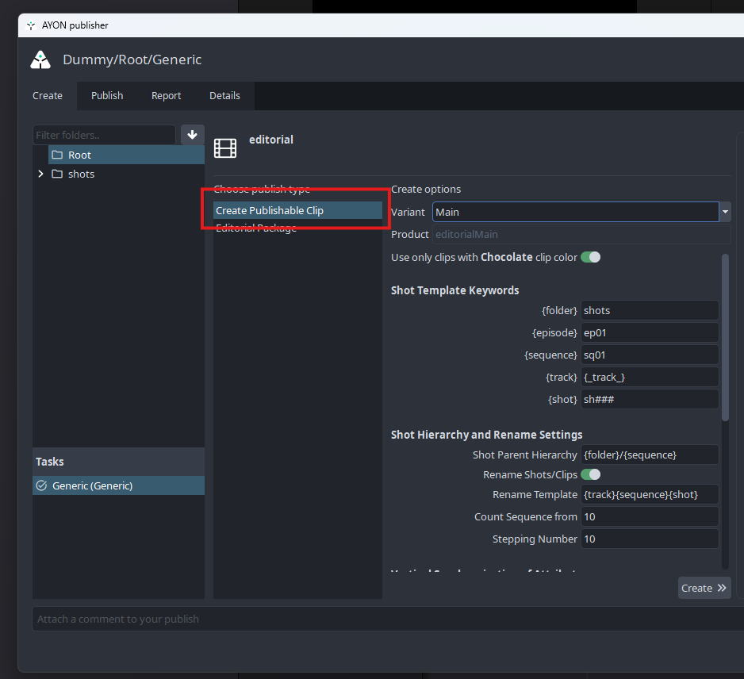
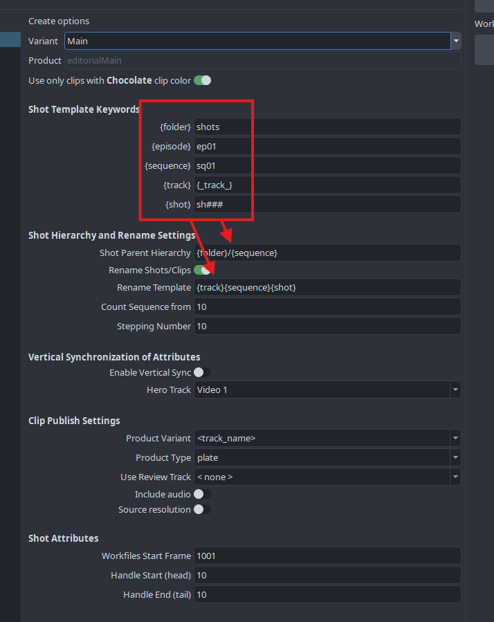
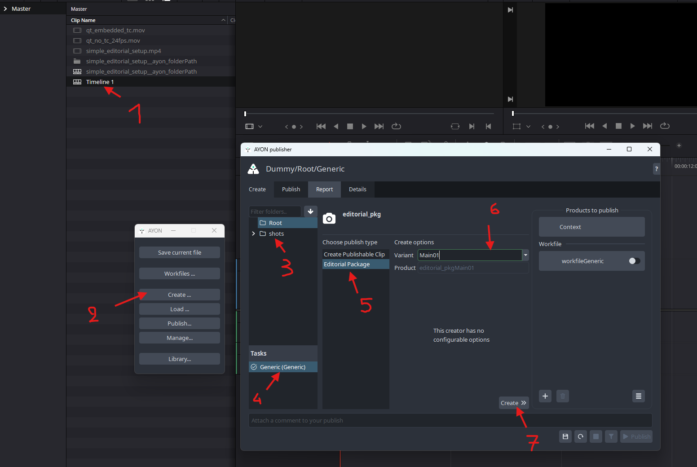
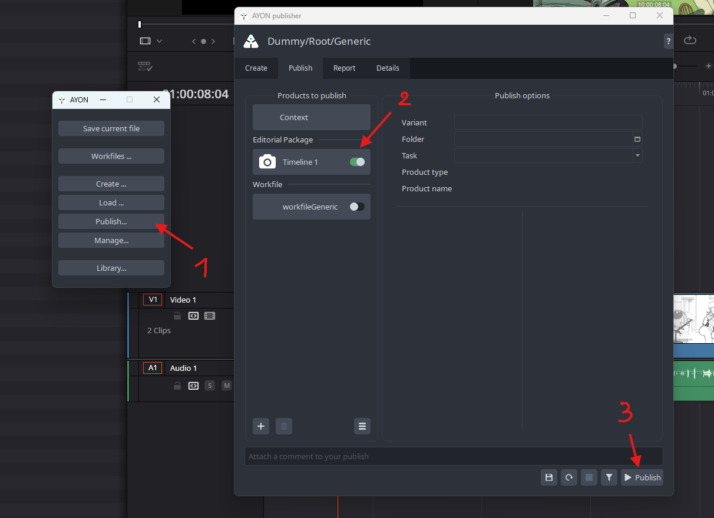

import ReactMarkdown from "react-markdown";
import versions from '@site/docs/assets/json/Ayon_addons_version.json'

<ReactMarkdown>
{versions.Resolve_Badge}
</ReactMarkdown>

import Tabs from '@theme/Tabs';
import TabItem from '@theme/TabItem';

:::warning
Before you are able to start with AYON tools in DaVinci Resolve, installation of its own Python 3.6 interpreter and PySide 2 has to be done. Go to [Installation of python and pyside](addon_resolve_admin.md#installation-of-python-and-pyside) link for more information.
:::

:::note
Resolve Studio is the only version that works with the Ayon toolkit because of external scripting requirements.
:::

## AYON global tools

-   [Work Files](artist_tools_workfiles.md)
-   [Create](artist_tools_creator.md)
-   [Load](artist_tools_loader.md)
-   [Manage (Inventory)](artist_tools_inventory.md)
-   [Publish](artist_tools_publisher.md)

## Report Fps and Resolution from AYON task

It is possible for AYON to automatically set the Resolve project FPS and Resolution settings from the current task.
This feature can be enabled via the `ayon+settings://resolve/report_fps_resolution` addon setting.

**Note that AYON can only handle this for workfiles opened through the [Workfile Menu](./artist_tools_workfiles.md) or at Startup**.

Unfortunately, Resolve has some limitations that can prevent those settings from being properly reported:
* If one or multiple timeline(s) already exist within the Project, the project FPS settings might become non-editable.
* Resolve only supports a subset of common industry-standard FPS (see Resolve help for more information)
* Resolve only supports a subset of common industry-standard Pixel Aspect Ratio
* Vertical Resolution cannot be set automatically, this has to be done through the project settings 

## Creating Shots from timeline items

Before a clip can be published with [Publisher](artist_tools_publisher.md) timeline item has to be marked with AYON metadata markers. This way it is converted to a publishable product.

Lets do it step by step.

### Color clips before opening Create menu

Timeline video clips should be colored to `Chocolate` color for AYON to se it as selected for product creation.

### Rename timeline track names

To be able to work with dynamic product name, which is based on track names it is recommended to rename those tracks to what type of plates their clips represent. Commonly used ones are `main`, `review`, `fg01`, `fg02`, `bg`, `bg01`, etc. It is completely up to you but we recommend to always have at least `main` plate. For example if a clip is on track **element** and product family is set to **plate** then the resulting product name will be **plateElement**

  

The name of the resulting *product* can be seen in the **AYONData** marker.
    

Simple track setup where we are only using `main` and  `review` track names.

An example of used track names. The yellow frame is highlighting vertically aligned clips - which are going to be renamed and grouped together under one asset (shot) name. The concept of vertical renaming will be explained later in [Vertical Synchronization of Product Attributes](#vertical-synchronization-of-product-attributes).

### Create menu...

After all clips which are intended to be converted to publishable instances are colored to `Chocolate` color, you can open AYON menu.

After the menu widget is opened (it can take while so be patient please :).

Hit `Create ...` and then select the product type to **Create Publishable Clip**.

You can leave `Use only clips with Chocolate clip colors` enabled to publish only the selection.

The Product name can stay as it is, it is not going to be used because each clip will generate it's own name.

The "Create options" section let you define various attributes for your future products and shots.

Set Rename clips to active if you wish to use different names of shots in pipeline then the original clip names conformed from EDL/XML.

**Count sequence from** - Start of the shot numbering if `#` is used in one of the keywords

**Stepping number** - Sequential gaps in the numbering

As you can see the in `{shot}` key within *Shot Template Keywords* section, you can use `#` symbol do define padding of the number in sequence and where it's going to be used.

Notice the relationship of following sections. Keys from **Shot Template Keywords** sections will be used for formatting of templates in **Shot Hierarchy And Rename Settings** section.

**Shot parent hierarchy** will be forming parents of the asset (shot) *the hidden root for this is project folder*. So for example of this template we will get resulging string `shots/sq01`

**Clip name template** in context of clip sitting on track name `main` in second position `mainsq01sh020`. This is due track key is hosting `{_track_}` which is inheriting name form timeline track name. Other allowed namespases are:
- `{_sequence_}`: timeline name
- `{_clip_}`: clip name
- `{_trackIndex_}`: position of track on timeline from bottom
- `{_clipIndex_}`: clip position on timeline from left

### Reviewable source

In case you wish to publish reviewable video per `plate`:
1. Ensure the `review` toggle is enabled for the plate instance
2. Select either the appropriate track name or `[clip's media]` (will use the clip own source) as `Reviewable Source`

### Vertical synchronization of product attributes

This feature allows to publish multiple plate variant(s) per shot.

The timeline must contain multiple tracks - as mentioned [here](#rename-timeline-track-names) - one of those being the hero (driving) track.
Per shot, the clip on the hero track will be driving the shot creation (shot length, shot resolution...)

To publish multiple plates for a shot process as following:

1. Set up a multiple track timeline. Rename each track to determine plate variants (e.g `L01`, `L02` and `L03`)
2. Pick-up one track the be the **hero** track and set your main plate clip onto it
3. Then, for each shot, stack additional plate clip(s) on other tracks aligned with the hero/main plate clip. Clips can be shorter than the main hero track clip, but not longer.
4. (Optional) You can setup another track to contain your review material
5. Select all clips that needs to be published (with chocolate color)
6. In the creator enable vertical align and select your main track as hero track
5. Create instances by hitting "Create"
6. Ensure all instances are parented to the same shot, whose length is driven by the hero clip.

:::note
If you are working with only two tracks where one track is going to be used as plates (e.g. `main`) and the other one holds video clips for offlines and web preview (e.g. `review`), then **Enable vertical sync** is not required.
:::

  

## Publishing Shots

Once all `Chocolate` colored clips have gone through the [creator](#rcreate-menu), have been colored to `Pink` color and a marker has been created for each of them, it means they have been successfully converted to publishable clips. Now we can run **Publisher** - it's button can be found in the AYON menu.

  

Notice that the main track clips and review had been merged into one instance. And since it is main `hero` clip it is also holding all new shot metadata. For that reason it also create secon instance for each with `shot` family. This instance will create all shot hierarchy and pass frame range attributes to shot (asset).

Also notice how the product name is formed form a *track* name and *product family* from previous steps.

Also important is to notice the asset name in *AYONData* at marker - the name is the same for all **Vertically renamed** shots as they have been grouped together. Unfortunately Resolve is not allowing to rename the clips so the only way to know is to see it in marker's metadata.

## Publishing Editorial Package

An editorial package is a product that includes an OTIO file referencing all shots from a timeline and media sources linked to the OTIO clips.

There are two ways to create a publishable editorial package: by creating a new one or by loading a previously published one.

### Create/Convert a Timeline from Media Pool into an Editorial Package

To create an editorial package, select a timeline in the media pool (1) and use the AYON Create tool (2).
Then set the target folder (3) context and task (4). 

Choose _`Editorial Package`_ (5) as the product type. You can also use a Variant (6) to differentiate between different versions of timelines within the same target context. Hit Create (7).

Now, your timeline is ready to be published.

:::warning Metadata storing
AYON is storing metadata for production tracking in the media pool clip's **VFX Notes**. The content of this key should not be changed or removed.

:::

### Loading a Previously Published Editorial Package

Loading a previously published package adds publishable product data to the timeline, preparing it for publication as an editorial package.

### Publishing Editorial Package

Open the publisher (1) from the AYON menu. Ensure that your editorial package instance is enabled in the "Product to publish" section (2). You can then publish by clicking the _`Publish`_ button (3).

The publishing process will also render the full timeline into a reference video, which is published along with the OTIO file.

:::note Burn-ins Suggestion

We suggest using Resolve's burn-ins to add timecode and shot names to the reference video. However, you must add shot name metadata to each media-source clip to display it in the burn-ins. This won't be possible if one media clip source is used for multiple shots on the timeline.

:::