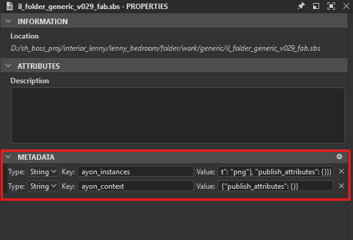
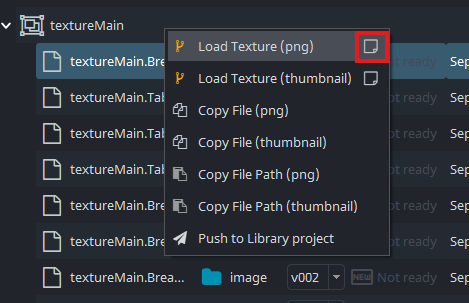
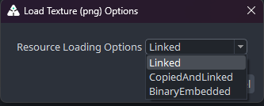
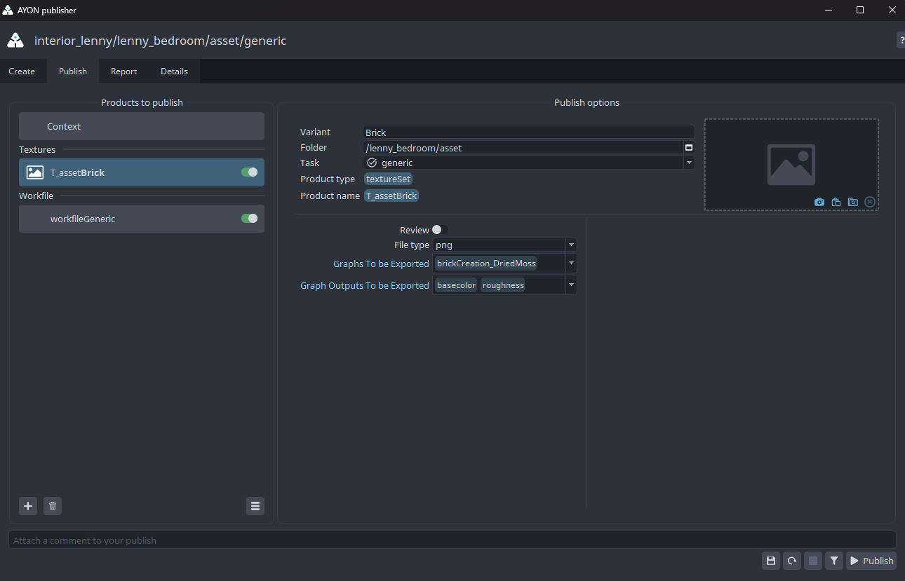
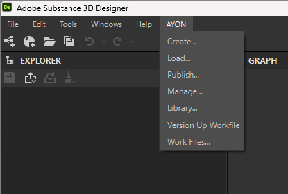

import ReactMarkdown from "react-markdown";
import versions from '@site/docs/assets/json/Ayon_addons_version.json'

<ReactMarkdown>
{versions.SubstanceDesigner_Badge}
</ReactMarkdown>

## AYON global tools

-   [Work Files](artist_tools_workfiles.md)
-   [Create](artist_tools_creator.md)
-   [Load](artist_tools_loader.md)
-   [Manage (Inventory)](artist_tools_inventory.md)
-   [Publish](artist_tools_publisher.md)
-   [Library Loader](artist_tools_library_loader.md)

## Working with AYON in Substance Designer

The Substance Designer AYON integration allows you to:
- Easily export your textures/sbsar as versioned publishes for others to load and update.
- Easily load your textures into resource folders in your package project and use those
    in your Substance Graphs.

## Setting up the project

You need to set up your graph and package prior to the use of the AYON plugins

The current workflow of AYON depends on the package of the Substance graph you are opening
and the graph itself.
E.g. If you want to publish textures of the Substance graph `BrickMoss`, you need to
open the `BrickMoss` graph and create textures instance, the related data would be embed into
the package of which the graph inherits from.

:::note
Make sure you dont remove ayon-related data in the metadata, otherwise you would lose all
information for either loading or publishing through AYON.

:::

## Project creation
You can preset the template you want to use with AYON settings by accessing
`ayon+settings://substancedesigner/project_creation/project_templates`
You fill your graph name in the blank(the red sequared in the screenshot below)
and select your template type.

If you choose `Custom Template` as template type, you need to fill in the
filepath of substance file and the name of graph in the sbs file you want to use
as template.
e.g. If you want to add the graph `metallic_roughness_sss` from the substance file
`D:\test_pbr_template.sbs` as template for your project creation, you can just fill
Path to Custom Template as `D:\test_pbr_template.sbs` and Custom Template Graph Name
as `metallic_roughness_sss`. You can take reference from the screenshot below.

:::note
Once the project is created with the template(s), there would be `temp_ayon_package.sbs`
saved as the local temp file. You need to make sure you use workfile tool to save the files otherwise
your working data inside `temp_ayon_package.sbs` would be gone after you closed the Substance Designer.

:::

## Loading Textures

Users can go to **AYON -> Load** and load texture to the resources folder
(with `{project_name}_resources`) of the package.
Users can choose whether they want to link or import resources by clicking the small memo
(See the red framed of the screenshot below) before importing the texture

## Setting Version for the loaded textures

Users can go to **AYON -> Manage** and manage the version of the loaded version.
If you want to update the loaded texture to the latest version, it will load the texture
with the latest version into the resources folder.

## Publishing Textures

Users need to open the graph(s) of which inherited from the package they want to publish,
and go to **AYON -> Create** to create texture instance.

Users can define which graphs and which graph outputs they want to export.

The Texture Set instance generates a publish per output map per graph that is defined in
the Substance Designer's template during project creation.
When publishing default Substance Designer's PBR template with variant **Main** six
instances will be published with the variants:
- Main.**basecolor**
- Main.**normal**
- Main.**roughness**
- Main.**metallic**
- Main.**height**
- Main.**ambientocclusion**
The bold output map name for the publish is based on the string that is pulled
from the default pattern set in export presets.
So `$(graph)_$(identifier)` becomes `basecolor`.

## Publishing Sbsar

Users need to open the graph(s) of which are inherited from the package
they want to publish, and go to **AYON -> Create** to create Sbsar instance.
Once the user hits **Publish**, it publishes the sbsar to AYON.

## Known issues

#### Can't see the AYON menu?

If you're unable to see the AYON top level menu in Substance Designer make
sure you have launched Substance Designer through AYON and that the AYON
Integration plug-in is loaded inside Substance Designer: **Tools > Plugins_Manager > ayon_plugin**

#### Substance Designer + Steam

Running the steam version of Substance Designer within AYON will require you
to close the Steam executable before launching Substance Designer through AYON.
Otherwise the Substance Designer process is launched using Steam's existing
environment and thus will not be able to pick up the pipeline integration.

This appears to be a limitation of how Steam works.
