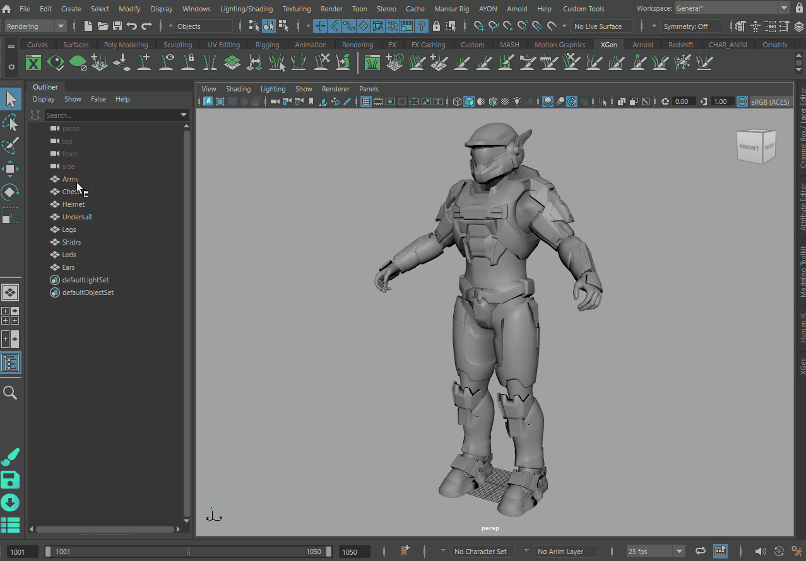
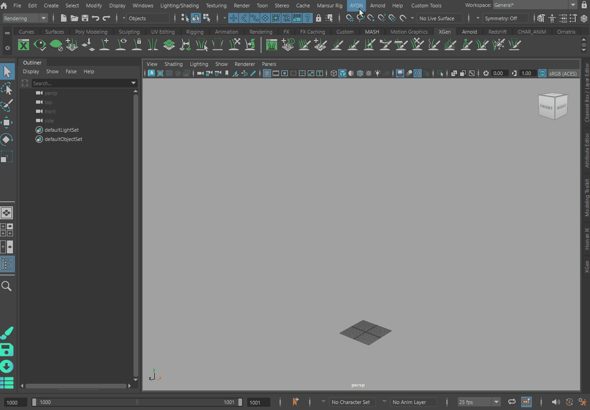

import ReactMarkdown from "react-markdown";
import versions from '@site/docs/assets/json/Ayon_addons_version.json'


<div class="container">
  <div class="row">
    <div class=".col-sm-"  style={{'margin-right':10+'px'}}>
      <ReactMarkdown>
        {versions.Maya_Badge}
      </ReactMarkdown>
    </div>
    <div class=".col-sm-" style={{'margin-right':10+'px'}}>
      <ReactMarkdown>
        {versions.Core_Badge}
      </ReactMarkdown>
    </div>
    <div class=".col-sm-" style={{'margin-right':10+'px'}}>
      <ReactMarkdown>
        {versions.USD_Badge}
      </ReactMarkdown>
    </div>
  </div>
</div>

:::info
This page is still under construction 👷🚧🛠️🔜🏗️.
:::

### Publishing a model

Any contribution to an asset structure should be within the default root primitive. In AYON, that defaults to the asset's folder name. 

So for folder path `/asset/characters/hero` that root name is `hero`.

The Creator allows to create that asset structure for you by enabling the `Create Asset Structure` checkbox. 
Then select your geometry, create and it will directly be conveniently parented to the required hierarchy.



After publishing this asset contribution you will have generated three products:


The AYON asset contribution workflow automates the generation of the layers for you.

Above we published a `usdMain` product, which had USD contributions enabled and targeted the product `usdAsset` with the department layer `model`.

So it generated:

- The target `usdAsset` product.
- The department layer for the `usdAsset`, specifically `usdAsset_{layer}` -> `usdAsset_model`.
- The `usdMain` product is added into that department layer, so the `usdMain` product is in the `usdAsset_model` layer.

Generating the asset structure:
```
usdAsset (target product)
  - usdAsset_model (department layer)
    - usdMain (product of the instance)
```

If you were to publish multiple products at once, say we would generate `usdModelMain` and `usdModelDamaged`. It would then generate:

```
usdAsset (target product)
  - usdAsset_model (department layer)
    - usdModelMain
    - usdModelDamaged
```

#### Contributions are additive

Over time, contributing to the asset adds more products to the `usdAsset`, across likely a variety of department layers.
Say our current publish structure is:
```
usdAsset (target product)
  - usdAsset_model (department layer)
    - usdModelMain (single contribution product)
```

Now publishing a `usdLookMain` to department layer `look` would make a new `usdAsset` version:
```
usdAsset (target product)
  - usdAsset_model (department layer)
    - usdModelMain (single contribution product)
  - usdAsset_look (department layer)
    - usdLookMain (single contribution product)
```

Then publishing another look variant `usdLookDamaged` would make a new `usdAsset` version:

```
usdAsset (target product)
  - usdAsset_model (department layer)
    - usdModelMain (single contribution product)
  - usdAsset_look (department layer)
    - usdLookMain (single contribution product)
    - usdLookDamaged (single contribution product)
```

:::note Contribution workflow is 'additive' to the target product's department layers

Whenever publishing a product with contribution enabled it will add it to an existing target product's department layers (or _update_ if it's the exact same product).

This workflow makes it possible for different departments to simultaneously work on an asset and contribute to it additively.

:::

:::note Work in Progress - Removing contributions 

There currently are no ready-to-go AYON tools that make it trivial to remove existing contributions from a product or department layer.

Unfortunately this means if you currently accidentally make a wrong contribution you will have to go and edit the actual USDA files' contents to remove entries.

_Warning: This can be a technical process!_

Providing tools for [easy editing of these existing contributions is on our issue tracker](https://github.com/ynput/ayon-usd/issues/23).

:::

### Loading USD products

You can load USD products back to Maya into Maya USD Proxy Shapes.



:::note Looking for different loaders?

Different Loaders are being implemented, like referencing the data as regular
maya geometry or "referencing" directly into an existing Maya USD Proxy.

See: https://github.com/ynput/ayon-maya/pull/61

:::
