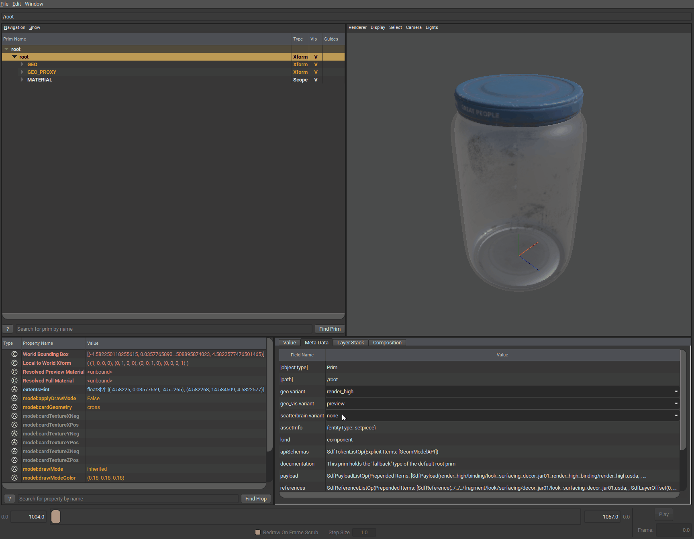

Introduction to USD and reasons to adopt it

## Why USD
[USD Explainer Guide](https://www.foundry.com/insights/film-tv/usd-explainer-guide) article provides great insights about why USD is very useful.

Let me paraphrase it:

> Traditional pipeline production followed a waterfall model, where each stage involved a "baking" process. To make any alterations, you would need to return to the start and re-bake at each step along the way.
Conversely, USD enables the seamless continuation of decisions throughout the pipeline by allowing live updates to existing USD layers. This is achieved through the creation of higher-order layers that can override an attribute or a value, thereby eliminating the need for baking the existing layers.
Thus, USD significantly enhances team collaboration by enabling multiple individuals to work on different layers of the same assets or shots simultaneously. Team members can override each other's work in a non-destructive manner, preserving the integrity of the overall project.

## What is USD
USD, short for Universal Scene Description, is a robust ecosystem featuring a versatile file format and a comprehensive Library API. The USD file format,which represents a USD layer, is capable of representing a wide array of 3D data, including scene hierarchies, geometries, instances, material networks, lights, cameras, volumes, coordinate systems, and shading nodes.

The accompanying USD API offers a suite of tools designed for broad adoption, enabling a wide array of applications to effectively interact with USD content.

This versatility is why USD is aptly named Universal Scene Description—it has the unique ability to "describe" scenes across any application that implements USD, independent of the operating system on which it runs.

In the screenshot provided, I've opened an [ALab usd scene](https://animallogic.com/alab/) across various applications: Houdini, Omniverse, and Usdview. 

## Understanding a USD Asset
A USD Asset is content organized to facilitate efficient asset exchange. It boasts several key features:
- The ability to load and unload the asset as needed.
- Multiple layers to store data from various departments, such as modeling, materials, effects, lighting, and animation.
- Flexibility for each layer to contain switchable variants, enhancing adaptability and collaboration.

### Load and Unload

Unloading an asset effectively makes it resemble an empty folder, which can significantly lighten the scene. This feature is particularly beneficial when assembling scenes, as it helps manage resource usage efficiently.

### Multiple Layers
This jar asset consists of three layers:
- surfacing 
- modeling
- assembly

### Variants
Assets can contain multiple variant sets, yet only a single variant within each set can be active at any given moment.

## Understanding a USD Shot
A USD Shot is a USD file structured to enhance shot exchange.
It effectively combines distinct layers from various departments into one streamlined file.

## Further Reading

### USD Introduction Guides
- [**Book of USD** - Getting Started with Universal Scene Description (USD)](https://remedy-entertainment.github.io/USDBook/) by Remedy Entertainment
> :point_up: Very good introduction to USD concepts in a slightly simplified and practical way

- [**Usd Survival Guide**](https://lucascheller.github.io/VFX-UsdSurvivalGuide/index.html) by Luca Scheller
> :point_up: More technical guide going over USD with the API as guideway. Also introduces a lot of "workflow optimizations" tips with a focus on Houdini Solaris and Python

### USD Asset Structure Guidelines
:::info
Our USD workflow follows the following structure guidelines.
:::

* **[Principles of Scalable Asset Structure in OpenUSD](https://docs.omniverse.nvidia.com/usd/latest/learn-openusd/independent/asset-structure-principles.html#id5)**
* **[Guidelines for Structuring USD Assets](https://wiki.aswf.io/display/WGUSD/Guidelines+for+Structuring+USD+Assets)**

### Example USD Assets

The ALab data set is the Animal Logic interpretation and implementation of real world production and pipeline concepts in USD.

- **[ALab Download](https://dpel.aswf.io/alab/)**
- **[ALab Documentation](https://usd-alab2.s3.amazonaws.com/README.html)**

Activision provides a USD data set from their Call of Duty franchise with some good instructions in the readme:

- **[Activision's Call of Duty®: Warzone™  Caldera USD dataset](https://github.com/Activision/caldera)**