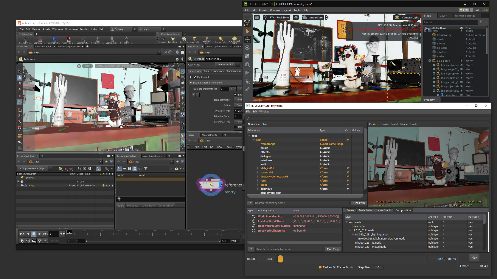
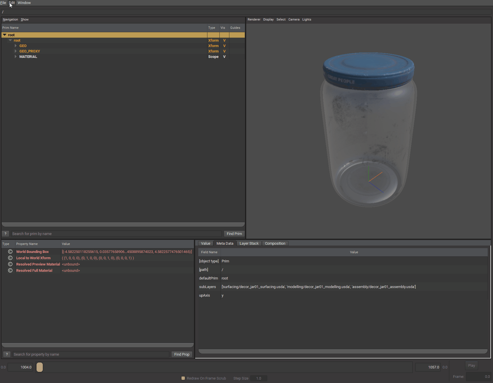

:::info
This page is still under construction 👷🚧🛠️🔜🏗️.
:::

## Why USD
[USD Explainer Guide](https://www.foundry.com/insights/film-tv/usd-explainer-guide) article provides great insights about why USD is very useful

Let me paraphrase it:

Traditional pipeline production was like a waterfall. Each stage has a baking process and in order to change anything, you’d have to go back to the beginning.
On the other hand, USD enables the continuity of decisions throughout the pipeline through live updating these descriptions without baking by allowing creating a higher order USD layer that overrides an attribute or a value without baking existent layers.
So, USD enhances team collaboration as people can work simultaneously on different layers of the same assets or shots. People can override others work in a non destructive manner.

## What is USD
USD, short for Universal Scene Description, is a robust ecosystem featuring a versatile file format and a comprehensive Library API. The USD file format is capable of representing a wide array of 3D data, including scene hierarchies, geometries, instances, material networks, lights, cameras, volumes, coordinate systems, and shading nodes.

The accompanying USD API offers a suite of tools designed for broad adoption, enabling a wide array of applications to effectively interact with USD content.

This versatility is why USD is aptly named Universal Scene Description—it has the unique ability to "describe" scenes across any application that implements USD, independent of the operating system on which it runs.

In the screenshot provided, I've opened an [ALab usd scene](https://animallogic.com/alab/) across various applications: Houdini, Omniverse, and Usdview. 

## Understanding a USD Asset
A USD Asset is content organized to facilitate efficient asset exchange. It boasts several key features:
- The ability to load and unload the asset as needed.
- Multiple layers to store data from various departments, such as modeling, materials, effects, lighting, and animation.
- Flexibility for each layer to contain switchable variants, enhancing adaptability and collaboration.

### Load and Unload

Unloading an asset effectively makes it resemble an empty folder, which can significantly lighten the scene. This feature is particularly beneficial when assembling scenes, as it helps manage resource usage efficiently.

### Multiple Layers
This jar asset consists of three layers:
- surfacing 
- modeling
- assembly

### Variants
Assets can contain multiple variant sets, yet only a single variant within each set can be active at any given moment.

## Understanding a USD Shot
A USD Shot is a USD file structured to enhance shot exchange.
It effectively combines distinct layers from various departments into one streamlined file.

