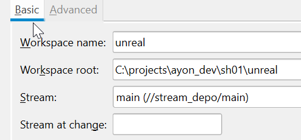

import ReactMarkdown from "react-markdown";
import versions from '@site/docs/assets/json/Ayon_addons_version.json'

<ReactMarkdown>
    {versions.VersionControl_Badge}
</ReactMarkdown>

## Current state of the addon

This addon tries to implement generic API for various version control system.

Currently contains WIP implementation of Perforce, but there might be more in the future which should follow
same API methods.

The implementation aims to rely solely on a single dependency, `p4python`, which is binary-dependent on the Python version in use.
This means it might be different in different DCCs, different versions of Unreal etc.

To mitigate need of having binary compatible `p4python` libraries addon currently implements REST api to run p4 commands 
only on separate webserver started by AYON Tray which contains `p4python` library installed via dependency package and 
REST stub class which might be used in each DCC that has `requests` library.

:::info
The AYON Version Control addon doesn't replace the built-in versioning functionality.
Instead, it adds an extra layer by publishing the product to two separate locations: the AYON publish directory and the Perforce server.
:::

## Configuration of connection to Perforce server

Addons offers configuration of credentials to P4 server with username and password on multiple levels via
Studio(single credentials), Project (credentials different per project)  or Site settings(credentials different per artist.)

## Perforce workspace

It is expected that P4 workspaces would be setup and existed on artists machines. Each artist then only 
provides path to their locally accessible P4 workspace folder in Site Settings.

It is expected that folder name of the workspace matches worskpace name. (`unreal` in this example)

## Main functionalities for Perforce

This addons contains two main functionalities for slightly different use cases:
- create separate version controlled streams from AYON of published products in Perforce
- help with Deadline rendering of Unreal projects with Perforce

It is expected that majority working for Perforce with Unreal project files are done with official Perforce
tools like `P4V` or command line utility. Neither of those are distributed by addon and it is required
for IT department to install/configure them.

### Commits to Perforce

This approach allows to copy version control not only in AYON, where each publish results in new version
of published product, but committing this version directly to Perforce. 

The products with versions are separately kept in Perforce, from which ordinary Perforce tools
could be used (P4V) to pull latest version of published product.

Profiles could be used to limit which published products should be committed to Perforce.

As Perforce controls the product which doesn't contain version name directly in its name nor path, additional
AYON template must be configured in Project's Anatomy > Templates.

New template must follow [Hero template](artist_concepts.md#hero-version) approach,
`Hero` template could be used directly too (if it is matching required folder structure in Perforce)

### Support for Unreal and Deadline

The other workflow is to help rendering Unreal from Perforce on Deadline rendering farm.

In this use case there is an exception that multiple artists are working on Unreal project with standard utilization of
P4 or Unreal P4 official plugin to checkout/commit any modifications to Unreal project to Perforce.

Addons offers additional possibility to mark current stage of Unreal project, eg. latest commit/changelist, as 'published' and
store its metadata in AYON for possible future workflows and enhancements.

New additional mini tool is provided for artists before they open Unreal via AYON launcher which allows them to 
`P4 sync` (not `checkout` - that would lock the files) to any previously published version before Unreal is actually opened.

This marker, or tag, points to commit/changelist and could be pushed to Deadline integration where Deadline
syncs to this particular commit before rendering. 

This requires to have AYON integration to Deadline installed. Please check https://ayon.ynput.io/docs/addon_deadline_admin for more details.

Usage of Perforce in Deadline submissions could be controlled by toggling on/off of automatically created instance of 
`changelist_metadata` product type in AYON Publisher.
