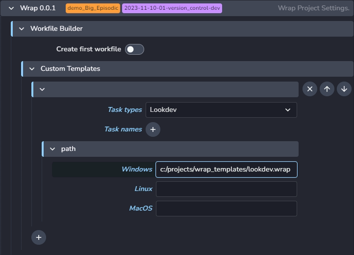
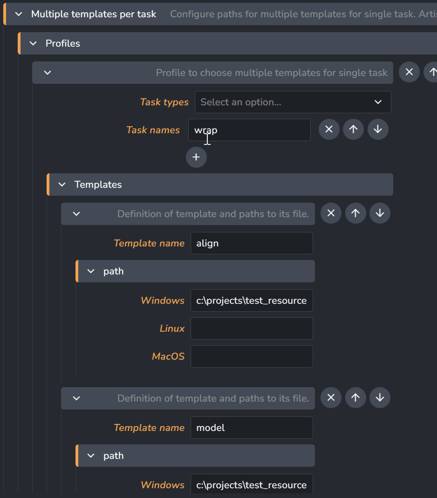

import ReactMarkdown from "react-markdown";
import versions from '@site/docs/assets/json/Ayon_addons_version.json'

<ReactMarkdown>
{versions.Wrap_Badge}
</ReactMarkdown>

import Tabs from '@theme/Tabs';
import TabItem from '@theme/TabItem';

## Wrap settings

A Faceform **Wrap** is a topology transfer tool for creation of digital characters based on 3D scans of real actors or sculpts.

As **Wrap** has no Python API its integration is a bit limited. It can now open predefined template workfile based on profiles.
These template workfiles could contain placeholders which will be textually replaced before starting and opening a workfile with Wrap.

Location: `ayon+settings://wrap/workfile_builder/custom_templates`



### Workfile Builder

Allows to open prepared workfile for an artist when no workfile exists. Useful to share standards, additional helpful content in the workfile.

Could be configured per `Task type`, eg. `composition` task type could use different `.wrap` template file than `art` task.
Workfile template must be accessible for all artists.

(Currently template sharing is not handled by [SiteSync](addon_site_sync_admin.md) so they must be accessible for all artist machines.)

### Multi templates per task

If your use case requires usage of multiple templates for single task (imagine it as steps)
```
Example:
- ALIGN (task)
  - align scan (step)
  - align scan render
  - retouch sheet
- MODEL (task)
  - wrap (step)
```
configuration in `Workfile Builder` wouldn't be enough. 


Admin needs to configure location of separate templates in `ayon+settings://wrap/multiple_templates_per_tasks`.



Inputs are type name or type and returned value is path to the template.

There is also need for additional new template in `Anatomy`. It is expected to be called `wrap_multi` and would look like:
```
Directory template: {root[work]}/{project[name]}/{hierarchy}/{folder[name]}/work/{task[name]}</{template_name}>
File name template: {project[code]}_{folder[name]}_{task[name]}<_{template_name}>_{@version}.{ext}
```
That added `</{template_name}>` is important to separate workfiles for particular template into subfolders.

Artist then will be shown with new Dialog where they can select from list of templates and shown if any workfile exist for those.
