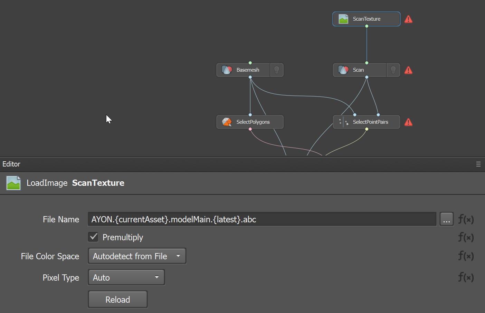
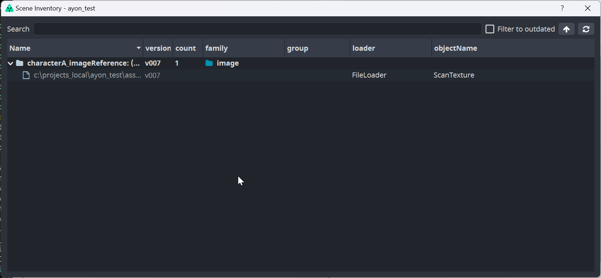
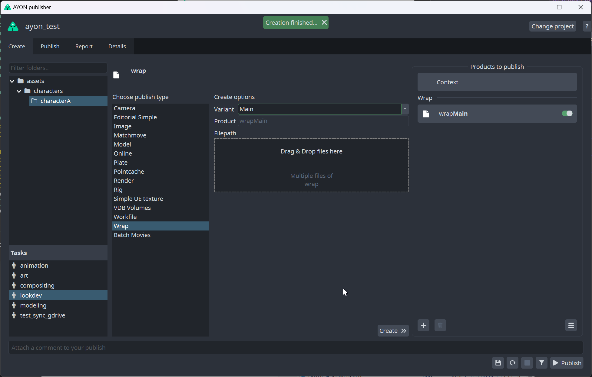

import ReactMarkdown from "react-markdown";
import versions from '@site/docs/assets/json/Ayon_addons_version.json'

<ReactMarkdown>
{versions.Wrap_Badge}
</ReactMarkdown>

import Tabs from '@theme/Tabs';
import TabItem from '@theme/TabItem';

## Wrap integration

A Faceform Wrap is a topology transfer tool for creating digital characters based on 3D scans of real actors or sculpts.

As Wrap has no Python API, its integration is a bit limited. It can now open predefined template workfiles based on profiles.
These template workfiles could contain placeholders which will be textually replaced before starting and opening a workfile with Wrap.

This must be configured by Ayon admin in: `ayon+settings://wrap/workfile_builder/custom_templates`

### Template preparation

Templates must be prepared manually in Wrap host. Selected artist can build `.wrap` workfile as expected and
mark read nodes controllable by Ayon by providing text placeholder value in the node's `File Name` path. 

#### Read nodes
Placeholder value points Ayon to specific representation of specific version for specific asset.

Format of placeholder is:
`AYON.ASSET_NAME.PRODUCT_NAME.VERSION.EXTENSION`

Description:
- `AYON` - hardcoded prefix denoting this is Ayon placeholder
- `{ASSET_NAME}` - points to asset
  - could be encased with {} to denote it is dynamic value `{currentAsset}` - asset from context
  - or any actual name of asset (`characterA`)
- `PRODUCT_NAME` - value of product from asset (`modelMain`)
- `VERSION` - value to select version
  - encased in {} (`{latest}`, `{hero}`) points to version of current context
  - any integer number points to specific version (`4`)
- `EXTENSION` - extension of loaded representation (`png`)

Example:
    `AYON.{currentAsset}.modelMain.{latest}.abc` - will load latest version of `abc` representation of `modelMain` product of
        currently opened asset from context 

Any number of input nodes could be marked as Ayon placeholders. Each value will be resolved when opening workfile for a first
time or updated if opening for next times.

### Launching of Wrap

Regular artist opens Wrap ordinary via Launcher. Before Wrap is opened Scene Inventory tool will be shown to highlight which items
were loaded when placeholders got resolved. Artist can see version, if loaded version is not the latest, it is highlighted by red color.

In case of error, it could be a missing representation of specified product, similar error dialog will be shown. Artist can change version
of loaded item via dialog after Right Mouse Click is pressed above the item.

This dialog MUST be closed for Wrap to be opened!

#### Publish

As there is no Python API to run code of Ayon directly in Wrap application, publish process is semi-manual. Artists must prepare
workfile, save it and then publish it via Publisher: docs/artist_tools_publisher tool.

There might be multiple write nodes inside of the workfile, but not all of them must be published via Ayon. Publishable nodes
must contain AYON_ prefix in their names. Whole name has then format AYON_PUBLISHED_PRODUCT_NAME (eg.AYON_wrapRenderMain -
this will publish wrapRenderMain product of wrap family.

Artist should open Publisher, select published context in left column, drag&drop prepared workfile in the middle column and hit Create.
There should appear new instance in the right column, next step would be to hit Publish to start publishing process.

##### Versioned intermediate output

Anytime workfile is being published, all write nodes get computed (currently there is no way to tell `Wrap` to only compute specific node).
To limit unwanted overwrites artist could use `{version}` placeholder in `File Name` of write node.

Example:
- `$PROJECT_DIR/{version}/Frame######.obj`

