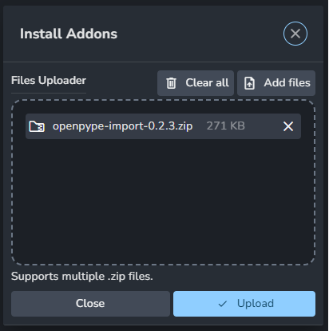

## Introduction

You can import OpenPype projects into AYON, but it's not recommended for production purposes. There are some issues to be aware of, and the imported project won't exactly match the one in OpenPype. Before we dive in, let's go over some important points about this process.

### What makes an OpenPype project

Typical OpenPype projects consists of two parts. The first part is the files themselves, which could be Maya scenes, Nuke scripts, or rendered images. These are typically divided into two areas: `work` and `publish`. 

The work area contains the scenes from which published data is generated. This data might include loaded and versioned data that was previously published. There's a connection between these files; they depend on each other.

The second part of an OpenPype project is the metadata about versions and products. This information is stored in documents within a MongoDB database.

When you load a version of a product into your scene, a record is created somewhere, that referenes that particular version and its representation - this is the ID of the corresponding document in the MongoDB database.

### Differences

An AYON project is quite similar at the file level, but AYON doesn't use MongoDB. This means all references to metadata stored in a database work differently. This is one of the issues when you import a project into AYON - those IDs won't function anymore and you won't be able to manage versions of loaded products in the scene, that was created in OpenPype anymore. Everything should appear the same in the scene because the importing process doesn't alter the files themselves. However, the IDs won't match those in AYON. If you need to change versions within that scene, you'll have to reload the product back in. The other option is to create a script that attempts to match OpenPype IDs with AYON ones. However, this second option involves a lot of guesswork and might not be reliable in some cases.

**What will remain the same:**
- Files will be untouched and their relations (references, etc.) will be the same.
- Project structure, assets, their products, versions and representations in AYON we reflect whatever was in OpenPype.

**What will be lost:**
- References to loaded version in the scenes (workfiles) preventing versioning
via Manage tool.
- Settings won't be transfered.

:::note
Thumbnails are supported, but you need to add folder where OpenPype is storing thumbnails for the project to the exported zip within `thumbnails` folder.
:::


### OpenPype to AYON project migration

#### I. Exporting project from OpenPype

:::note
You can only pack projects with one project root. For multi-root project, this is not currently supported.
:::

To import OpenPype project, you need to export it first. For that, you can use handy command `pack-project`.

```sh
./openpype_console.exe pack-project --project NAME_OF_YOUR_PROJECT --dirpath ../export/path --dbonly
```

or from the sources:

```sh
./.poetry/bin/poetry run python start.py --project NAME_OF_YOUR_PROJECT --dirpath ../export/path --dbonly
```

Just replace name of the project in `--project`. Destination, where the project will be packed is specified by `--dirpath`. Adding `--dbonly` will dump only MongoDB documents. If you use `--dbonly`, you also need to specify `--dirpath`.

This will produce ZIP file with the project files, `database.json` file with the MongoDB dump and `metadata.json` that contains the project root definitions. Lets keep this zip file for later and setup the importer service itself.

#### II. Installing OpenPype Importer Service for AYON

##### Setting up ASH:

First requirement is to have [ASH](https://github.com/ynput/ash) set up and running. ASH stands for *AYON Service Host* and it takes
care for handling AYON Services. It Periodically checks the services declared in th AYON and starts
them if they are not running. Since OpenPype Importer Service can be started with ASH, let's firstly set it up:

```sh
git clone https://github.com/ynput/ash.git
cd ./ash
# to build the Docker image
docker build -t ynput/ayon-ash:latest
```

If you want ASH to be part of your AYON Docker stack, make sure that `docker-compose.yml` in your
[ayon-docker](https://github.com/ynput/ayon-docker.git) has something like this in:

```yaml
worker:
    image: ynput/ayon-ash:latest
    hostname: worker01
    restart: unless-stopped
    depends_on:
      - server
    volumes:
      - "/var/run/docker.sock:/var/run/docker.sock"
    environment:
      - "AYON_API_KEY=xxxxxxxxxxxxxxxxxxxxxxx"
      - "AYON_SERVER_URL=http://172.18.0.4:5000"
```

*NOTE:* you can (and should) customize this to fit your needs. Be aware that `AYON_SERVER_URL` must
be reachable from withing the Docker network, otherwise you'll get connection errors.

With these changes, you can run it with:

```sh
docker compose up --detach --build worker
```

If you rather like to run it manually with `docker`, this command will do the same:

```sh
# to run the image
docker run -rm -ti \
    -v /var/run/docker.sock:/var/run/docker.sock \
    --hostname worker01
    --env AYON_API_KEY=xxxxxxxxxxxxxxxxxxxxxxx
    --env AYON_SERVER_URL=http://172.18.0.4:5000
    ynput/ayon-ash
```

For development, you can also run it directly from Python 3.10+ using Poetry:

```sh
poetry run -m ash
```

##### Setting up OpenPype Importer Service:

First, clone repository addon:

```sh
git clone https://github.com/ynput/ayon-openpype-import
```

Create server addon from the sources by running `create_package.py` script:

```sh
python ./create_package.py
```

You'll find your freshly created addon zip in `package`.

Next step is to upload this addon to AYON server. In AYON, press `S+S` or go to `Studio Settings -> Bundles`. From there, click on `Install addons` and drag'n'drop `openpype-import-x.x.x.zip` into the dialog.





After upload, just restart the server and you'll be able to set the service.

---

### More reading:

*ASH Service and OpenPype Import*: https://community.ynput.io/t/using-ayon-service-host/118

