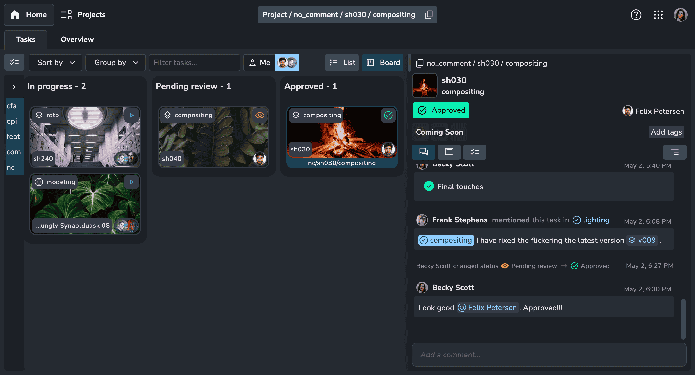
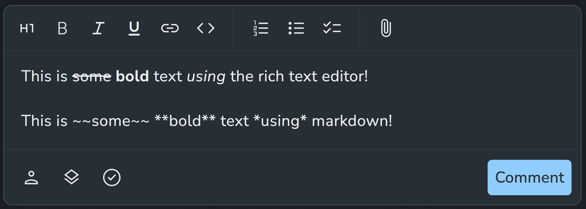

:::info
The activity feed is a suite of features that were introduced in `1.1.0`.
:::

### Overview

In a nutshell, the activity feed is a single interface to view a stream of events about a particular entity. For example, the activity feed of a task could contain comments made supervisors, status updates or when a user was assigned to the task.

You can think of it as a timeline of activities that have occurred relating to an entity.

The activity feed is not just a section of comments but an array of different "activities" together in one feed.

The activity feed will mainly be used on your tasks board but will extended to more pages in the future.

:::note
The activity feed will first be available on tasks and versions but potentially extended to other entity types in the future, like folders.
:::

### Types of activities

1. Comments
2. Status changes
3. Assignee changes
4. Published versions (coming in a later update)

:::tip
You can filter these different types to have a more focused feed. There are also special filters that can filter out specific comment types, like comments with checklist items.

:::

### Mentions

The activity feed has a powerful linking system between entities that allows for seamless collaboration and better in context communication.

You can mention or "tag" three different things using the @ annotation:

1. @users - any user on the same project.
2. @@versions - versions related to the entity.
3. @@@tasks - sibling tasks of the same folder.

When something is mentioned in a comment, it will appear inside the activity feed of that mention.

:::info
In this example Felix leaves a comment on his Compositing task, mentioning the lighting task that there are fixes that need to be done. Felix doesn't need to find search for the lighting task and write his comment again, it automatically appears on the lighting task. Now both Felix and Frank can collaborate together on the fix, without leaving the context of their task. Frank can then mention the compositing task to let Felix know a new version is ready.
:::

### Relations

Some activity items can have a relation to another entity other than it's origin. For example comments made on versions have a relation with their parent task. When a comment is made on a version this relation causes the comment to be visible on the task itself. This is similar to how mentions work, except no mention is required, it's almost like a default mention.

### Rich Text Editor and Markdown

Comments fully support [github flavoured](https://github.github.com/gfm/#:~:text=1Introduction-,1.1What%20is%20GitHub%20Flavored%20Markdown%3F,-GitHub%20Flavored%20Markdown) [markdown](https://www.markdownguide.org/basic-syntax/). You may asking, what is markdown? Don't worry, the comment text editor is also a rich text editor and supports everything you would expect, including headings, bold, italic, underlines and lists.

### Checklists

Checklists can be made and checked/unchecked by any user. They don't affect the status of the task but give a general idea of how much work is left on a task. Useful for reviews, to keep track of if feedback has been addressed.

### Attachments

You can attach any type of file to a comment. Common image types will be preview-able inside the webapp and we plan to support preview-able videos in the future.

:::tip
As well as using the attachments button you can drag and drop and even paste images straight from your clip board.

Review workflow: screenshot frame -> markup in desired app -> paste marked up image as an attachment.
:::
