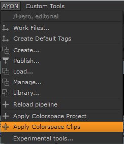
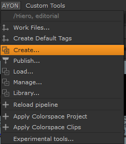
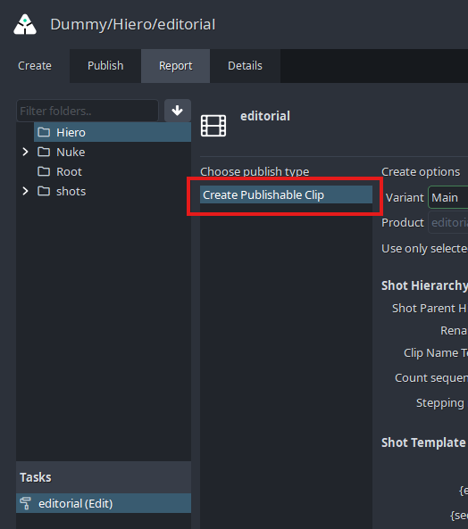
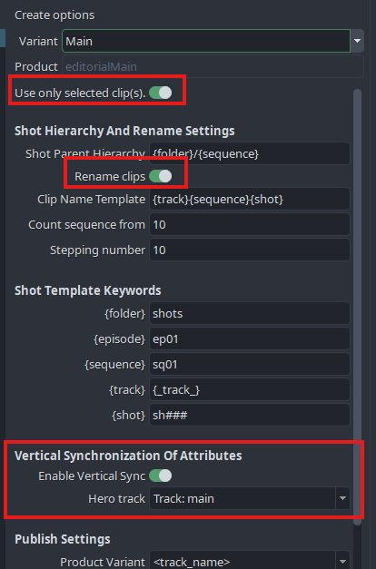
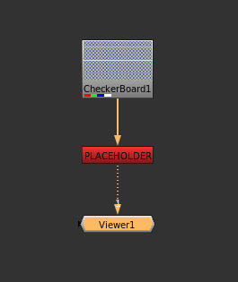
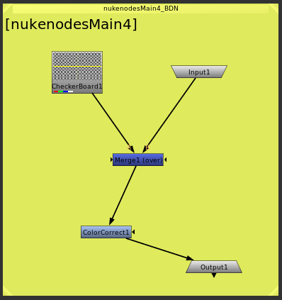
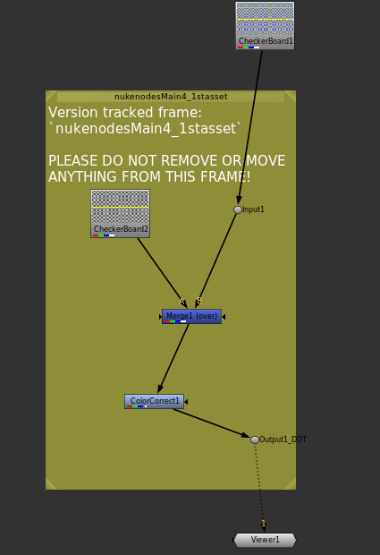
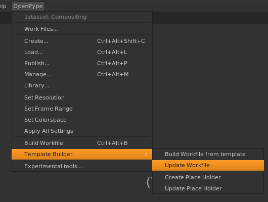

:::note
All the information also applies to **_Nuke Studio_**(NKS), but for simplicity we only refer to Hiero/NKS. The workflows are identical for both. We are supporting versions **`11.0`** and above.
:::

## AYON global tools

-   [Work Files](artist_tools.md#workfiles)
-   [Create](artist_tools.md#creator)
-   [Load](artist_tools.md#loader)
-   [Manage (Inventory)](artist_tools.md#inventory)
-   [Publish](artist_tools.md#publisher)

## Hiero specific tools

### Create Default Tags

This tool will recreate all necessary AYON tags needed for successful publishing. It is automatically ran at start of the Hiero/NKS. Use this tool to manually re-create all the tags if you accidentally delete them, or you want to reset them to default values.

#### Result

-   Will create tags in Tags bin in case there were none
-   Will set all tags to default values if they have been altered

 <!-- picture needs to be changed -->

### Apply Colorspace Project

This tool will set any defined colorspace definition from ayon `Settings / Project / Anatomy / Color Management and Output Formats / Hiero / Workfile` to Hiero `menu / Project / Edit Settings / Color Management tab`

#### Result

-   Define correct color management settings on project

 <!-- picture needs to be changed -->

### Apply Colorspace Clips

This tool will set any defined colorspace definition from ayon `Settings / Project / Anatomy / Color Management and Output Formats / Hiero / Colorspace on Inputs by regex detection` to any matching clip's source path.

#### Result

-   Set correct `Set Media Color Transform` on each clip of active timeline if it matches defined expressions

 <!-- picture needs to be changed -->

## Publishing Shots

With AYON, you can use Hiero/NKS as a starting point for creating a project's **shots** as *assets* from timeline clips with its *hierarchycal parents* like **episodes**, **sequences**, **folders**, and its child **tasks**. Most importantly it will create **versions** of plate *subsets*, with or without **reference video**. Publishig is naturally creating clip's **thumbnails** and assigns it to shot *asset*. Hiero is also publishing **audio** *subset* and various **soft-effects** either as retiming component as part of published plates or **color-tranformations**, that will be evailable later on for compositor artists to use either as *viewport input-process* or *loaded nodes* in graph editor.
    

<iframe width="512px" height="288px" src="https://www.youtube.com/embed/mdIfbTY5fCc" frameborder="0" modestbranding="1" allow="accelerometer; autoplay; encrypted-media; gyroscope; picture-in-picture" allowfullscreen="1"></iframe>

### Preparing timeline for conversion to instances
Because we don't support on-fly data conversion so in case of working with raw camera sources or some other formats which need to be converted for 2D/3D work. We suggest to convert those before and reconform the timeline. Before any clips in timeline could be converted to publishable instances we recommend following.
1. Merge all tracks which supposed to be one and they are multiply only because of editor's style
2. Rename tracks to follow basic structure > if only one layer then `main` in case of multiple layer (elements) for one shot then `main`, and other elements for example: `bg`, `greenscreen`, `fg01`, `fg02`, `display01`, etc. please avoid using [-/_.,%&*] or spaces. These names will be later used in *subset* name creation as `{family}{trackName}` so for example **plateMain** or **plateFg01**
3. Define correct `Set Media Color Transform` at all clips as those will be also published to metadata and used for later loading with correct color transformation.
4. Reviewable video material which you wish to be used as preview videos on any supported Project manager platform (Ftrack) has to be added ideally to track named **review**. This can be offline edit used as reference video for 2D/3D artists. This video material can be edited to fit length of **main** timeline track or it cand be one long video clip under all clips in **main** track, because ayon will trim this to appropriate length with use of FFMPEG. Please be avare we only support MP4(h264) or JPG sequence at the moment.

### Converting timeline clips to instances

Every clip on timeline which is intended to be published has to be converted to publishable instance.

In AYON it is done by tagging a clip with our own metadata. Select all clips you wish to convert and `menu > AYON > Create`.
    

Then chose `Create Publishable Clip` in **Instance Creator** dialogue.
  

Then you can alter Subset name, but this will be changed dynamically and replaces with timeline's track name.
  

Keep **Use selection** on.
  

Hit **Create**
  

Dialogue `Pype publish attributes creator` will open. Here you can define instance properties. If you wish to rename clips dynamically during creation then Keep  **Rename clips** ticked.
  

In case you wish to use *multiple elements of shots* workflow then keep **Enamble vertical sync** ticked on and define correct hero track which is holding main plates, this is usually the **main** track.

Subset name is created dynamically if `<track_name>` is selected on **Subset name**.
  

I case you wish to publish reviewable video as explained above then find the appropriate track from drop down menu **Use review track**. Usually named `review`
  

Hover above each input field for help.
  

Handles can be defined here to. In case you wish to have individual clip set differently we recommend to set here the default value and later change those in the created ayon tag's metadata under `handleStart` and `handleEnd` properties (look below for details)

After you hit **Ok** tags are added to selected clips (except clips in **review** tracks).
  

If you wish to change any individual properties of the shot then you are able to do it here. In this example we can change `handleStart` and `handleEnd` to some other values.

### Publishing Effects from Hiero to Nuke
This video shows a way to publish shot look as effect from Hiero to Nuke.

<iframe width="512px" height="288px" src="https://www.youtube.com/embed/HzZDdtII5io" frameborder="0" modestbranding="1" allow="accelerometer; autoplay; encrypted-media; gyroscope; picture-in-picture" allowfullscreen="1"></iframe>

### Assembling edit from published shot versions

<iframe width="512px" height="288px" src="https://www.youtube.com/embed/5Wd6X-71vbg" frameborder="0" modestbranding="1" allow="accelerometer; autoplay; encrypted-media; gyroscope; picture-in-picture" allowfullscreen="1"></iframe>

# Nuke Build Workfile
This is a tool of Node Graph initialisation using a pre-created template.

### Add a profile
The path to the template that will be used in the initialisation must be added as a profile on Project Settings.

### Create Place Holder

This tool creates a Place Holder, which is a node that will be replaced by published instances.

#### Result
- Create a red node called `PLACEHOLDER` which can be manipulated as wanted by using it in Node Graph.

:::note
All published instances that will replace the place holder must contain unique input and output nodes in case they will not be imported as a single node. 
:::

The informations about these objects are given by the user by filling the extra attributes of the Place Holder

### Update Place Holder
This tool alows the user to change the information provided in the extra attributes of the selected Place Holder.

### Build Workfile from template
This tool imports the template used and replaces the existed PlaceHolders with the corresponding published objects (which can contain Place Holders too). In case there is no published items with the description given, the place holder will remain in the node graph.

#### Result
- Replace `PLACEHOLDER` node in the template with the published instance corresponding to the informations provided in extra attributes of the Place Holder

:::note
In case the instance that will replace the Place holder **A** contains another Place Holder **B** that points to many published elements, all the nodes that were imported with **A** except **B** will be duplicated for each element that will replace **B**
:::

### Update Workfile
This tool can be used to check if some instances were published after the last build, so they will be imported.

:::note
Imported instances must not be deleted because they contain extra attributes that will be used to update the workfile since the place holder is been deleted.
:::