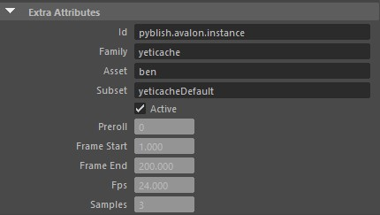

## Working with Yeti in AYON

AYON can work with [Yeti](https://peregrinelabs.com/yeti/) in two data modes.
It can handle Yeti caches and Yeti rigs.

### Creating and publishing Yeti caches

Let start by creating simple Yeti setup, just one object and Yeti node. Open new empty scene in Maya and create sphere. Then select sphere and go **Yeti → Create Yeti Node on Mesh**
Open Yeti node graph **Yeti → Open Graph Editor** and create setup like this:


It doesn't matter what setting you use now, just select proper shape in first *Import* node. Select your Yeti node and create *Yeti Cache instance* - **AYON → Create...** and select **Yeti Cache**. Leave `Use selection` checked. You should end up with this setup:


You can see there is `yeticacheDefault` set. Instead of *Default* it could be named with whatever name you've entered in `subset` field during instance creation.

We are almost ready for publishing cache. You can check basic settings by selecting
Yeti cache set and opening *Extra attributes* in Maya **Attribute Editor**.



Those attributes there are self-explanatory, but:

- `Preroll` is number of frames simulation will run before cache frames are stored.
This is useful to "steady" simulation for example.
- `Frame Start` from what frame we start to store cache files
- `Frame End` to what frame we are storing cache files
- `Fps` of cache
- `Samples` how many time samples we take during caching

You can now publish Yeti cache as any other types. **AYON → Publish**. It will create sequence of `.fur` files and `.fursettings` metadata file with Yeti node setting.

### Loading Yeti caches

You can load Yeti cache by **AYON → Load ...**. Select your cache, right+click on it and select **Load Yeti cache**. This will create Yeti node in scene and set its cache path to point to your published cache files. Note that this Yeti node will be named with same name as the one you've used to publish cache. Also notice that when you open graph on this Yeti node, all nodes are as they were in publishing node.

### Creating and publishing Yeti Rig

Yeti Rigs are working in similar way as caches, but are more complex and they deal with other data used by Yeti, like geometry and textures.

Let's start by [loading](artist_hosts_maya.md#loading-model) into new scene some model.
I've loaded my Buddha model.

Create select model mesh, create Yeti node - **Yeti → Create Yeti Node on Mesh** and setup similar Yeti graph as in cache example above.

Then select this Yeti node (mine is called with default name `pgYetiMaya1`) and create *Yeti Rig instance* - **AYON → Create...** and select **Yeti Cache**.
Leave `Use selection` checked.

Last step is to add our model geometry to rig instance, so middle+drag its
geometry to `input_SET` under `yetiRigDefault` set representing rig instance.
Note that its name can differ and is based on your subset name.


Save your scene and ready for publishing our new simple Yeti Rig!

Go to publish **AYON → Publish** and run. This will publish rig with its geometry
as `.ma` scene, save Yeti node settings and export one frame of Yeti cache from
the beginning of your timeline. It will also collect all textures used in Yeti
node, copy them to publish folder `resource` directory and set *Image search path*
of published node to this location.

:::note Collect Yeti Cache failure
If you encounter **Collect Yeti Cache** failure during collecting phase, and the error is like
```fix
No object matches name: pgYetiMaya1Shape.cbId
```
then it is probably caused by scene not being saved before publishing.
:::

### Loading Yeti Rig

You can load published Yeti Rigs as any other thing in AYON - **AYON → Load ...**,
select you Yeti rig and right+click on it. In context menu you should see
**Load Yeti Cache** and **Load Yeti Rig** items (among others). First one will
load that one frame cache. The other one will load whole rig.

Notice that although we put only geometry into `input_SET`, whole hierarchy was pulled inside also. This allows you to store complex scene element along Yeti node.

:::tip auto-connecting rig mesh to existing one
If you select some objects before loading rig it will try to find shapes
under selected hierarchies and match them with shapes loaded with rig (published under `input_SET`). This mechanism uses *cbId* attribute on those shapes. If match is found shapes are connected using their `outMesh` and `outMesh`. Thus you can easily connect existing animation to loaded rig.
:::
