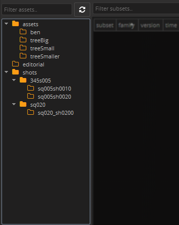

# Loader
Test Loader loads published subsets into your current scene or script.

## Usage
1. Open *Loader* from AYON menu.
2. Select the asset where the subset you want to load is published.
3. From subset list select the subset you want.
4. Right-click the subset.
5. From action menu select what you want to do *(load, reference, ...)*.

 <!-- picture needs to be changed -->

## Refresh data
Data are not auto-refreshed to avoid database issues. To refresh assets or subsets press refresh button.

## Load another version
Loader by default load last version, but you can of course load another versions. Double-click on the subset in the version column to expose the drop down, choose version you want to load and continue from point 4 of the [Usage](#usage-1).

  

  

## Filtering

### Filter Assets and Subsets by name
To filter assets/subsets by name just type name or part of name to filter text input. Only assets/subsets containing the entered string remain.

- **Assets filtering example** *(it works the same for subsets)*:

### Filter Subsets by Family

To filter [subsets](artist_concepts.md#subset) by their [families](artist_publish.md#families) you can use families list where you can check families you want to see or uncheck families you are not interested in.

## Subset groups
Subsets may be grouped which can help to make the subset list more transparent. You can toggle visibility of groups with `Enable Grouping` checkbox.

### Add to group or change current group
You can set group of selected subsets with shortcut `Ctrl + G`.

:::warning
You'll set the group in Avalon database so your changes will take effect for all users.
:::

## Site Sync support

If **Site Sync** is enabled additional widget is shown in right bottom corner.
It contains list of all representations of selected version(s). It also shows availability of representation files
on particular site (*active* - mine, *remote* - theirs). 

On this picture you see that representation files are available only on remote site (could be GDrive or other). 
If artist wants to work with the file(s) they need to be downloaded first. That could be done by right mouse click on
particular representation (or multiselect all) and select *Download*.

This will mark representation to be download which will happen in the background if AYON Tray is running.

For more details of progress, state or possible error details artist should open **[Sync Queue](#Sync-Queue)** item in Tray app.

Work in progress...

