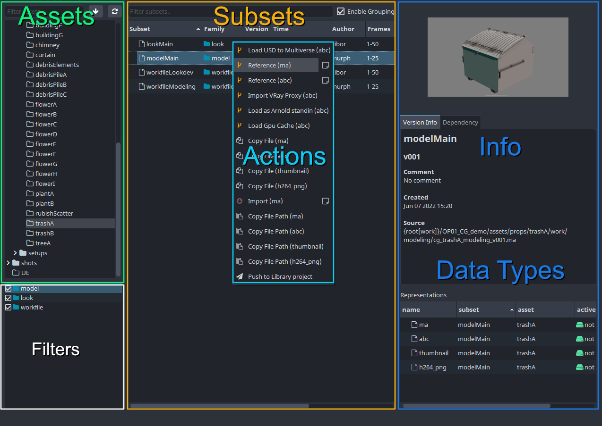
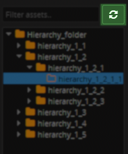

# Loader
Whenever you need to load available published assets to your current workfile scene / script use **Loader** tool.

## Usage
1. Go to **AYON** menu and choose **Loader** tool.
2. In **Loader** window go to the left pane with file browser and pick an **Asset** you would like to load into your workfile.
3. In the middle pane pick a desired **subset** of a particular asset you chose beforehand.
4. By right-clicking it menu with **Actions** shows up.
5. Select the way subset gets into your scene *(load, reference, ...)*.

import loaderVideo from './assets/video/tools_loader_01.mp4'

<video controls style={{width: "75%" }}>
  <source src={loaderVideo}/>
</video>

---

Here you can see Loader window with marked areas for Assets, Subsets, Info & Data, Action menu visible. User has also possibility to use various types of filtering of items listed in each area.

## Refresh data
Data are not auto-refreshed to avoid database issues. To refresh assets or subsets press refresh button.

## Load another version
Loader by default loads the latest existing version, but you can of course load any other version too. Just double-click on the **subset** in the **version column** to expose the drop down, choose the version you want and via action menu load it.

 
import loaderVideo2 from './assets/video/tools_loader_02.mp4'
 

<video controls style={{width: "75%" }}>
  <source src={loaderVideo2}/>
</video>

<!--

  

  

-->

## Filtering

### Filter Assets and Subsets by name
To filter assets/subsets by name just type the name or part of it to the filter input box. Only assets/subsets containing the string remain visible.

### Filter Subsets by Family

To filter [subsets](artist_concepts.md#subset) by their [families](artist_publish.md#families) you can use families list where you can check families you want to see or uncheck families you are not interested in.

import loaderVideo3 from './assets/video/tools_loader_03.mp4'

<video controls style={{width: "75%" }}>
  <source src={loaderVideo3}/>
</video>

## Subset groups
Subsets may be grouped leading to better readibility in the **Loader**. You can toggle visibility of groups with `Enable Grouping` checkbox.

### Add to group or change current group
You can set group of selected subsets with shortcut `Ctrl + G`. If needed you can remove the existing group by selecting it first and hitting `Ctrl + G` leaving its name empty which removes the group completely.

import loaderVideo4 from './assets/video/tools_loader_04.mp4'

<video controls style={{width: "75%" }}>
  <source src={loaderVideo4}/>
</video>

:::note
Your group setup will take effect for all users working on the project being shared accross the database.
:::

___

## Site Sync support

If **Site Sync** is enabled in AYON Studio Settings, additional widget in Loader is shown in the bottom right corner.
It allows user to share work accross multiple sites being it local drive or remote site like Google Drive etc. Offering set of tools for transferring data across sites.

It contains list of all representations for selected asset and their availability on particular site (*active* - mine, *remote* - theirs). 

As seen above there are representation files available only on remote site but not on active (local) site.
If artist wants to work with the files they need to be downloaded first. That can be done via right clicking on
particular representation and by selecting *Download* action.

:::note
User can use multiselection for representations to mark them for downloading in one step
:::

If AYON Tray is running these files will be transferred in background for the user and shows up on the local active site.

For more details of progress, state or possible error details artist should open **[Sync Queue](#Sync-Queue)** item in AYON Tray app.

___

#### This concludes the basics of usage of the Loader tool.
