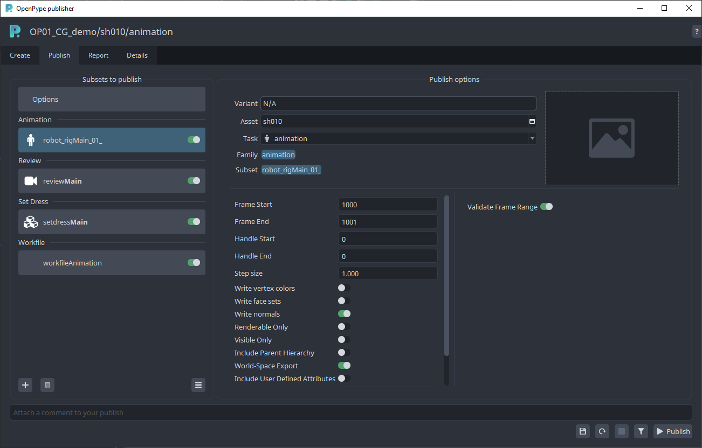

# Publisher

Use publish to share your work with others. It collects, validates and exports the data in standardized way. Accessible through the AYON menu inside the host.

## Details

When you run the publisher, the UI is made of 2 main parts; `Products to publish` and `Publish options`.

### Products to publish
On the left, you see all the products (also referred to as instances) the publisher will output.
Even though every task type has some pre-defined settings of what should be collected from the scene and what products will be published by default. You can technically publish any output type from any task type.

### Publish options
In this part of the UI you can customize how the selected product will be processed. The options are different depending on the product's `family`. Any changes to the product's publish options are persisted into the workfile for next publish.

## Using Publisher

Each product is passed through multiple plugins, each doing a small piece of work. These are run in sequence and organized into 4 areas; `collect`, `validate`, `extract` and `integrate`.
In the best case scenario, you open the publisher from the AYON menu, press `Publish`, wait for it to finish, and you're done.
These are the steps in detail, for cases, where the default settings don't work for you or you know that the task you're working on requires a different treatment.

### Collect

Finds all the important data in the scene and makes it ready for publishing.

### Validate

Each validator (plugin) makes sure your output complies to one particular condition. This could be anything from naming conventions, scene setting to plugin usage. An item can only be published if all validators pass.

### Extract

Extractor (plugin) takes the product (instance) and outputs it to the disk. Usually to temporary location. Each extractor represents one file format and there can be multiple file formats exported for each product.

### Integrate

Integrator takes the extracted files, categorizes and moves them to a correct location on the disk or on the server.
