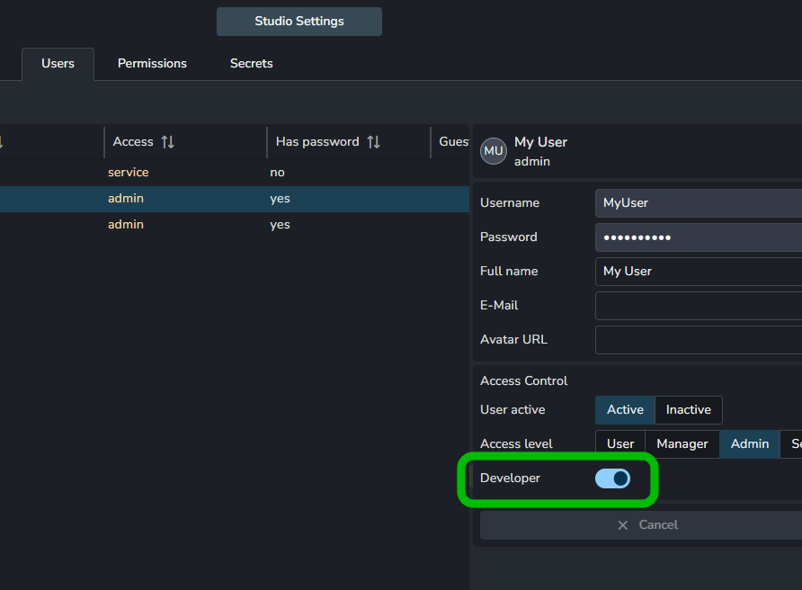

import Tabs from '@theme/Tabs';
import TabItem from '@theme/TabItem';

# Introduction
As name suggest developer mode is in AYON ecosystem to help developers quickly propagate changes in code.

That is possible by adding special bundles. By default, bundles on AYON server can be marked as `Production` or `Staging`. In developer mode it is possible to create `Dev` bundle.

## Pre-requirements
- AYON server - 0.5.0
- AYON launcher - 1.0.0-beta.6
- addon openpype - 3.17.3

## How to enable developer mode
Developer mode is configured in WebUI of AYON server, must be allowed per user, user then can enable developer mode in WebUI.

### How to enable developer mode
1. Log in to AYON server as admin user.
2. In user settings select your user, enable `Developer` checkbox and save changes.
   
3. At top right corner should appear `Developer mode` checkbox (you may need to refresh page).
   
4. Enable the checkbox.

### How to create dev bundle
1. Make sure developer mode is enabled.
2. Go to Bundles page (in Studio settings).
3. Click on `Add new bundle`. Form for bundle creation should have `Dev bundle` checkbox and `Assigned dev`.
4. Make sure `Dev bundle` is enabled.
5. Assign yourself to the bundle. Only one user can be assigned to dev bundle.
6. Choose addons and their versions.
7. Confirm Create new bundle.
   


## Dev bundle
Dev bundles have almost the same data as standard bundles, but they cannot be marked as `Production` or `Staging`. It is possible to re-assigned them to different user.

The main difference from standard bundles is that it is possible to change versions of addons or enable/disable them, and gives option to define custom path to addon code for AYON launcher.

:::important
Custom paths to addons only affects AYON launcher code and has no effect for server side code.
:::

Configuration of custom addon paths have checkbox and path input. If checkbox is disabled the path is ignored and if is enabled then path is used, even if not filled. Point the path to the client code inside repository to be able to have git controlled changes that are directly propagated.

:::warning
Some addons have more complicated preparation of code for AYON launcher, in that case it is recommended to modify addon's create package script to extract client code to predefined directory.
:::

### Example of custom addon path
Small example how this could be used with [ayon-third-party](https://github.com/ynput/ayon-third-party) addon.

#### 1. Define local directory with code
In this example will be used `C:/code/addons`.
```shell
cd C:/code/addons
```

#### 2. Clone addon repository
```shell
git clone https://github.com/ynput/ayon-third-party
```

#### 3. Create addon package
The addon must be available on server. If addon is already available on server skip to step 5.
```shell
python ./create_package.py
```

#### 4. Upload addon to server
Open AYON server in browser. Go to `Studio settings` and select `Bundles` tab. Click to `Install addon` and upload zip from `C:/code/addons/ayon-third-party/package/`. 

#### 5. Define custom path
Select or create dev bundle. Enable `ayon-third-party` addon. Enable custom path and fill the path to `C:/code/addons/ayon-third-party/client`.

#### 6. Run AYON launcher
Start AYON launcher with `--use-dev` argument.
```shell
"C:/Users/MyUser/AppData/Local/Ynput/AYON/app/AYON 1.0.0-beta.6/ayon.exe" --use-dev
```

AYON launcher should use code from the location we've defined. Try to do changes in the core, restart AYON launcher and validate if changes are propagated.
