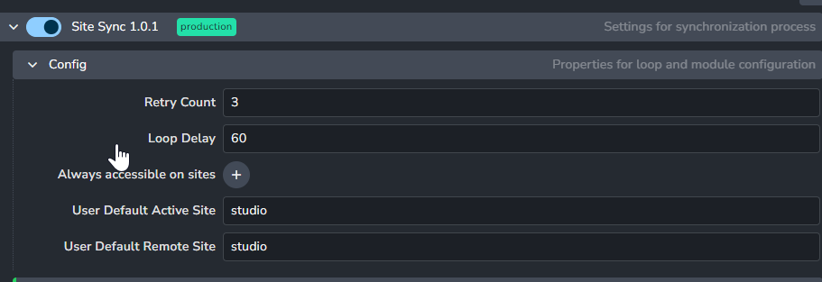
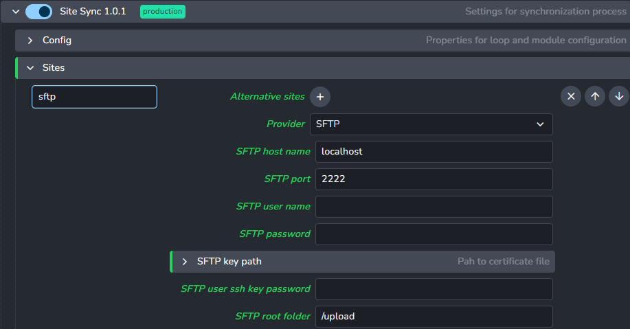
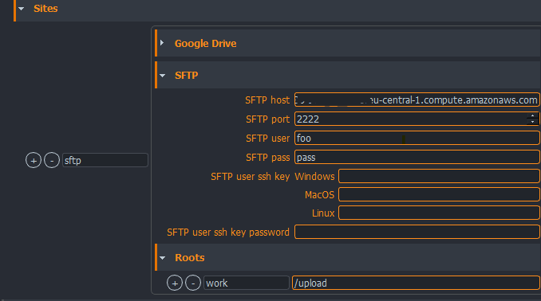
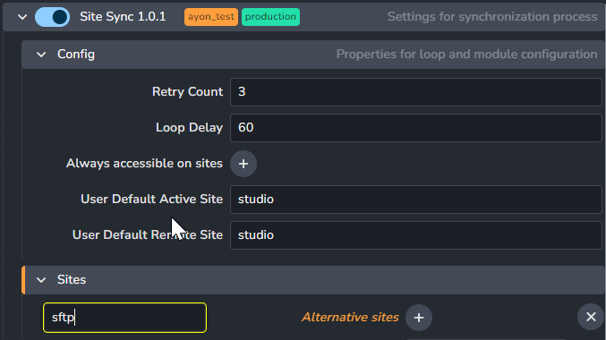

import Tabs from '@theme/Tabs';
import TabItem from '@theme/TabItem';

:::warning
**This feature is** currently **in a beta stage** and it is not recommended to rely on it fully for production.
:::

Site Sync allows users and studios to synchronize published assets between multiple 'sites'. Site denotes a storage location,
which could be a physical disk, server, cloud storage. To be able to use site sync, it first needs to be configured. 

The general idea is that each user acts as an individual site and can download and upload any published project files when they are needed. that way, artist can have access to the whole project, but only every store files that are relevant to them on their home workstation. 

:::note
At the moment site sync is only able to deal with publishes files. No workfiles will be synchronized unless they are published. We are working on making workfile synchronization possible as well. 
:::

## System Settings

To use synchronization, *Site Sync* needs to be enabled globally in **AYON Settings/System/Modules/Site Sync**.



### Sites 

By default there are two sites created for each AYON installation:
- **studio** - default site - usually a centralized mounted disk accessible to all artists. Studio site is used if Site Sync is disabled.
- **local** - each workstation or server running AYON Tray receives its own with unique site name. Workstation refers to itself as "local"however all other sites will see it under it's unique ID.

Artists can explore their site ID by opening AYON Info tool by clicking on a version number in the tray app. 

Many different sites can be created and configured on the system level, and some or all can be assigned to each project.

Each AYON Tray app works with two sites at one time. (Sites can be the same, and no syncing is done in this setup).

Sites could be configured differently per project basis. 

Each new site needs to be created first in `System Settings`. Most important feature of site is its Provider, select one from already prepared Providers.

#### Alternative sites 

This attribute is meant for special use cases only.

One of the use cases is sftp site vendoring (exposing) same data as regular site (studio). Each site is accessible for different audience. 'studio' for artists in a studio via shared disk, 'sftp' for externals via sftp server with mounted 'studio' drive.

Change of file status on one site actually means same change on 'alternate' site occurred too. (eg. artists publish to 'studio', 'sftp' is using
same location >> file is accessible on 'sftp' site right away, no need to sync it anyhow.)

##### Example

Admin created new `sftp` site which is handled by `SFTP` provider. Somewhere in the studio SFTP server is deployed on a machine that has access to `studio` drive.

Alternative sites work both way:
- everything published to `studio` is accessible on a `sftp` site too
- everything published to `sftp` (most probably via artist's local disk - artists publishes locally, representation is marked to be synced to `sftp`. Immediately after it is synced, it is marked to be available on `studio` too for artists in the studio to use.)

## Project Settings

Sites need to be made available for each project. Of course this is possible to do on the default project as well, in which case all other projects will inherit these settings until overridden explicitly.

You'll find the setting in **Settings/Project/Global/Site Sync**

The attributes that can be configured will vary between sites and their providers. 

## Local settings

Each user should configure root folder for their 'local' site via **Local Settings** in AYON Tray. This folder will be used for all files that the user publishes or downloads while working on a project. Artist has the option to set the folder as "default"in which case it is used for all the projects, or it can be set on a project level individually.

Artists can also override which site they use as active and remote if need be. 


## Providers

Each site implements a so called `provider` which handles most common operations (list files, copy files etc.) and provides interface with a particular type of storage. (disk, gdrive, aws, etc.)
Multiple configured sites could share the same provider with different settings (multiple mounted disks - each disk can be a separate site, while
all share the same provider).

**Currently implemented providers:**

### Local Drive

Handles files stored on disk storage.

Local drive provider is the most basic one that is used for accessing all standard hard disk storage scenarios. It will work with any storage that can be mounted on your system in a standard way. This could correspond to a physical external hard drive, network mounted storage, internal drive or even VPN connected network drive. It doesn't care about how the drive is mounted, but you must be able to point to it with a simple directory path.

Default sites `local` and `studio` both use local drive provider.


### Google Drive

Handles files on Google Drive (this). GDrive is provided as a production example for implementing other cloud providers

Let's imagine a small globally distributed studio which wants all published work for all their freelancers uploaded to Google Drive folder.

For this use case admin needs to configure:
- how many times it tries to synchronize file in case of some issue (network, permissions)
- how often should synchronization check for new assets
- sites for synchronization - 'local' and 'gdrive' (this can be overridden in local settings)
- user credentials
- root folder location on Google Drive side

Configuration would look like this:


*Site Sync* for Google Drive works using its API: https://developers.google.com/drive/api/v3/about-sdk

To configure Google Drive side you would need to have access to Google Cloud Platform project: https://console.cloud.google.com/ 

To get working connection to Google Drive there are some necessary steps:
- first you need to enable GDrive API: https://developers.google.com/drive/api/v3/enable-drive-api
- next you need to create user, choose **Service Account** (for basic configuration no roles for account are necessary) 
- add new key for created account and download .json file with credentials
- share destination folder on the Google Drive with created account (directly in GDrive web application)
- add new site back in AYON Settings, name as you want, provider needs to be 'gdrive'
- distribute credentials file via shared mounted disk location

:::note
If you are using regular personal GDrive for testing don't forget adding `/My Drive` as the prefix in root configuration. Business accounts and share drives don't need this.
:::

### SFTP

SFTP provider is used to connect to SFTP server. Currently authentication with `user:password` or `user:ssh key` is implemented.
Please provide only one combination, don't forget to provide password for ssh key if ssh key was created with a passphrase.

(SFTP connection could be a bit finicky, use FileZilla or WinSCP for testing connection, it will be mush faster.)

Beware that ssh key expects OpenSSH format (`.pem`) not a Putty format (`.ppk`)!

#### How to set SFTP site

- Enable Site Sync module in Settings
- Add side with SFTP provider



- In Projects setting enable Site Sync (on default project - all project will be synched, or on specific project)
- Configure SFTP connection and destination folder on a SFTP server (in screenshot `/upload`)


  
- if you want to force syncing between local and sftp site for all users, use combination `active site: local`, `remote site: NAME_OF_SFTP_SITE`
- if you want to allow only specific users to use SFTP syncing (external users, not located in the office), use `active site: studio`, `remote site: studio`. 



- Each artist can decide and configure syncing from his/her local to SFTP via `Local Settings`


  
### Custom providers

If a studio needs to use other services for cloud storage, or want to implement totally different storage providers, they can do so by writing their own provider plugin. We're working on a developer documentation, however, for now we recommend looking at `abstract_provider.py`and `gdrive.py` inside `ayon/modules/sync_server/providers` and using it as a template.

### Running Site Sync in background

Site Sync server synchronizes new published files from artist machine into configured remote location by default.

There might be a use case where you need to synchronize between "non-artist" sites, for example between studio site and cloud. In this case
you need to run Site Sync as a background process from a command line (via service etc) 24/7.

To configure all sites where all published files should be synced eventually you need to configure `project_settings/global/sync_server/config/always_accessible_on` property in Settings (per project) first.


This is an example of:
- Site Sync is enabled for a project
- default active and remote sites are set to `studio` - eg. standard process: everyone is working in a studio, publishing to shared location etc.
- (but this also allows any of the artists to work remotely, they would change their active site in their own Local Settings to `local` and configure local root.
  This would result in everything artist publishes is saved first onto his local folder AND synchronized to `studio` site eventually.)
- everything exported must also be eventually uploaded to `sftp` site

This eventual synchronization between `studio` and `sftp` sites must be physically handled by background process.

As current implementation relies heavily on Settings and Local Settings, background process for a specific site ('studio' for example) must be configured via Tray first to `syncserver` command to work.

To do this:

- run OP `Tray` with environment variable AYON_LOCAL_ID set to name of active (source) site. In most use cases it would be studio (for cases of backups of everything published to studio site to different cloud site etc.)
- start `Tray`
- check `Local ID` in information dialog after clicking on version number in the Tray
- open `Local Settings` in the `Tray`
- configure for each project necessary active site and remote site
- close `Tray`
- run OP from a command line with `syncserver` and `--active_site` arguments


This is an example how to trigger background syncing process where active (source) site is `studio`. 
(It is expected that OP is installed on a machine, `ayon_console` is on PATH. If not, add full path to executable.
)
```shell
ayon_console syncserver --active_site studio
```