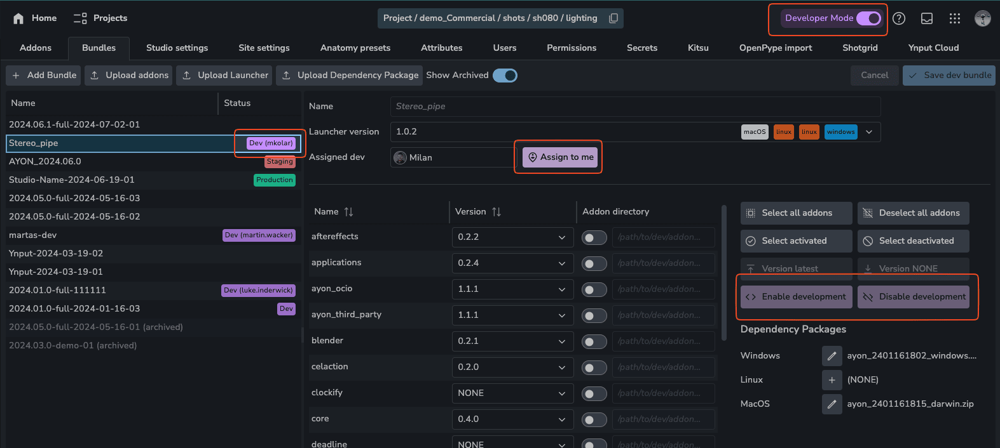

The ayon theme is based on the material design philosophy: https://m2.material.io/.

Every color used has a variable from the theme and will always start with --md-sys-color-{name} .

## Colors

### Surface Containers

Surfaces go highest to lowest, elements with a higher z level should use higher surface levels.

-   Highest (buttons) `--md-sys-color-surface-container-highest`
-   High (cards) `--md-sys-color-surface-container-high`
-   Neutral (cards) `--md-sys-color-surface-container`
-   Low (BGs) `--md-sys-color-surface-container-low`
-   Lowest (BGs) `--md-sys-color-surface-container-lowest`

### Primary Color

The primary color is a bright blue and is used in areas to draw attention, like save buttons. When using a color, ensure any content on top uses the inverse to ensure sufficient contrast ratios.

There are other colors like secondary and tertiary, but they are rarely used.

**Primary - important stuff **

```CSS
background-color: var(--md-sys-color-primary);
color: var(--md-sys-color-on-primary);
```

**Primary container - less important selections**

```CSS
background-color: var(--md-sys-color-primary-container);
color: var(--md-sys-color-on-primary-container);
```

### Text and border colors

Mostly uses `--md-sys-color-on-surface` but can use the inverse of a color like `--md-sys-color-on-primary` .

For a more fade text use `--md-sys-color-outline` or even more faded `--md-sys-color-outline-variant`.

These are also used for borders (try to avoid outlines).

### Developer Mode

Developer mode actions and UI use a specific purple color to make them standout and to signal they are for developers only. Rarely should you see this color when not in developer mode.

This color is a custom color outside of the theme color.



```CSS
  var(--color-hl-developer);
  var(--color-hl-developer-container);
  var(--color-hl-developer-hover);
  var(--color-hl-developer-surface);
  var(--color-hl-developer-surface-hover)
```

### Production and Staging

Two specific colors are used to specify the difference between "production" and "staging". These color are outside of the theme color.


```CSS
  var(--color-hl-production)
  var(--color-hl-production-hover)
  var(--color-hl-production-active)

  var(--color-hl-staging)
  var(--color-hl-staging-hover)
  var(--color-hl-staging-active)
```

:::note
Text on top of these colors should always be dark.
:::

## Useful Variables

-   **Padding**: `--padding-s` (4px) `--padding-m` (8px) `--padding-l` (16px)
-   **Border radius**: `--border-radius-m` (4px) `--border-radius-l` (8px) (there are more but they are wrong, this needs fixing)

## Typography

If you want to change the font size we have a theme of sizes.

Instead of using font-size: 14px use a className module from ARC typography.module.css.

(this could change)

```jsx
import Typography from "@theme/typography.module.css";

<span className={Typography.titleSmall}>Hello</span>;
```

## Loading state

-   Avoid spinners
-   Avoid layout shifts when the data loads in.
-   Use skeleton shimmer placeholders.
-   Use `${getShimmerStyles}` in styled components.

Example loading shimmer

